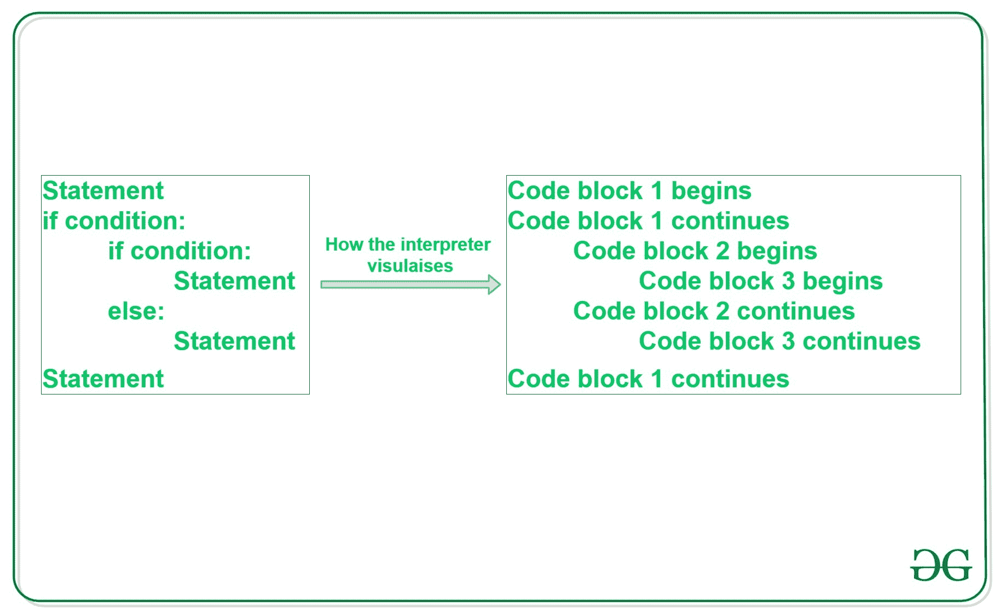

# Python 中的缩进

> 原文:[https://www.geeksforgeeks.org/indentation-in-python/](https://www.geeksforgeeks.org/indentation-in-python/)

缩进是 Python 中一个非常重要的概念，因为如果不对 Python 代码进行适当的缩进，最终会看到`IndentationError` ，代码也不会被编译。

## 刻痕

简而言之，缩进是指在语句前添加空格。但问题来了，这有必要吗？
要理解这一点，可以考虑这样一种情况:你正在看书，突然书上所有的页码都不见了。所以你不知道，在哪里继续阅读，你会感到困惑。这种情况与 Python 类似。如果没有缩进，Python 不知道下一步要执行哪个语句，或者哪个语句属于哪个块。这将导致`IndentationError`。



在上面的例子中，

*   语句(第 1 行)，如果条件(第 2 行)和语句(最后一行)属于同一个块，这意味着在语句 1 之后，将执行`if condition`。假设`if condition`变成了`False` ，那么 Python 会跳到最后一条语句来执行。
*   嵌套的`if-else`属于块 2，这意味着如果`nested if`变为假，那么 Python 将执行`else` 条件中的语句。
*   嵌套`if-else`内的语句属于块 3，根据`if-else`条件，只执行一条语句。

Python 缩进是一种告诉 Python 解释器该组语句属于特定代码块的方式。块是所有这些语句的组合。块可以看作是为了特定目的的语句分组。大多数像 C、C++、Java 这样的编程语言都使用大括号`{ }`来定义一个代码块。Python 使用缩进来突出显示代码块。空白在 Python 中用于缩进。右边距离相同的所有语句都属于同一个代码块。如果一个块必须嵌套得更深，它只需进一步向右缩进。通过查看下面几行代码，您可以更好地理解它。

**示例#1:**

```py
# Python program showing 
# indentation 

site = 'gfg'

if site == 'gfg': 
    print('Logging on to geeksforgeeks...') 
else: 
    print('retype the URL.') 
print('All set !') 
```

**输出:**

```py
Logging on to geeksforgeeks...
All set !

```

第`print(‘Logging on to geeksforgeeks…’)`行和第`print(‘retype the URL.’)`行是两个独立的代码块。我们的 if 语句示例中的两个代码块都缩进了四个空格。最后的`print(‘All set!’)`没有缩进，所以它不属于 else-block。

**例 2:**

```py
j = 1

while(j<= 5): 
     print(j) 
     j = j + 1
```

**输出:**

```py
1
2
3
4
5

```

要在 Python 中表示一个代码块，必须用相同的空格缩进代码块的每一行。`while` 循环中的两行代码都缩进了四个空格。它是指示语句属于哪个代码块所必需的。例如`j=1`和`while(j<=5):< code> is not indented, and so it is not within `while` 区块。所以，Python 代码通过缩进来构造。`

`**注意:** Python 默认使用 4 个空格作为缩进。但是，空间的数量由您决定，但至少要使用 1 个空间。`

 `= 5):<>`