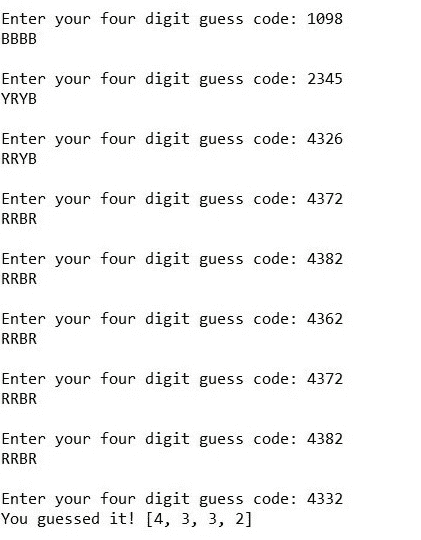

# Python 中的中间编码问题

> 原文:[https://www . geesforgeks . org/intermediate-coding-problems in-python/](https://www.geeksforgeeks.org/intermediate-coding-problems-in-python/)

Python 作为一种非常动态和通用的编程语言，几乎应用于每个领域。从软件开发到机器学习，它涵盖了所有这些。这篇文章将集中在一些有趣的编码问题上，这些问题可以用来提高我们的技能，同时，解决这些特别精心策划的问题也很有趣。尽管本文将重点讨论如何使用 Python 解决这些问题，但是人们可以随意使用他们选择的任何其他语言。让我们开始吧！

#### 无限猴子定理

该定理指出，一只猴子在打字机键盘上随机敲击按键无限长的时间，几乎肯定会键入给定的文本，如威廉·莎士比亚全集。好吧，假设我们用 Python 函数替换猴子。Python 函数只生成一句话需要多长时间？我们要争取的句子是:“极客的计算机科学门户”。
我们模拟这种情况的方法是编写一个函数，通过从字母表加上空格的 26 个字母中随机选择字母，生成一个 35 个字符长的字符串。我们将编写另一个函数，通过将随机生成的字符串与目标进行比较来对每个生成的字符串进行评分。第三个函数将重复调用 generate 并评分，然后如果 100%的字母是正确的，我们就完成了。如果字母不正确，那么我们将生成一个全新的字符串。为了更容易理解，我们的程序应该跟踪到目前为止生成的最佳字符串。

**示例:**

## 蟒蛇 3

```
import random

# function to generate 
# a random string 
def generateOne(strlen): 

    # string with all the alphabets
    # and a space
    alphabet = "abcdefghijklmnopqrstuvwxyz "
    res =""

    for i in range(strlen):
        res+= alphabet[random.randrange(27)]

    return res

# function to determine the 
# score of the generated string
def score(goal, testString): 
    numSame = 0

    for i in range(len(goal)):
        if goal[i] == testString[i]:
            numSame+= 1

    return numSame / len(goal)

# main function to call the previous
# two functions until the goal is achieved
def main(): 
    goalString = "a computer science portal for geeks"
    newString = generateOne(35)
    best = 0
    newScore = score(goalString, newString)

    while newScore<1:
        if newScore>best:
            print(newString)
            best = newScore
        newString = generateOne(35)
        newScore = score(goalString, newString)

# Driver code
main()
```

**输出:**

```
pxwvkdfwpbzneycy rifcrnczxqtsfowgjm
wfgytnakffjty ggfy trylljfhurazyxow
docujzolvswarzqszridmejyluhwviujlkj
 qbtvqanrbwsximmnlhjgkaacufhskiooxm
w jnlhvvinzrlimtesllsroqqqf wwteela
mjcevludro yoigewqudxjsad bxrl qnlv
f pomksbzrjizegcjwyoqftjz wwx   ges
```

这里，我们写了三个函数。人们将使用字母表中的 26 个字符和空格生成一个随机字符串。然后，第二个函数将通过将生成的字符串的每个字母与目标字符串进行比较来对其进行评分。第三个函数将重复调用前两个函数，直到任务完成。它还将通过比较得分来记录到目前为止生成的最佳字符串。得分最高的将是最好的。最后，我们在集成开发环境中运行这个程序，并看到它工作。

#### 子串困境

这是一个非常有趣的程序，因为它产生了一些非常有趣的输出。对于想要更清晰理解“弦”型的初学者来说，也是一个健康的练习问题。让我们调查一下这个问题。
给定一个字符串，根据以下条件查找一个子字符串:

*   子字符串必须是给定字符串中所有可能的子字符串中最长的一个。
*   子字符串中不得有任何重复字符。
*   如果有多个子串满足上述两个条件，则打印最先出现的子串。
*   如果没有满足所有上述条件的子字符串，则打印-1。

虽然有许多方法可以解决这个问题，但我们将看看最基本的一种。

**示例:**

## 蟒蛇 3

```
def test_1(string =""):

    # initializing the substring
    substring = "" 
    testList = []
    initial = 0

    for char in string:

        for i in range(initial, len(string)):
            substring+= string[i]

            # checking conditions
            if substring.count(string[i])>1:
                testList.append(substring[:-1])
                initial+= 1
                substring = ""
                break
    maxi =""

    for word in testList:

        if len(word)>len(maxi):
            maxi = word

    if len(maxi)<3:
        return "-1"
    else:
        return maxi

# Driver code
print(test_1("character"))
print(test_1("standfan"))
print(test_1("class"))
```

在这里，我们编写一个单一的函数来执行整个任务。首先，它将初始化名为 substring 和 testList 的变量，分别存储子字符串和可能的输出列表。然后，它将在提供的整个字符串上循环，并在每次发现重复时中断，并将该单词追加到测试列表中。最后，返回可能输出中最长的单词。

**输出:**

```
racte
standf
clas 
```

#### 策划

经典游戏《主谋》的低级实现。我们需要编写一个生成四位数随机代码的程序，用户需要在 10 次或更少的尝试中猜出代码。如果猜出来的四位数代码中有一位数字是错的，电脑应该打印出“B”。如果数字是正确的，但在错误的地方，计算机应该打印“Y”。如果数字和位置都正确，计算机应该打印“R”。示例:



**示例:**

## 蟒蛇 3

```
import random

# generates a four-digit code
def gen_code(): 
    set_code = []

    for i in range(4):
        val = random.randint(0, 9)
        set_code.append(val)

    return set_code

# asks for input from the user
def input_code(): 
    code = input("Enter your four digit guess code: ")
    return code

# plays the game
def mastermind(): 

    genCode = gen_code()
    i = 0

    while i < 10:
        result = ""
        inputCode = [int(c) for c in input_code()]

        if len(inputCode) != 4:
            print("Enter only 4 digit number")
            continue

        if inputCode == genCode:
             print("You guessed it !", genCode)
             break

        for element in inputCode:

            if element in genCode:

                if inputCode.index(element) == genCode.index(element):
                    result+="R"
                else:
                    result+="Y"
            else:
                result+="B"
        print(result)

        i += 1
    else:    
        print("You ran out of trys !", genCode)    

# Driver Code
mastermind()
```

首先，我们编写一个函数，使用 Python 的随机模块生成一个随机的四位数代码。接下来，我们定义一个请求用户输入的函数。最后，我们编写一个函数，将生成的代码与猜测的代码进行比较，并给出适当的结果。

#### 方向灾难

一个非常简单的问题，有许多不同的解决方案，但主要目的是以最有效的方式解决它。一个人被指示从 A 点到 b 点，方向是:“南”、“北”、“西”、“东”。显然“北”和“南”是对立的，“西”和“东”也是。往一个方向走，反方向回来，是浪费时间和精力。因此，我们需要通过编写一个程序来帮助这个人，这个程序将消除无用的步骤，并且只包含必要的方向。
例如:方向[“北”、“南”、“南”、“东”、“西”、“北”、“西”]应简化为[“西”]。这是因为先去“北方”，然后立即去“南方”，意味着回到同一个地方。所以我们取消了它们，我们有[“南”、“东”、“西”、“北”、“西”]。接下来，我们走“南”，走“东”，然后立即走“西”，这再次意味着回到同一点。因此，我们取消“东”和“西”来给我们[“南”、“北”、“西”]。很明显，“南”和“北”是对立的，因此被取消，最后我们只剩下[“西”]。

**示例:**

## 蟒蛇 3

```
opposite = {'NORTH': 'SOUTH', 
            'EAST': 'WEST', 
            'SOUTH': 'NORTH', 
            'WEST': 'EAST'}

# Function to find the reduced
# direction
def dirReduc(givenDirections):
    finalDirections = []

    for d in range(0, len(givenDirections)):

        if finalDirections:

            if finalDirections[-1] == opposite[givenDirections[d]]:
                finalDirections.pop()
            else:
                finalDirections.append(givenDirections[d])

        else:
            finalDirections.append(givenDirections[d])

    return finalDirections

# Driver Code
print(dirReduc(["NORTH", "SOUTH", "SOUTH", "EAST", "WEST", "NORTH", "WEST"]))
```

在上面的解决方案中，我们创建了一个对立词典来帮助我们确定给定的方向是否与另一个方向相反。接下来，我们初始化一个名为 finalDirections 的变量，它将是我们的输出。如果给定方向中的方向与最终方向中的最后一个元素相反，我们将它弹出最终方向，否则我们将它附加到最终方向。

**输出:**

```
['WEST'] 
```

#### 比较数组

这个问题有助于理解 Python 中数组(列表)的关键概念。如果两个数组包含相同的元素并且顺序相同，则称它们相同。然而，在这个问题中，我们将比较两个数组，看看它们是否相同，但有轻微的扭曲。这里，如果一个数组的元素是其他数组的元素的平方，则两个数组是相同的，与顺序无关。考虑两个阵列 **a** 和 **b** 。

> a = [121，144，19，161，19，144，19，11]
> b = [121，14641，20736，361，25921，361，20736，361]

这里 **b** 可以写成:

> b = [11*11，121*121，144*144，19*19，161*161，19*19，144*144，19*19]

它是**和**的每个元素的平方。因此，它们是相同的。如果 **a** 或 **b** 都不是，我们的程序应该写为假

**示例:**

## 蟒蛇 3

```
# function to compare the arrays
def comp(array1, array2):

    # checking if any array is None
    if array1 is None or array2 is None: 
        return False

    # checking if any of the array 
    # is a square of the other
    if (sorted(array1) == sorted([i ** 2 for i in array2])) or (sorted(array2) == sorted([i ** 2 for i in array1])): 
        return True

    return False

# Driver Code
comp([1,2,3,4], [1,4,9,16])
```

**输出:**

```
True
```