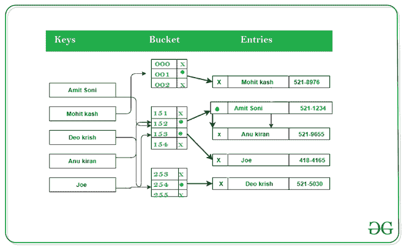

# Python 字典内部结构

> 原文:[https://www . geesforgeks . org/python 内部结构词典/](https://www.geeksforgeeks.org/internal-structure-of-python-dictionary/)

**Python 中的 Dictionary** 是一个无序的数据值集合，用于像地图一样存储数据值，与其他只保存单个值作为元素的数据类型不同，Dictionary 保存**键:值**对。字典中提供了键值以使其更加优化

这本字典由许多桶组成。每个桶都包含包含键值对的对象的哈希代码。指向键对象的指针和指向值对象的指针。

**下图为词典内部结构:**



这本字典从 8 个空桶开始。然后，每当达到其容量时，通过将条目数量增加一倍来调整大小。在 32 位机器上总计至少 12 个字节，在 64 位机器上总计至少 24 个字节

**示例 1:** 一个空的 python 字典消耗 240 字节

## 蟒蛇 3

```
# code
import sys

d = {}
print(sys.getsizeof(d))
```

**输出:**

```
240
```

**例 2** 。我们第一次创建字典时，它只包含 8 个可以填充键值对的槽。

## 蟒蛇 3

```
# code
import sys

d = {}
d['python'] = 1
print(sys.getsizeof(d))
```

**输出:**

```
240
```

如你所见，增加一些内容后，字典的大小仍然不变。字典储存在还没满的桶里。

**例 3:**

键值不存储在字典中，即使我们增加了键值的大小，字典的大小也不会改变

## 蟒蛇 3

```
import sys

d = {}
d['a'] = 'a' * 100000
print("Size of dictionary ->", sys.getsizeof(d))
print("Size of a ->", sys.getsizeof('a'))
```

**Output**

```
Size of dictionary -> 240
Size of a -> 50
```

**输出:**

```
Size of dictionary -> 240
Size of a -> 50
```

**示例 4:** 如果我们从字典中删除条目，字典的大小仍然是相同的。

## 蟒蛇 3

```
# code
import sys

d = {}
d['python'] = 1
for key in list(d.keys()):
  d.pop(key)

print(len(d))
print(sys.getsizeof(d))
```

**输出:**

```
0
240
```

在这里，你可以看到字典没有释放它分配的内存。它从哈希表中移除引用，但值在内存中。因为它没有被分配，可能会成为垃圾收集的一部分。

**示例 5:** 如果我们使用 clear 方法清空字典，它的大小比初始化的空字典小 72 字节，即 240 字节

## 蟒蛇 3

```
import sys

d = {}
d['python'] = 1
for key in list(d.keys()):
  d.pop(key)

print(len(d))
d.clear()
print(sys.getsizeof(d))
```

**输出:**

```
0
72
```

这是因为该方法会清除内存。它还会清除初始默认空间，即字典中分配的 8 个存储桶。