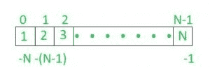
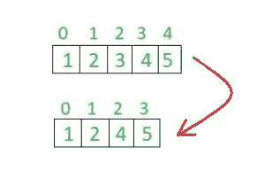

# Python 中列表的内部工作

> 原文:[https://www . geesforgeks . org/python 中列表的内部工作方式/](https://www.geeksforgeeks.org/internal-working-of-list-in-python/)

**Python 列表介绍:**
[Python 列表](https://www.geeksforgeeks.org/python-list/)内部表示为数组。使用的思想类似于 C++中向量的[实现或者 Java 中的 ArrayList。代价高昂的操作是在靠近开始处插入和删除项目(因为所有东西都必须移动)。如果预先分配的空间变满，在末尾插入也会变得昂贵。
我们可以用 python 创建一个列表，如下图所示。
**例:**](https://www.geeksforgeeks.org/how-does-a-vector-work-in-c/) 

## 蟒蛇 3

```
list1 = [1, 2, 3, 4]
```

我们可以通过分配的索引来访问 python 中列表的每个元素。在 python 中，列表序列的起始索引为 0，结束索引为(如果有 N 个元素)N-1。



同样如上所示，数组列表也有从-N(如果列表中有 N 个元素)到-1 的负索引。
**在 Python 中查看 List 的元素:**
列表的单个项目可以通过它们的索引来访问，如下面的代码段所示。

## 蟒蛇 3

```
list1 = [1, 2, 3, 4]

# for printing only one item from a list
print(list1[1])

# to print a sequence of item in a list
# we use ':' value before this is starting
# and value after that tells ending of sequence
print(list1[1:4])

# accessing through negative index
print(list1[-1])
```

**分配和访问数据:**
为了创建一个列表，我们需要在方括号“[]”中指定元素，然后给它一个名称。每当您想要访问列表元素时，请使用您想要显示的元素的列表名称和索引。
列表中的每个元素都被分配了一个索引，在正索引中，我们有从 0 到列表末尾的索引，在负索引中，我们有从-N(如果元素是 N)到-1 的索引。
如以上示例所示，访问元素的工作是手动的。我们还可以通过循环访问或分配元素。

## 蟒蛇 3

```
# assigning elements to list
list1 =[]
for i in range(0, 11):
     list1.append(i)

# accessing elements from a list
for i in range(0, 11):
     print(list1[i])
```

**更新列表:**
我们可以更新已经分配给列表的元素，也可以一次给你的列表添加一个元素。甚至你可以通过在当前列表中添加另一个列表来扩展你的列表。
上述任务可以按如下方式执行。

## 蟒蛇 3

```
list1 =[1, 2, 3, 4]

# updating
list1[2]= 5
print(list1)

# appending
list1.append(6)
print(list1)

# extending
list1.extend([1, 2, 3])
print(list1)
```

**注意:** append()和 extend()是 python 中用于列表的内置方法。
**删除列表元素:**
我们可以利用 del 函数删除列表中的元素。在这种情况下，您需要指定作为元素索引的元素的位置，该元素将从列表中删除，索引将被更新。



在上面显示的图像中，索引 2 中的元素 3 已经被删除，并且在该索引被更新之后。

## 蟒蛇 3

```
list1 = [1, 2, 3, 4, 5]
print(list1)

# deleting element
del list1[2]
print(list1)
```

**操作的时间复杂性**

<figure class="table">

| **操作** | **平均情况** | [T1】摊销 T3】T4】最坏情况](https://www.geeksforgeeks.org/analysis-algorithm-set-5-amortized-analysis-introduction/) |
| 复制 | O(n) | O(n) |
| 追加[1] | O(1) | O(1) |
| 最后一次流行 | O(1) | O(1) |
| Pop 中间体 | 好的 | 好的 |
| 插入 | O(n) | O(n) |
| 获取项目 | O(1) | O(1) |
| 套餐项目 | O(1) | O(1) |
| 删除项目 | O(n) | O(n) |
| 循环 | O(n) | O(n) |
| 获取切片 | 好的 | 好的 |
| 切片 | O(n) | O(n) |
| 设置切片 | O(k+n) | O(k+n) |
| 扩展[1] | 好的 | 好的 |
| 分类 | O(n 对数 n) | O(n 对数 n) |
| 乘；成倍增加；（使）繁殖 | O(nk) | O(nk) |
| s 中的 x | O(n) | O(n) |
| 最小，最大 | O(n) | O(n) |
| 获取长度 | O(1) | O(1) |

</figure>

来源:[Python Wiki](https://wiki.python.org/moin/TimeComplexity)
[Python 列表及其操作。](https://www.geeksforgeeks.org/python-list/)