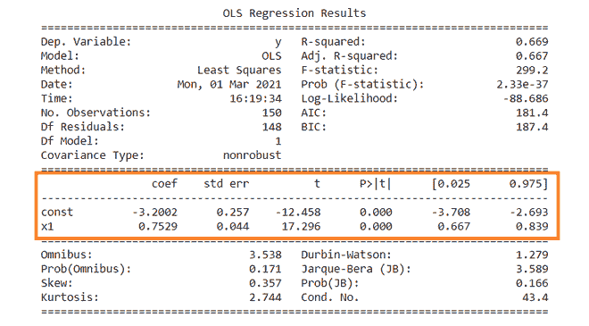
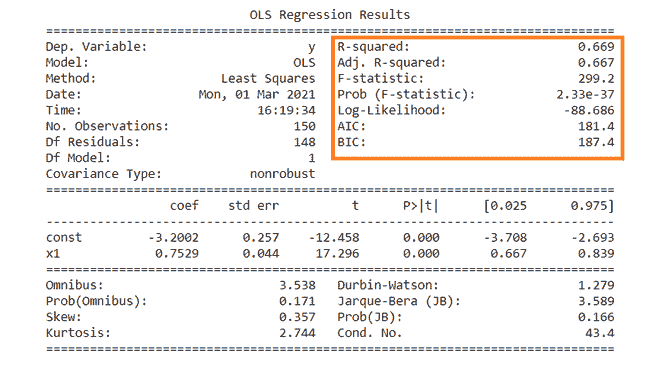

# 使用 OLS 摘要解释线性回归的结果

> 原文:[https://www . geeksforgeeks . org/解释线性回归结果-使用-ols-summary/](https://www.geeksforgeeks.org/interpreting-the-results-of-linear-regression-using-ols-summary/)

这篇文章是告诉你回归汇总表的全部解读。用于回归分析的统计软件有很多，如 Matlab、Minitab、spss、R 等。但是本文使用 python。其他工具的解释也是一样的。本文需要统计学的基础知识，包括回归、自由度、标准差、残差平方和、ESS、t 统计等基础知识。

在回归中有两种类型的变量，即因变量(也称为解释变量)和自变量(解释变量)。

这里使用的回归线是，


回归汇总表如下。

```py
                                    OLS Regression Results                            
        ==============================================================================
        Dep. Variable:                      y   R-squared:                       0.669
        Model:                            OLS   Adj. R-squared:                  0.667
        Method:                 Least Squares   F-statistic:                     299.2
        Date:                Mon, 01 Mar 2021   Prob (F-statistic):           2.33e-37
        Time:                        16:19:34   Log-Likelihood:                -88.686
        No. Observations:                 150   AIC:                             181.4
        Df Residuals:                     148   BIC:                             187.4
        Df Model:                           1                                         
        Covariance Type:            nonrobust                                         
        ==============================================================================
                         coef    std err          t      P>|t|      [0.025      0.975]
        ------------------------------------------------------------------------------
        const         -3.2002      0.257    -12.458      0.000      -3.708      -2.693
        x1             0.7529      0.044     17.296      0.000       0.667       0.839
        ==============================================================================
        Omnibus:                        3.538   Durbin-Watson:                   1.279
        Prob(Omnibus):                  0.171   Jarque-Bera (JB):                3.589
        Skew:                           0.357   Prob(JB):                        0.166
        Kurtosis:                       2.744   Cond. No.                         43.4
        ==============================================================================
```

**因变量:**因变量是将依赖于其他变量的变量。在这个回归分析中 **Y** 是我们的因变量，因为我们要分析 **X** 对**Y**的影响

**模型:**由于其高效性，**普通最小二乘法(OLS)** 是应用最广泛的模型。该模型给出了真实人口回归线的最佳近似。OLS 的原则是误差平方最小化( **∑e <sub>i</sub> <sup>2</sup>** )。

**观察次数:**观察次数是我们样本的大小，即 N = 150。

### **残差自由度:**

自由度是独立观测值的数量，在此基础上计算平方和。

数模残差= 150 –( 1+1)= 148

自由度计算如下:

自由度，***D . f = N–K***

*其中， **N =** 样本量(观测数)和 **K =** 变量数+ 1*

### 型号的 Df:

***模型的 Df = K–1 = 2–1 = 1，***

*其中， **K =** 变量个数+ 1*



**常数项:**常数项是回归线的截距。从回归线(方程式 1)来看，截距为-3.002。在回归中，我们省略了一些对因变量没有太大影响的自变量，截距表示这些省略变量的平均值和模型中存在的噪声。

**系数项:**系数项表示 **X** 单位变化的 **Y** 的变化，即如果 **X** 上升 1 个单位，则 **Y** 上升 0.7529。如果你熟悉导数，那么你可以把它联系为 **Y** 相对于**X**的变化率

**参数的标准误差:**标准误差也叫标准差。标准误差显示了这些参数的采样可变性。标准误差计算如下–

**截距项(b1)的标准误差:**


**系数项标准误差(b2):**


这里，σ <sup>2</sup> 是回归的**标准误差(SER)。**和σ <sup>2</sup> 等于 RSS(平方和残差即∑e<sub>I</sub>T8】2)。

### **t–统计:**

理论上，我们假设误差项遵循正态分布，因此参数 **b <sub>1</sub>** 和 **b <sub>2</sub>** 也具有正态分布，方差在上面部分中计算。

也就是说，

*   **b<sub><sub>∞n(b<sub><sub>，</sub></sub></sub></sub>****<sub>【B1】</sub>**)
*   **b****n(b<sub>【2】，</sub>**σ**<sub><sup>))；</sup></sub>**

这里 **B <sub>1</sub> 和 B<sub>2</sub>T5【是 b1 和 b2 的真实意思。**

t–通过假设以下假设计算统计数据–

*   ***H <sub>0</sub> : B <sub>2</sub> = 0(变量 X 对 Y 无影响)***
*   ***H<sub>a</sub>:B<sub>2</sub>0(X 对 Y 有重大影响)***

t 统计的计算:

**t =(B<sub>1</sub>–B<sub>1</sub>)/s . e(B<sub>1</sub>)**

从汇总表来看，b <sub>1</sub> = -3.2002，se(b <sub>1</sub> ) = 0.257，所以，

**t =(-3.2002–0)/0.257 =-12.458**

**同样，b <sub>2</sub> = 0.7529，se(b <sub>2</sub> ) = 0.044**

**t =(0.7529–0)/0.044 = 17.296**

### **p–值:**

**理论上，我们认为 p 值是获得至少与假设零假设为真所计算的 H <sub>0</sub> 相矛盾的 t 统计量的概率。在汇总表中，我们可以看到两个参数的 P 值都等于 0。这并不完全是 0，但是由于我们有非常大的 t 统计(-12.458 和 17.296)，p 值将大约为 0。**

**如果你知道显著性水平，那么你可以看到我们可以在几乎每个显著性水平上拒绝零假设。**

### **置信区间:**

**检验假设的方法有很多，包括上面提到的 p 值方法。置信区间方法就是其中之一。5%是标准显著性水平(∧)，在此水平上进行 C.I。**

**C.我对于 B <sub>1</sub> 是**(B<sub>1</sub>–t<sub>∧/2</sub>s . e(B<sub>1</sub>)，B<sub>1</sub>+t<sub>∧/2</sub>s . e(B<sub>1</sub>)****

**由于∧= 5%，b <sub>1</sub> = -3.2002，s.e(b <sub>1</sub> ) =0.257，由 t 表可知，t <sub>0.025，148</sub> = 1.655，**

**放入数值后，B <sub>1</sub> 的 C.I 约为。 ( -3.708，-2.693)。b<sub>2</sub>也可以这样做。**

**在计算 p 值时，我们拒绝了零假设，我们也可以在 C.I 中看到同样的情况。因为 0 不在任何区间内，所以我们将拒绝零假设。**

****

### **r–平方值:**

**R <sup>2</sup> 是决定系数，告诉我们自变量可以解释多少百分比变化的自变量。这里 Y 的 66.9 %的变异可以用 x 来解释，R <sup>2</sup> 的最大可能值可以是 1，意味着 R <sup>2</sup> 值越大回归越好。**

### **f–统计数据:**

**f 检验说明回归的拟合优度。该测试类似于 t 检验或我们为假设所做的其他测试。F 统计数据计算如下–**

****

**插入 R <sup>2</sup> ，n 和 k 的值，F = (0.669/1) / (0.331/148) = 229.12。**

**对于 1 和 148 df，可以计算出 F >229.1 的概率，约为。0.由此，我们再次拒绝上述零假设。**

**其余术语不常使用。像偏斜度和峰度这样的术语说明了数据的分布。正态分布的偏斜度和峰度分别为 0 和 3。Jarque-Bera 检验用于检验一个误差是否具有正态分布。**