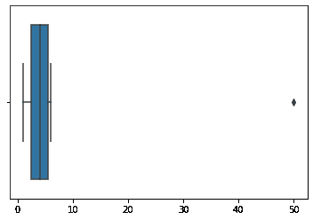

# 检测数据异常值的四分位数范围

> 原文:[https://www . geeksforgeeks . org/四分位数区间检测数据中的异常值/](https://www.geeksforgeeks.org/interquartile-range-to-detect-outliers-in-data/)

与样本数据集中的整体模式不同的观察被称为异常值。

**异常值:**
异常值可能暗示实验误差、测量中的可变性或异常。一个人的年龄可能被错误地记录为 200 岁而不是 20 岁。这样的异常值绝对应该从数据集中丢弃。
然而，并不是所有的离群值都是不好的。一些异常值表明数据与其他数据明显不同。例如，它可能表明一种异常，如银行欺诈或一种罕见的疾病。

**异常值的显著性:**

*   异常值严重影响数据集的均值和标准差。这些可能在统计上给出错误的结果。
*   大多数机器学习算法在存在异常值的情况下不能很好地工作。因此，检测和去除异常值是可取的。
*   异常值在异常检测中非常有用，例如欺诈检测，其中欺诈交易与正常交易非常不同。

**什么是 IQR 四分位区间？**

IQR 通过将数据集分成四分位数来测量可变性。数据按升序排序，并分成 4 个相等的部分。Q1、Q2、Q3 称为第一、第二和第三四分位数，是分隔 4 个相等部分的值。

*   Q1 代表了数据的第 25 个百分点。
*   Q2 代表数据的第 50 个百分点。
*   Q3 代表数据的第 75 个百分点。

如果数据集有 *2n / 2n+1* 个数据点，那么
Q1 =数据集的中值。
Q2 = n 个最小数据点的中位数。
Q3 = n 个最高数据点的中位数。

IQR 是第一和第三个四分位数之间的范围，即 Q1 和 Q3:*IQR = Q3–Q1*。低于*Q1–1.5 IQR*或高于 *Q3 + 1.5 IQR* 的数据点是异常值。

**例:**
假设数据 6、2、1、5、4、3、50。如果这些值代表午餐中吃的沙拉的数量，那么 50 显然是一个异常值。
使用 **Python** 逐步检测该数据集中的异常值:

**步骤 1:导入必要的库。**

```
import numpy as np 
import seaborn as sns
```

**第二步:取数据，按升序排序。**

```
data = [6, 2, 3, 4, 5, 1, 50]
sort_data = np.sort(data)
sort_data
```

**输出:**

```
array([ 1,  2,  3,  4,  5,  6, 50])
```

**第三步:计算 Q1、Q2、Q3、IQR。**

```
Q1 = np.percentile(data, 25, interpolation = 'midpoint') 
Q2 = np.percentile(data, 50, interpolation = 'midpoint') 
Q3 = np.percentile(data, 75, interpolation = 'midpoint') 

print('Q1 25 percentile of the given data is, ', Q1)
print('Q1 50 percentile of the given data is, ', Q2)
print('Q1 75 percentile of the given data is, ', Q3)

IQR = Q3 - Q1 
print('Interquartile range is', IQR)
```

**输出:**

```
Q1 25 percentile of the given data is, 2.5
Q1 50 percentile of the given data is, 4.0
Q1 75 percentile of the given data is, 5.5
Interquartile range is 3.0
```

**第四步:求下限和上限分别为 Q1–1.5 IQR 和 Q3 + 1.5 IQR。**

```
low_lim = Q1 - 1.5 * IQR
up_lim = Q3 + 1.5 * IQR
print('low_limit is', low_lim)
print('up_limit is', up_lim)
```

**输出:**

```
low_limit is -2.0
up_limit is 10.0
```

**第五步:大于上限或小于下限的数据点为异常值**

```
outlier =[]
for x in data:
    if ((x> up_lim) or (x<low_lim)):
         outlier.append(x)
print(' outlier in the dataset is', outlier)
```

**输出:**

```
 outlier in the dataset is [50]
```

**第 6 步:绘制方框图，突出异常值。**

```
sns.boxplot(data)
```

<center></center>

**第七步:下面的代码也可以用来计算 IQR**

```
from scipy import stats
IQR = stats.iqr(data, interpolation = 'midpoint')
IQR
```

**输出:**

```
3.0
```

**结论:** IQR 和箱线图是检测数据异常值的有效技术。