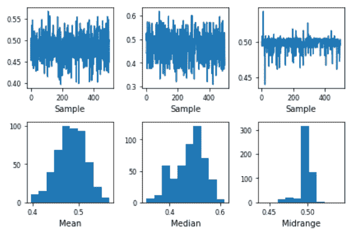

# 自举图介绍

> 原文:[https://www . geesforgeks . org/introduction-to-bootstrap-plot/](https://www.geeksforgeeks.org/introduction-to-bootstrap-plot/)

在进入 Bootstrap 图之前，让我们首先了解 Bootstrap(或 Bootstrap 采样)是什么。

**Bootstrap Sampling:** 这是一种方法，我们从一个数据集中重复获取样本数据，并进行替换，以估计一个总体参数。它用于确定群体的各种参数。

**自举图:**这是一种用于测量群体的任何期望统计特征的不确定性的图形方法。它是置信区间的替代。(也是用于统计计算的数学方法)。

**结构**

*   **x 轴:**子样本号。
*   **y 轴:**给定子样本所需统计的计算值。

**需要自举图:**

通常，我们可以使用置信区间从数学上计算总体统计的不确定性。然而，在许多情况下，导出的不确定性公式在数学上是难以处理的。在这种情况下，我们使用自举图。

假设，我们在一个公园里有 5000 个人，我们需要找到整个人口的平均体重。测量每个人的体重然后取平均值是不可行的。这就是自举抽样进入画面的地方。

我们所做的是，从人群中随机抽取 5 人一组，找出其平均值。我们做同样的过程，比如 8-10 次。通过这种方式，我们可以更有效地估计人口的平均体重。

**直觉:**

让我们考虑一个例子，了解 Bootstrap 图如何使从大量人群中获取关键信息变得更容易。假设我们有 3000 个随机生成的统一数字的样本数据。我们取出一个 30 个数字的子样本，找到它的平均值。我们对另一个随机子样本再次这样做，以此类推。

我们绘制了上面获得的信息的自举图，仅仅通过查看它，我们就可以很容易地给出所有 3000 个数字的平均值的良好估计。从引导图中还可以获得各种其他有用的信息，例如:

*   哪个子样本的方差最低，或者
*   哪个子样本产生最窄的置信区间，等等。

**实施:**

## 计算机编程语言

```
import pandas as pd
import numpy as np

s = pd.Series(np.random.uniform(size=500))
pd.plotting.bootstrap_plot(s)
```

**输出**



**限制**

1.  自举图给出了对总体所需信息的估计，而不是精确值。
2.  它高度依赖于给定的数据集。当许多子集有重复样本时，它不能给出好的结果。
3.  当我们获得高度依赖尾值的信息时，自举图就变得无效了。**【如图 1 所示】**