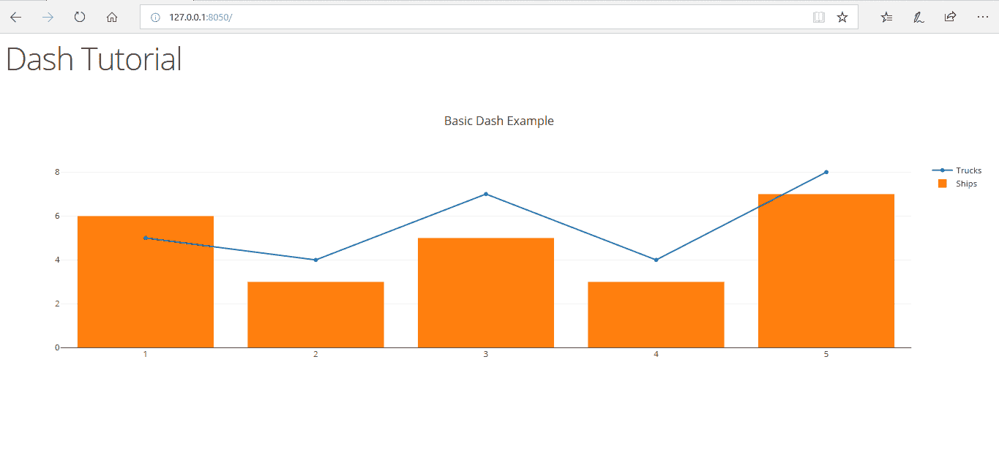
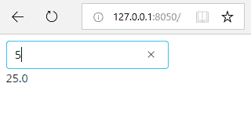

# Python 中 Dash 的介绍

> 原文:[https://www . geesforgeks . org/introduction-to-dash-in-python/](https://www.geeksforgeeks.org/introduction-to-dash-in-python/)

Dash 是一个用于构建分析性网络应用程序的 Python 框架。Dash 有助于构建反应灵敏的网络仪表板，这种仪表板看起来很好，而且速度非常快，不需要理解复杂的前端框架或语言，如 HTML、CSS 和 JavaScript。让我们使用 Dash 构建我们的第一个网络仪表板。

## 安装和导入

安装最新版本的 Dash

```py
pip install dash

```

## 基本仪表板

在本节中，我们将制作一个应用程序，使用破折号在网页上显示静态(但响应迅速)的图形。

**第一步:导入所有需要的库**
现在我们来导入 Dash，Dash 核心组件(有图形，输入等组件。，)和 Dash HTML 组件(它有元标签、正文标签、段落标签等 HTML 组件。, )

```py
# importing required libraries
import dash
import dash_core_components as dcc    
import dash_html_components as html
```

**第二步:设计布局**
HTML 组件就像 HTML 一样。这里 *html。H1* 指的是 HTML 中的 *h1* 标签。
然后，我们制作一个具有各种参数的图形，如 *id* (特定图形的唯一 ID)*图形*(图形本身)*布局*(基本布局、图形标题、X 轴、Y 轴数据等。, ).

*   *图形*参数本质上是一个字典，其中有像 *x，y，type，name* 这样的元素。
*   *x* 指的是 X 轴值(可以是列表，也可以是单个元素) *y* 除了和 Y 轴关联外，其他都是一样的。
*   *类型*参数是指图形的类型，它可能是*线*、*条*。
*   *名称*参数是指与图形轴相关的名称

```py
app = dash.Dash()

app.layout = html.Div(children =[
    html.H1("Dash Tutorial"),
    dcc.Graph(
        id ="example",
        figure ={
            'data':[
                       {'x':[1, 2, 3, 4, 5],
                        'y':[5, 4, 7, 4, 8],
                        'type':'line', 
                        'name':'Trucks'},
                       {'x':[1, 2, 3, 4, 5], 
                        'y':[6, 3, 5, 3, 7], 
                        'type':'bar',
                        'name':'Ships'}
                   ],
            'layout':{
                'title':'Basic Dashboard'
            }
        }
    )
])
```

**第三步:运行服务器**
仪表板现在已经准备好了，但是它需要一个服务器来运行。因此，我们使用下面的代码来设置服务器。

```py
if __name__ == '__main__':
    app.run_server()
```

在本地主机和默认端口 8050 的网络浏览器上打开该应用程序。

```py
http://127.0.0.1:8050/

```

**输出:**



基本 Dash 应用的截图。

## 使用回调

上面教我们一个基本的静态 app。但是如果你想让用户控制呢？这就是为什么我们将使用 Dash 中提供的应用程序回调。在本节中，我们将制作一个 web 应用程序，从用户那里获取数字并返回数字的平方

**第一步:导入所有需要的库**
就像上面我们要导入所有需要的库。这里我们需要一个额外的 *dash.dependencies.Input* 和 *dash.dependencies.Output* 来为我们提供输入和输出回调功能。

```py
# importing required libraries
import dash
import dash_core_components as dcc    
import dash_html_components as html
from dash.dependencies import Input, Output 
```

**第二步:设计布局**

我们将设计一个简单的文本框来帮助获取输入，并设计一个文本标签来输出输入数字的平方，如果输入不是数字，则返回一个错误。

```py
app = dash.Dash()

app.layout = html.Div(children =[
    dcc.Input(id ='input', 
              value ='Enter a number', 
              type ='text'),

    html.Div(id ='output')
])
```

**第三步:回调**

回调就像一个触发器，它对输入状态的改变执行某种功能。在这种情况下，它执行方法 *update_value* ，并采用 *input_data* 作为参数，并返回该数字的平方。如果输入不是数字，则返回一个错误语句。

```py
@app.callback(
    Output(component_id ='output', component_property ='children'),
    [Input(component_id ='input', component_property ='value')]
)

def update_value(input_data):
    try:
        return str(float(input_data)**2)
    except:
        return "Error, the input is not a number"
```

**第三步:运行服务器**
再次，就像上面一样，我们要运行服务器。

```py
if __name__ == '__main__':
    app.run_server()
```

在本地主机和默认端口 8050 的网络浏览器上打开应用程序。

```py
http://127.0.0.1:8050/

```

**输出:**



使用 Python Dash 回调的五次方。

## 脚注

以上两个例子对你理解 Dash 框架的工作一定很有用。虽然上面写的两个例子本身可能没有什么用处，但它确实有助于理解使用 Dash 框架构建网络应用程序的概念，这将有助于您将来使用真实数据构建有用的网络应用程序。