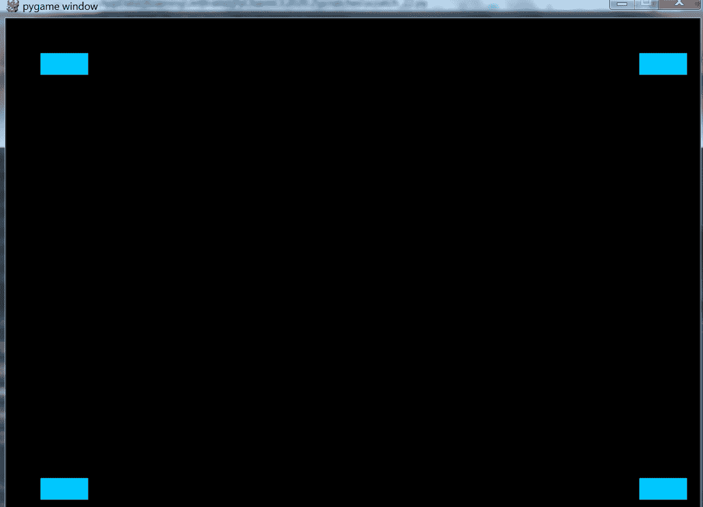

# pygame 简介

> 原文:[https://www.geeksforgeeks.org/introduction-to-pygame/](https://www.geeksforgeeks.org/introduction-to-pygame/)

游戏编程现在很有价值，它也可以用于广告和作为教学工具。游戏开发包括数学、逻辑、物理、人工智能等等，非常有趣。在 python 中，游戏编程是在 pygame 中完成的，它是这样做的最佳模块之一。

**安装 pygame:**
Pygame 需要 Python 如果你还没有，可以从[python.org](https://www.python.org/)下载。使用 python 3.6.1 或更高版本，因为它对新手更友好，而且运行速度更快。
安装 pygame 的最佳方式是使用 pip 工具(python 使用该工具安装软件包)。注意，在最近的版本中，这是 python 附带的。我们使用–user 标志告诉它安装到主目录，而不是全局目录。

```
python3 -m pip install -U pygame --user

```

要查看它是否有效，请运行包含的示例之一:

```
python3 -m pygame.examples.aliens

```

如果成功了，我们就可以出发了！
一旦安装了 pygame，就可以创建第一个 pygame 实例了。

## 蟒蛇 3

```
# import the pygame module
import pygame

# import pygame.locals for easier
# access to key coordinates
from pygame.locals import *

# Define our square object and call super to
# give it all the properties and methods of pygame.sprite.Sprite
# Define the class for our square objects
class Square(pygame.sprite.Sprite):
    def __init__(self):
        super(Square, self).__init__()

        # Define the dimension of the surface
        # Here we are making squares of side 25px
        self.surf = pygame.Surface((25, 25))

        # Define the color of the surface using RGB color coding.
        self.surf.fill((0, 200, 255))
        self.rect = self.surf.get_rect()

# initialize pygame
pygame.init()

# Define the dimensions of screen object
screen = pygame.display.set_mode((800, 600))

# instantiate all square objects
square1 = Square()
square2 = Square()
square3 = Square()
square4 = Square()

# Variable to keep our game loop running
gameOn = True

# Our game loop
while gameOn:
    # for loop through the event queue
    for event in pygame.event.get():

        # Check for KEYDOWN event
        if event.type == KEYDOWN:

            # If the Backspace key has been pressed set
            # running to false to exit the main loop
            if event.key == K_BACKSPACE:
                gameOn = False

        # Check for QUIT event
        elif event.type == QUIT:
            gameOn = False

    # Define where the squares will appear on the screen
    # Use blit to draw them on the screen surface
    screen.blit(square1.surf, (40, 40))
    screen.blit(square2.surf, (40, 530))
    screen.blit(square3.surf, (730, 40))
    screen.blit(square4.surf, (730, 530))

    # Update the display using flip
    pygame.display.flip()
```

上面的 Python 代码是一个简单的 pygame 脚本，用来绘制四个青色方块。

**输出:**



别担心！在接下来的几篇文章中，我们将了解更多关于如何移动对象、如何添加动画效果、按钮、音乐等内容，但现在让我们了解一下包含所有必要 pygame 元素的基本代码。

```
import pygame

from pygame.locals import *

```

在前几行中，我们导入了 pygame 和 pygame.locals，这是在 python 中使用任何模块之前必须做的事情。

### 雪碧、冲浪和直击:

**雪碧:**雪碧只是我们在屏幕上绘制的 2d 对象。我们可以通过扩展 sprite 类来使用它们。
**冲浪:**表面就像我们画画的白纸。我们的屏幕对象也是一个曲面。它们也可以保存图像。
**矩形:我们在曲面上定义的矩形区域。** 

## 蟒蛇 3

```
class Square(pygame.sprite.Sprite):

    def __init__(self):
        super(Square, self).__init__()
        self.surf = pygame.Surface((25, 25))
        self.surf.fill((0, 200, 255))
        self.rect = self.surf.get_rect()
```

**注意:**我们使用的是颜色编码的 RGB 格式，在这种格式中，我们可以通过给出 0-255 范围内的红、蓝、绿颜色值来形成不同的颜色。元组(0，0，0)是黑色，因为不存在颜色，元组(255，255，255)是白色。
在我们的代码中，我们扩展了 sprite 类，这样我们就可以使用 *surfs* 和 *rects* 来绘制我们的方块。我们制作了一个尺寸为 25x25px 的表面，并填充了一种颜色:(0，200，255)

### pygame.init():

## 蟒蛇 3

```
pygame.init()

screen = pygame.display.set_mode((800, 600))

square1 = Square()
square2 = Square()
square3 = Square()
square4 = Square()
```

上面几行代码使用 pygame.init()命令初始化 pygame，这是使用 pygame 模块命令所必需的。之后，我们以像素为单位定义屏幕对象及其尺寸。然后在接下来的几行中，我们初始化我们的四个方块。

### 游戏循环

## 蟒蛇 3

```
while running:
    for event in pygame.event.get():
        if event.type == KEYDOWN:
            if event.key == K_BACKSPACE:
                running = False
        elif event.type == QUIT:
            running = False
```

游戏开发代码最重要的部分是游戏循环。这个循环在后台持续运行，直到用户结束游戏或者游戏结束。现在我们的游戏循环没什么可期待的。它只跟踪两个基本事件。我们可以根据游戏状态、用户输入等添加更多的事件，但这里要记住的一点是，游戏循环必须在某种情况下结束，否则用户将永远被困在游戏循环中。

### Blit 和 Flip–

**Blit:** Blit 关键字用于在另一个曲面上绘制一个曲面。简单地说，当我们画一个表面时，我们只是把它放到另一个表面上*。
**翻转:**用来在绘制完所有内容后更新整个屏幕。请记住，翻转仅在绘制完所有必要的曲面后才起作用，否则，它不会更新任何内容。* 

## 蟒蛇 3

```
screen.blit(square1.surf, (40, 40))
screen.blit(square2.surf, (40, 530))
screen.blit(square3.surf, (730, 40))
screen.blit(square4.surf, (730, 530))

pygame.display.flip()
```

在上面的代码行中，首先我们*在屏幕上 blit* 四个方块，然后我们*翻转*让它们出现。