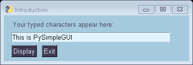

# PySimpleGUI 介绍

> 原文:[https://www.geeksforgeeks.org/introduction-to-pysimplegui/](https://www.geeksforgeeks.org/introduction-to-pysimplegui/)

使用简单但高度可定制的 Python 图形用户界面功能很容易。完全基于 [Tkinter](https://www.geeksforgeeks.org/python-gui-tkinter/) 。这是一个面向人类的 Python 图形用户界面，它将 Tkinter、PyQt、Remi、WxPython 转换为可移植的用户友好的 Python 界面。

### 我们如何使用 PySimpleGUI？

使用图形用户界面包 PySimpleGUI 的步骤如下

*   安装 PySimpleGUI

    ```
    pip install PySimpleGUI 
    ```

*   找到一个看起来很像你想要设计和创建的图形用户界面。
*   从 Cookbook 复制代码。
*   粘贴到您的 IDE 中并运行。

**示例:**展示 PySimpleGUI 布局的示例程序。

```
import PySimpleGUI as sg

sg.theme('BluePurple')

layout = [[sg.Text('Your typed characters appear here:'),
           sg.Text(size=(15,1), key='-OUTPUT-')],
          [sg.Input(key='-IN-')],
          [sg.Button('Display'), sg.Button('Exit')]]

window = sg.Window('Introduction', layout)

while True:
    event, values = window.read()
    print(event, values)

    if event in  (None, 'Exit'):
        break

    if event == 'Display':
        # Update the "output" text element
        # to be the value of "input" element
        window['-OUTPUT-'].update(values['-IN-'])

window.close()
```

**输出:**

