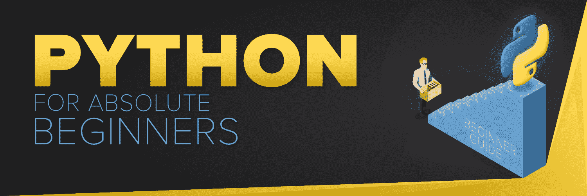

# 绝对初学者 Python 入门

> 原文:[https://www . geesforgeks . org/绝对初学者 python 入门/](https://www.geeksforgeeks.org/introduction-to-python-for-absolute-beginners/)

你是一个初学者，打算在竞争激烈的编程世界开始你的职业生涯吗？作为一个绝对初学者寻找 Python 的资源？你在一个完美的地方。这个面向初学者的 Python 页面围绕从基础到高级学习 [Python 编程语言](https://www.geeksforgeeks.org/python-programming-language/)的逐步教程展开。
Python 是一种高级编程语言，在开发者社区中被广泛使用。Python 主要是为了强调代码可读性而开发的，它的语法允许程序员用更少的代码行来表达概念。Python 是一种编程语言，可以让开发人员快速工作，并更高效地集成系统。


## 为什么作为一个绝对的初学者学习 Python？

在探讨 Python 的基础知识、数据类型和其他特性之前，让我们先来探讨一下为什么您应该学习 Python，以及它是如何在行业中占据一席之地的。

**应用程序:**
1)基于 GUI 的桌面应用程序(游戏、科学)
2) Web 框架和应用程序
3)企业和业务应用程序
4)操作系统
5)语言开发
6)原型制作

**使用 Python 语言的组织:**
1)谷歌(谷歌蜘蛛和搜索引擎的组件)
2)雅虎(地图)
3)YouTube
4)Mozilla
5)Dropbox
6)微软

## 基础

Python 是吉多·范·罗苏姆在 20 世纪 90 年代初开发的，其最新版本是 3.7.1，我们可以简单地称之为 Python3。Python 3.0 于 2008 年发布。并且是解释语言，即它没有被编译，解释器将逐行检查代码。这些文章可以用来学习 Python 编程语言的基础知识。

*   [Python 语言介绍](https://www.geeksforgeeks.org/python-language-introduction/)
*   [Python 3 基础知识](https://www.geeksforgeeks.org/python-3-basics/)
*   [Python 新一代语言](https://www.geeksforgeeks.org/python-the-new-generation-language/)
*   [python 2 . x 和 python 3.x 的区别](https://www.geeksforgeeks.org/important-differences-between-python-2-x-and-python-3-x-with-examples/)
*   [Python 中的关键词|第 1 集](https://www.geeksforgeeks.org/keywords-python-set-1/)、[第 2 集](https://www.geeksforgeeks.org/keywords-python-set-2/)
*   [Python 中的名称空间和范围](https://www.geeksforgeeks.org/namespaces-and-scope-in-python/)
*   [Python 中的语句、缩进和注释](https://www.geeksforgeeks.org/statement-indentation-and-comment-in-python/)

*   [构建 Python 程序](https://www.geeksforgeeks.org/structuring-python-programs/)
*   [如何在 Python 中检查一个字符串是否是有效的关键字？](https://www.geeksforgeeks.org/check-string-valid-keyword-python/)
*   [如何在 Python 等语言中给变量赋值](https://www.geeksforgeeks.org/how-to-assign-values-to-variables-in-python-and-other-languages/)
*   [Python 中没有换行符怎么打印？](https://www.geeksforgeeks.org/print-without-newline-python/)
*   [决策](https://www.geeksforgeeks.org/decision-making-python-else-nested-elif/)
*   [使用 Python 的基本计算器程序](https://www.geeksforgeeks.org/make-simple-calculator-using-python/)

## 输入/输出

开发人员经常需要与用户进行交互，要么获取数据，要么提供某种结果。如今，大多数程序使用对话框来要求用户提供某种类型的输入。而 Python 为我们提供了两个从键盘读取输入的内置功能。

```py
raw_input ( prompt )
input ( prompt )
```

*   [Get input](https://www.geeksforgeeks.org/taking-input-in-python/) in Python
*   [Get input from console in Python](https://www.geeksforgeeks.org/taking-input-from-console-in-python/)
*   [Get multiple inputs from users in Python](https://www.geeksforgeeks.org/taking-multiple-inputs-from-user-in-python/)
*   [Python input method for competitive programming](https://www.geeksforgeeks.org/python-input-methods-competitive-programming/)
*   [Vulnerability in input () function–Python 2.x](https://www.geeksforgeeks.org/vulnerability-input-function-python-2-x/)

*   [蟒蛇|蟒蛇](https://www.geeksforgeeks.org/python-output-using-print-function/)
*   [Python |结束打印中的参数()](https://www.geeksforgeeks.org/gfact-50-python-end-parameter-in-print/)
*   [Python | sep 打印中的参数()](https://www.geeksforgeeks.org/python-sep-parameter-print/)
*   [Python | Output Format](https://www.geeksforgeeks.org/python-output-formatting/)

## 数据类型

数据类型是数据项的分类或归类。它表示一种值，该值告诉可以对特定数据执行哪些操作。因为在 Python 编程中一切都是对象，所以数据类型实际上是类，变量是这些类的实例(对象)。

*   [**String**](https://www.geeksforgeeks.org/python-strings/)
*   [**List**](https://www.geeksforgeeks.org/python-list/)
*   [**tuple**](https://www.geeksforgeeks.org/python-tuples/)

*   [**Set**](https://www.geeksforgeeks.org/python-sets/)
*   **dictionary**

## 变量

Python 不是“静态类型化”的。我们不需要在使用变量之前声明它们，或者声明它们的类型。当我们第一次给变量赋值时，它就被创建了。

*   [Variables, expression conditions and functions](https://www.geeksforgeeks.org/python-set-2-variables-expressions-conditions-and-functions/)
*   [The maximum possible value of an integer in Python?](https://www.geeksforgeeks.org/what-is-maximum-possible-value-of-an-integer-in-python/)
*   [Global and local variables in Python](https://www.geeksforgeeks.org/global-local-variables-python/)
*   [Packaging and unpacking parameter](https://www.geeksforgeeks.org/packing-and-unpacking-arguments-in-python/) in Python
*   [End parameter](https://www.geeksforgeeks.org/gfact-50-python-end-parameter-in-print/) in Python

*   [Type conversion in Python](https://www.geeksforgeeks.org/type-conversion-python/)
*   Byte object vs string in python
*   T40] Print single and multiple variables

 ## 经营者

Python 有各种各样的运算符，从算术运算符、关系运算符到逻辑运算符。这里是收银员–

*   [python 中的基本运算符](https://www.geeksforgeeks.org/basic-operators-python/)
*   [布尔](https://www.geeksforgeeks.org/g-fact-29-logical-and-bitwise-not-operators-on-boolean/)上的逻辑和按位非运算符
*   [三元运算符](https://www.geeksforgeeks.org/ternary-operator-in-python/)
*   [python 中的除法运算符](https://www.geeksforgeeks.org/division-operator-in-python/)
*   [Python 中的运算符重载](https://www.geeksforgeeks.org/operator-overloading-in-python/)
*   [python 中的位置和标准操作符](https://www.geeksforgeeks.org/inplace-vs-standard-operators-python/)
*   [Python 中==和 is 运算符的区别](https://www.geeksforgeeks.org/difference-operator-python/)

*   [python 中的运算符功能| Set–1](https://www.geeksforgeeks.org/operator-functions-in-python-set-1/)
*   [python 中的运算符函数| Set–2](https://www.geeksforgeeks.org/operator-functions-python-set-2/)
*   [就地操作员|设置-1](https://www.geeksforgeeks.org/inplace-operators-python-set-1iadd-isub-iconcat/)
*   [就地操作员|设置-2](https://www.geeksforgeeks.org/inplace-operators-in-python-set-2ixor-iand-ipow/)
*   [Python 中的逻辑门](https://www.geeksforgeeks.org/logic-gates-in-python/)
*   [Python | a += b 不总是 a = a + b](https://www.geeksforgeeks.org/python-a-b-is-not-always-a-a-b/)
*   [Python 成员资格和身份运算符| in，not in，is，is，is not](https://www.geeksforgeeks.org/python-membership-identity-operators-not-not/) 

## 【控制流】

Python 编程语言提供了以下类型的控制流语句来处理循环需求。

*   [cycle](https://www.geeksforgeeks.org/loops-in-python/)
*   [Loop and control statement (continued, broken and closed) in python](https://www.geeksforgeeks.org/loops-and-loop-control-statements-continue-break-and-pass-in-python/)
*   [Loop technique](https://www.geeksforgeeks.org/looping-techniques-python/) in python
*   [你好 vs xrange 哦，天啊 python(python 语言)何曰](https://www.geeksforgeeks.org/range-vs-xrange-python/)
*   [The program uses the method of printing pyramid](https://www.geeksforgeeks.org/programs-printing-pyramid-patterns-python/) in python.
*   [Link comparison](https://www.geeksforgeeks.org/chaining-comparison-operators-python/) in Python
*   [Other values are also](https://www.geeksforgeeks.org/using-else-conditional-statement-with-for-loop-in-python/)

[切换功能](https://www.geeksforgeeks.org/switch-case-in-python-replacement/)

*   [Python | The difference between iterable and iterator](https://www.geeksforgeeks.org/python-difference-iterable-iterator/)
*   [Generator in Python](https://www.geeksforgeeks.org/generators-in-python/)
*   [Generator expression](https://www.geeksforgeeks.org/generator-expressions/) in Python

 ## 功能

函数是一组接受输入、进行特定计算并产生输出的语句。其思想是将一些通常或重复完成的任务放在一起，并制作一个函数，这样我们就可以调用该函数，而不是针对不同的输入反复编写相同的代码。
Python 提供了 print()等内置功能。但是我们也可以创建您自己的函数。这些函数称为用户定义函数。

*   [Python 中的函数](https://www.geeksforgeeks.org/functions-in-python/)
*   [Python 中类方法 vs 静态方法](https://www.geeksforgeeks.org/class-method-vs-static-method-python/)
*   [用 Python 写一个空函数–pass 语句](https://www.geeksforgeeks.org/how-to-write-an-empty-function-in-python-pass-statement/ "Permalink to How to write an empty function in Python – pass statement?")
*   [收益率而非收益率](https://www.geeksforgeeks.org/use-yield-keyword-instead-return-keyword-python/)
*   [返回多个值](https://www.geeksforgeeks.org/g-fact-41-multiple-return-values-in-python/)
*   [Python 中的部分函数](https://www.geeksforgeeks.org/partial-functions-python/)
*   [Python 中的一级函数](https://www.geeksforgeeks.org/first-class-functions-python/)
*   [精密搬运](https://www.geeksforgeeks.org/precision-handling-python/)
*   [*args 和**kwargs](https://www.geeksforgeeks.org/args-kwargs-python/)

*   [Python 闭包](https://www.geeksforgeeks.org/python-closures/)
*   [功能装饰器](https://www.geeksforgeeks.org/function-decorators-in-python-set-1-introduction/)
*   [Python 中的装饰者](https://www.geeksforgeeks.org/decorators-in-python/)
*   [Python 中带参数的装饰器](https://www.geeksforgeeks.org/decorators-with-parameters-in-python/)
*   [Python 中使用装饰器的记忆](https://www.geeksforgeeks.org/memoization-using-decorators-in-python/)
*   [Python 中的帮助功能](https://www.geeksforgeeks.org/help-function-in-python/)
*   [Python | __import__()功能](https://www.geeksforgeeks.org/python-__import__-function/)
*   [Python | range()不返回迭代器](https://www.geeksforgeeks.org/python-range-does-not-return-an-iterator/)
*   [Python 位函数对 int(位长、to 字节和 from 字节)](https://www.geeksforgeeks.org/python-bit-functions-on-int-bit_length-to_bytes-and-from_bytes/) 

## 【应用程序】

Python 在工业中被用于不同的目的，用于机器学习，用于开发 web 和 android 应用程序等等。这里有一个应用程序列表，你可以用它来学习高级 Python–

*   [Python 绿筠哦，是吗□对](https://www.geeksforgeeks.org/python-programming-language/?ref=lbp#Object%20Oriented%20Concepts)
*   [姜戈网络框架](https://www.geeksforgeeks.org/django-tutorial/)
*   [Data Analysis and Visualization in Python](https://www.geeksforgeeks.org/data-analysis-visualization-python/?ref=lbp)
*   [Python 绿筠 num py〔t1〕](https://www.geeksforgeeks.org/python-numpy/)
*   [Panda in Python](https://www.geeksforgeeks.org/pandas-tutorial/)
*   [Machine learning in Python [T1】 T30](https://www.geeksforgeeks.org/machine-learning/)

*   [SQL 使用 Python |第 1 集](https://www.geeksforgeeks.org/sql-using-python/)
*   [Processing excel files with Python](https://www.geeksforgeeks.org/reading-excel-file-using-python/)
*   [为什么计算机编程语言最适合竞争编码？](https://www.geeksforgeeks.org/python-best-suited-competitive-coding/)
*   [Facebook uses python to log in](https://www.geeksforgeeks.org/facebook-login-using-python/)
*   [Send SMS updates to mobile phones using python](https://www.geeksforgeeks.org/send-sms-updates-mobile-phone-using-python/)