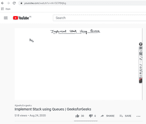

# pywhatkit 模块介绍

> 原文:[https://www . geesforgeks . org/introduction-to-pywhatkit-module/](https://www.geeksforgeeks.org/introduction-to-pywhatkit-module/)

Python 提供了许多内置的库来简化我们的工作。其中 **pywhatkit** 是一个在特定时间发送 WhatsApp 消息的 Python 库，它还有其他几个特性。

以下是 pywhatkit 模块的一些功能:

1.  发送 WhatsApp 消息。
2.  播放一段 YouTube 视频。
3.  执行谷歌搜索。
4.  获取特定主题的信息。

pywhatkit 模块还可以用于将文本转换为手写文本图像。

在 Python3 中，pywhatkit 模块不会预装，因此您可以使用以下命令进行安装:

> pip 安装 pywhatkit

### **1。发送 Whatsapp 消息:**

在这里，我们将学习使用 pywhatsapp 模块的最简单方法，该模块利用 WhatsApp 网页自动向 WhatsApp 上的任何号码发送消息。但是请确保您已经在浏览器中登录了您的 WhatsApp。

> **语法:** pywhatkit.sendmsg(“接收者手机号码”、“消息”、小时、分钟)
> 
> **参数:**
> 
> *   **接收方手机号码:**接收方手机号码必须为字符串格式，手机号码前必须提及国家代码。
> *   **消息:**要发送的消息(必须是字符串格式)。
> *   **小时:**本模块遵循 24 小时时间格式。
> *   **分钟:**提及消息预定时间的分钟数(00-59)。

**示例:**

## 蟒蛇 3

```
# importing the module
import pywhatkit

# using Exception Handling to avoid
# unprecedented errors
try:

  # sending message to receiver
  # using pywhatkit
  pywhatkit.sendwhatmsg("+91xxxxxxxxxx",
                        "Hello from GeeksforGeeks",
                        22, 28)
  print("Successfully Sent!")

except:

  # handling exception
  # and printing error message
  print("An Unexpected Error!")
```

### **2。播放一段 YouTube 视频:**

功能**pywhatkit . playannyt()**，在你的默认浏览器中打开 YouTube，播放你在功能中提到的视频。如果您将主题名称作为参数传递，它会播放该主题的随机视频。在传递视频的 URL 作为参数时，它会打开该视频。

> **语法:**pywhatkit . playhanyt(" URL/主题名")
> 
> **参数:**
> 
> *   **网址/主题名:**提及 YouTube 视频的主题名或网址

**示例:**

## 蟒蛇 3

```
# importing the module
import pywhatkit

# using Exception Handling
# to avoid exceptions
try:

  # it plays a random YouTube
  # video of GeeksforGeeks
  pywhatkit.playonyt("GeeksforGeeks")
  print("Playing...")

except:

  # printing the error message
  print("Network Error Occured")
```

**输出:**



### **3。执行谷歌搜索:**

您可以使用以下简单命令执行谷歌搜索。它会打开您的浏览器并搜索您在代码中给出的主题。

> **语法:** pywhatkit.search(“关键字”)
> 
> **参数:**
> 
> *   **关键词:**它打开你的浏览器，执行搜索操作。

**示例:**

## 蟒蛇 3

```
# importing the module
import pywhatkit

# use Try Except to
# handle the Exceptions
try:

  # it will perform the Google search
  pywhatkit.search("GeeksforGeeks")
  print("Searching...")

except:

  # Printing Error Message
  print("An unknown error occured")
```

**输出:**


### **4。获取特定主题的信息:**

我们可以获得某个特定主题的简要信息。我们还可以限制要打印的行数。此外，确保您正在搜索维基百科上可用的主题。

> **语法:** pywhatkit.info(“主题”，行数=x)
> 
> **参数:**
> 
> *   **主题:**给出所述主题的输出。
> *   **行:**以指定的行数打印搜索到的主题。

**示例:**

## 蟒蛇 3

```
# importing the module
import pywhatkit

# using Exception Handling for
# handling unprecendented errors
try:

  # it will perform google search
  pywhatkit.info("Google", lines = 4)
  print("\nSuccessfully Searched")

except:

  # printing error message
  print("An Unknown Error Occured")
```

**输出:**

> 谷歌有限责任公司是一家美国跨国科技公司，专门从事互联网相关服务和产品，包括在线广告技术、搜索引擎、云计算、软件和硬件。它被认为是与亚马逊、苹果和微软并列的四大科技公司之一。谷歌由拉里·佩奇和谢尔盖·布林于 1998 年 9 月创立，当时他们是加州斯坦福大学的博士生。他们总共拥有大约 14%的股份，并通过超级投票权控制着 56%的股东投票权。1998 年 9 月 4 日，他们在加州将谷歌注册为一家加州私人控股公司。
> 
> 已成功搜索