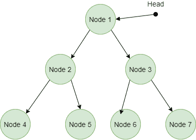
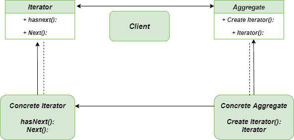

# 迭代器方法–Python 设计模式

> 原文:[https://www . geesforgeks . org/iterator-method-python-design-patterns/](https://www.geeksforgeeks.org/iterator-method-python-design-patterns/)

迭代器方法是一种 [**行为设计模式**](https://www.geeksforgeeks.org/design-patterns-set-1-introduction/) ，它允许我们遍历集合的元素，而无需暴露元素的深入细节。它提供了一种无需重复就能顺序访问复杂数据结构元素的方法。
根据**gangofore**，迭代器模式用于**“顺序访问聚合对象的元素，而不暴露其底层实现”**。

下图描述了链表数据结构。


迭代器方法链表

### 不使用迭代器方法的问题

想象一下，你正在为小孩子创建一个应用程序，它接受任何有效的字母作为输入，并返回所有字母。当此应用程序仅使用几次时，可以反复运行 [**For loop**](https://www.geeksforgeeks.org/loops-in-python/) 和 [**While loop**](https://www.geeksforgeeks.org/loops-in-python/) 但当运行频率增加时，此过程变得相当低效。所以，我们必须想办法避免这些循环。当我们处理复杂的非线性数据结构时，这个问题可能会变得更大，比如树、图，在这些数据结构中遍历并不像在数组中那样简单。
下图描述了树形数据结构的图像。



迭代器-方法-树-数据-结构

### 用迭代器方法求解

这里我们将讨论上述问题的解决方案。Python 用户使用[](https://www.geeksforgeeks.org/iterators-in-python/)**迭代器遍历任何类型的数据结构总是很方便，不管它们是线性还是非线性数据结构。我们有两个选项来实现 Python 中的迭代器，或者我们可以使用内置的迭代器来产生富有成效的输出，或者我们可以在 [**生成器**](https://www.geeksforgeeks.org/generators-in-python/) 的帮助下显式地创建迭代器。在下面的代码中，我们已经在生成器的帮助下显式地创建了迭代器。** 

****注意:**下面的代码是一个显式创建的迭代器方法的例子** 

## **蟒蛇 3**

```py
""" helper method for iterator"""

def alphabets_upto(letter):
    """Counts by word numbers, up to a maximum of five"""
    for i in range(65, ord(letter)+1):
            yield chr(i)

"""main method"""
if __name__ == "__main__":

    alphabets_upto_K = alphabets_upto('K')
    alphabets_upto_M = alphabets_upto('M')

    for alpha in alphabets_upto_K:
        print(alpha, end=" ")

    print()

    for alpha in alphabets_upto_M:
        print(alpha, end=" ")
```

****注意:**下面的代码是使用内置迭代器方法的例子** 

## **蟒蛇 3**

```py
"""utility function"""
def inBuilt_Iterator1():

    alphabets = [chr(i) for i in range(65, 91)]

    """using in-built iterator"""
    for alpha in alphabets:
        print(alpha, end = " ")
    print()

"""utility function"""
def inBuilt_Iterator2():

    alphabets = [chr(i) for i in range(97, 123)]

    """using in-built iterator"""
    for alpha in alphabets:
        print(alpha, end = " ")
    print()

"""main method"""
if __name__ == "__main__" :

    """call the inbuiltIterators"""
    inBuilt_Iterator1()
    inBuilt_Iterator2()
```

### **类图**

**下面是迭代器方法
的类图**

**

迭代器-方法-类图** 

### **优势**

*   ****单一责任原则:**在 Iterator 方法中把庞大的算法提取到单独的类中真的很容易。**
*   ****打开/关闭原则:**将新的迭代器和集合传递到客户端代码中不会破坏代码，可以很容易地安装到其中。**
*   ****易于使用的接口:**它使接口非常易于使用，并且还支持集合遍历的变化。**

### **不足之处**

*   ****不必要的资源浪费:**使用**迭代器方法**并不总是一个好习惯，因为有时在不需要复杂东西的简单应用程序中，它可能会被证明是对资源的过度消耗。**
*   ****增加复杂性:**正如我们前面所说，使用 Iterator 方法会使简单的应用程序变得复杂。**
*   ****降低效率:**就效率而言，与使用迭代器访问元素相比，直接访问元素是更好的选择。**

### **适用性** 

*   ****有限暴露:**当您想要访问较低级别的元素时，也就是说，您对元素的内部实现不感兴趣，那么最好总是使用迭代器方法。**
*   ****遍历未知数据结构:**迭代器方法可以很容易地用来遍历树、图、栈、队列等各种类型的数据结构。因为代码为集合和迭代器提供了两个通用接口。**

****进一步阅读–**[**Java 中的迭代器方法**](https://www.geeksforgeeks.org/iterator-pattern/)**