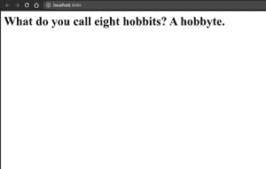

# 使用瓶子框架的笑话应用–Python

> 原文:[https://www . geesforgeks . org/joke-app-use-bottle-framework-python/](https://www.geeksforgeeks.org/joke-app-using-bottle-framework-python/)

python 中有很多框架可以让你创建像瓶子、瓶子、django 这样的网页。在本文中，您将学习如何创建简单的应用程序瓶。瓶子是一个快速、简单、轻量级的 Python WSGI 微网络框架。它是作为单个文件模块分发的，除了 Python 标准库之外没有其他依赖项。

**安装**

首先，我们必须安装必要的模块

```py
pip install bottle
```

```py
pip install pyjokes
```

你会得到有趣的一行，大部分与编程有关，只需导入一个名为 py challels 的库。

笑话库的一些方法

py chambers 中有两种方法 get _ jokes()和 get _ jokes()。

**get _ joke()**–它只返回一个笑话。我们每次都会收到随机的笑话。

**参数**–有两个参数——语言和类别。你可以从上面的语言和类别中选择。

**返回类型**–返回字符串类型(字符串)。

**get _ challenges()**–这里，我们得到一个笑话列表。

**参数**–参数同上-语言和类别。

**返回类型**–列表。

**py chambers 支持的语言:**

*   英语-' en '
*   德语–“de”
*   西班牙语–“是”
*   加利西亚语–“GL”
*   巴斯克语–“我”
*   意大利语——“它”

**黄色笑话中包含的类别:**

*   对于极客笑话——“中性”(默认选择)
*   克里斯·诺里斯的笑话——《恰克》。
*   如果你想要所有类型的笑话——“所有”
*   还有一个被称为“绕口令”的类别只适用于德语。这主要包括绕口令。

为项目**创建新目录笑话 _app**

在里面创建一个文件 **app.py**

## 蟒蛇 3

```py
from bottle import route, run, template
import pyjokes

@route('/')
def index():
    joke=pyjokes.get_joke()
    return template('index.tpl',{'joke':joke})

run(host='localhost', port=8080,debug=True)
```

然后创建新目录，并将其命名为**视图**

在里面创建新文件 **indes.tpl**

## 超文本标记语言

```py
<html>
    <head>
        <title>GFG</title>
    </head>
    <body>
         <h1>{{joke}}</h1>
    </body>
</html>
```

要运行应用程序，请打开终端或 cmd

```py
python app.py
```

**输出:-**

