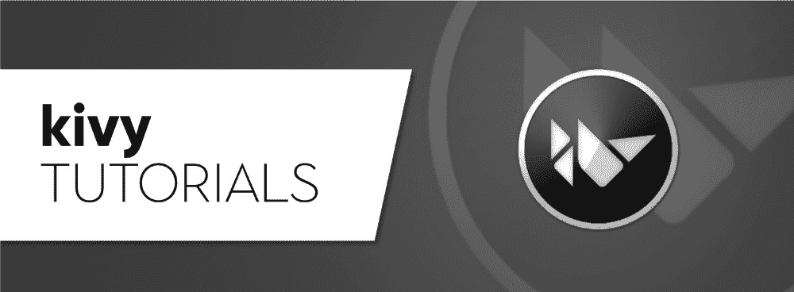

# 基维教程

> 哎哎哎:# t0]https://www . geeksforgeeks . org/kivy-tutorial/

**Kivy** 是一个图形用户界面开源 Python 库，允许你在 Windows、macOS、Android、iOS、Linux 和树莓-Pi 上开发多平台应用。除了常规的鼠标和键盘输入，它还支持**多点触控**事件。使用 Kivy 制作的应用程序在所有平台上都是相似的，但这也意味着应用程序的外观将不同于任何本地应用程序。

> **目录–**
> 
> *   [入门](#getting)
> *   [小部件](#widgets)
> *   [按钮](#buttons)
> *   [布局](#layouts)
> *   [kv 设计语言(。kv 文件教程)](#kv)
>     *   [小部件](#widgets2)
>     *   [按钮](#buttons2)
>     *   [布局](#layouts2)
> *   [应用和项目](#applications)

**[基维近况！！](https://www.geeksforgeeks.org/tag/python-kivy/)**

### 入门指南

*   [什么是 Kivy？](https://www.geeksforgeeks.org/what-is-kivy/)
*   [基维介绍&安装](https://www.geeksforgeeks.org/introduction-to-kivy/)
*   [基维的 Hello World](https://www.geeksforgeeks.org/hello-world-in-kivy/)

**小部件**

*   [Kivy 中的标签小部件](https://www.geeksforgeeks.org/python-add-label-to-a-kivy-window/)
*   [视图中的 Textinput 小部件](https://www.geeksforgeeks.org/python-textinput-widget-in-kivy/)
*   [kivy 中的画布](https://www.geeksforgeeks.org/python-canvas-in-kivy/)
*   [kivy](https://www.geeksforgeeks.org/python-line-canvas-in-kivy/)中的线条(画布)
*   [Kivy 中的复选框小部件](https://www.geeksforgeeks.org/python-checkbox-widget-in-kivy/)
*   [kivy 中的下拉列表](https://www.geeksforgeeks.org/python-dropdown-list-in-kivy/)
*   [窗口尺寸在 Kivy 中的调整](https://www.geeksforgeeks.org/python-window-size-adjustment-in-kivy/)
*   [在 kivy 中滚动浏览小部件](https://www.geeksforgeeks.org/python-scrollview-widget-in-kivy/)
*   [Kivy 中的转盘部件](https://www.geeksforgeeks.org/python-carousel-widget-in-kivy/)
*   kivy 中的 box layout widget
*   [Kivy 中的滑块小部件](https://www.geeksforgeeks.org/python-slider-widget-in-kivy/)
*   [在 Kivy 中添加图像小部件](https://www.geeksforgeeks.org/python-add-image-widget-in-kivy/)
*   [Kivy 中的弹出窗口小部件](https://www.geeksforgeeks.org/python-popup-widget-in-kivy/)
*   [在 Kivy 中切换小部件](https://www.geeksforgeeks.org/python-switch-widget-in-kivy/)
*   [kivy 中的微调器小部件](http://geeksforgeeks.org/python-spinner-widget-in-kivy/)
*   [进度条小部件在 kivy](https://www.geeksforgeeks.org/python-progress-bar-widget-in-kivy/)
*   [泡泡在基维](https://www.geeksforgeeks.org/python-bubble-in-kivy/)
*   [kivy 中的选项卡式面板](https://www.geeksforgeeks.org/python-tabbed-panel-in-kivy/)
*   [分散在基维](https://www.geeksforgeeks.org/python-scatter-in-kivy/)
*   [如何在 kivy](https://www.geeksforgeeks.org/how-to-use-multiple-ux-widgets-in-kivy-python/) 中使用多个 UX 小部件
*   [Kivy 中的动画](https://www.geeksforgeeks.org/python-animation-in-kivy/)

**按钮**

*   [在 Kivy 中使用按钮](https://www.geeksforgeeks.org/python-working-with-buttons-in-kivy/)
*   [Kivy 中的按钮动作](https://www.geeksforgeeks.org/python-button-action-in-kivy/)
*   [在 Kivy](https://www.geeksforgeeks.org/change-button-color-in-kivy/) 中更改按钮颜色
*   [更改 Kivy 中按钮的大小和位置](https://www.geeksforgeeks.org/change-the-size-and-position-of-button-in-kivy/)
*   [Python–在 kivy 中舍入按钮角](https://www.geeksforgeeks.org/python-rounding-button-corners-in-kivy/)
*   [禁用 Kivy 按钮](https://www.geeksforgeeks.org/disable-kivy-button/)
*   [带有 kivy 中验证按钮的文本输入框](https://www.geeksforgeeks.org/text-input-box-with-a-verification-button-in-kivy/)
*   [在 kivy](https://www.geeksforgeeks.org/use-image-as-a-button-in-kivy/) 中使用图像作为按钮

**布局**

*   [基维中的浮动布局](https://www.geeksforgeeks.org/python-float-layout-in-kivy/)
*   [基维的网格布局](https://www.geeksforgeeks.org/gridlayouts-in-kivy-python/)
*   [Kivy 中的 StackLayout](https://www.geeksforgeeks.org/python-stacklayout-in-kivy/)
*   [基维的锚点铺设](https://www.geeksforgeeks.org/python-anchorlayout-in-kivy/)
*   [基维相对布局](https://www.geeksforgeeks.org/python-relative-layout-in-kivy/)
*   [基维页面布局](https://www.geeksforgeeks.org/python-pagelayout-in-kivy/)
*   [Kivy 中布局(多个布局)中的布局](https://www.geeksforgeeks.org/python-layouts-in-layouts-multiple-layouts-in-kivy/)

### 千伏设计语言(。kv 文件教程)

**小部件**

*   [Kivy .kv 文件](https://www.geeksforgeeks.org/python-kivy-kv-file/)
*   [使用创建盒子布局小部件。kv 文件](https://www.geeksforgeeks.org/python-create-box-layout-widget-using-kv-file/)
*   [画布在基维使用。kv 文件](https://www.geeksforgeeks.org/python-canvas-in-kivy-using-kv-file/)
*   [文本输入在 kivy 中使用。kv 文件](https://www.geeksforgeeks.org/python-textinput-in-kivy-using-kv-file/)
*   [使用创建复选框。kv 文件](https://www.geeksforgeeks.org/python-create-checkbox-using-kv-file/)
*   [Python | kivy 中的下拉列表使用。kv 文件](https://www.geeksforgeeks.org/python-drop-down-list-in-kivy-using-kv-file/)
*   [使用 kivy 中的下拉列表。kv 文件](https://www.geeksforgeeks.org/python-drop-down-list-in-kivy-using-kv-file/)
*   [使用在 Kivy 中切换小部件。kv 文件](https://www.geeksforgeeks.org/python-switch-widget-in-kivy-using-kv-file/)
*   [使用 Kivy 中的微调器小部件。kv 文件](https://www.geeksforgeeks.org/python-spinner-widget-in-kivy-using-kv-file/)
*   [在 Kivy 中使用弹出小部件。kv 文件](https://www.geeksforgeeks.org/python-popup-widget-in-kivy-using-kv-file/)
*   [轮播小部件在基维使用。kv 文件](https://www.geeksforgeeks.org/python-carousel-widget-in-kivy-using-kv-file/)
*   [滑块小部件使用。kv 文件](https://www.geeksforgeeks.org/python-slider-widget-using-kv-file/)
*   [使用 kivy 中的 Progressbar 小部件。kv 文件](https://www.geeksforgeeks.org/python-progressbar-widget-in-kivy-using-kv-file/)
*   [Kivy 中的 recycle view](https://www.geeksforgeeks.org/python-recycleview-in-kivy/)
*   [使用在 Kivy 中添加图像。kv 文件](https://www.geeksforgeeks.org/python-adding-image-in-kivy-using-kv-file/)
*   [在 kivy](https://www.geeksforgeeks.org/python-set-background-template-in-kivy/) 中设置背景模板
*   [屏幕管理器在 Kivy 中使用。kv 文件](https://www.geeksforgeeks.org/python-screenmanager-in-kivy-using-kv-file/)
*   [动画在 Kivy 中使用。kv 文件](https://www.geeksforgeeks.org/python-animation-in-kivy-using-kv-file/)

**按钮**

*   [Python |使用 Kivy 中的按钮。kv 文件](https://www.geeksforgeeks.org/python-working-with-buttons-in-kivy-with-kv-file/)
*   [Python–使用 kivy 更改按钮颜色。kv 文件](https://www.geeksforgeeks.org/python-change-button-color-in-kivy-using-kv-file/)
*   [Python–使用 kv 文件](https://www.geeksforgeeks.org/python-change-kivy-button-size-and-position-using-kv-file/)更改 kivy 按钮的大小和位置
*   [在 kivy 中切换按钮使用。kv 文件](https://www.geeksforgeeks.org/python-toggle-button-in-kivy-using-kv-file/)
*   [使用添加图像按钮。kivy 中的 kv 文件](https://www.geeksforgeeks.org/add-image-button-using-kv-file-in-kivy/)
*   [Python–使用 kivy 舍入按钮角。kv 文件](https://www.geeksforgeeks.org/python-rounding-button-corners-in-kivy-using-kv-file/)
*   [禁用 kivy 按钮使用。kv 文件](https://www.geeksforgeeks.org/disable-kivy-button-using-kv-file/)
*   [kivy–Python 中的浮动动作类型按钮](https://www.geeksforgeeks.org/floating-action-type-button-in-kivy-python/)
*   [kivy–Python 中的动画浮动动作按钮](https://www.geeksforgeeks.org/animated-floating-action-button-in-kivy-python/)
*   [文本输入框，带有 kivy 中的验证按钮(使用。kv 档)](https://www.geeksforgeeks.org/text-input-box-with-a-verification-button-in-kivy-using-kv-file/)
*   [圆形(类似椭圆形)按钮使用画布中的 kivy(使用。kv 档)](https://www.geeksforgeeks.org/circular-oval-like-button-using-canvas-in-kivy-using-kv-file/)

**布局**

*   [不带的 Kivy 中的网格布局。kv 文件](https://www.geeksforgeeks.org/python-grid-layout-in-kivy-without-kv-file/)
*   [在 Kivy 中使用 StackLayout。kv 文件](https://www.geeksforgeeks.org/python-stacklayout-in-kivy-using-kv-file/)
*   [使用 Kivy 中的 FloatLayout。kv 文件](https://www.geeksforgeeks.org/python-floatlayout-in-kivy-using-kv-file/)
*   [Kivy 中的锚点布局使用。kv 文件](https://www.geeksforgeeks.org/python-anchorlayout-in-kivy-using-kv-file/)
*   [基维使用中的相对布局。kv 文件](https://www.geeksforgeeks.org/python-relative-layout-in-kivy-using-kv-file/)
*   [页面布局在 Kivy 中使用。kv 文件](https://www.geeksforgeeks.org/python-pagelayout-in-kivy-using-kv-file/)

### 应用程序和项目

*   [Kivy 中的椭圆(不同多边形)](https://www.geeksforgeeks.org/python-ellipse-different-polygons-in-kivy/)
*   [用 kivy](https://www.geeksforgeeks.org/python-make-a-simple-window-using-kivy/) 做一个简单的窗口
*   [kivy 中的 Vkeyboard(虚拟键盘)](https://www.geeksforgeeks.org/python-vkeyboard-virtual-keyboard-in-kivy/)
*   [多个滑块部件控制 Kivy 中的背景屏幕或窗口颜色](https://www.geeksforgeeks.org/python-multiple-sliders-widgets-controlling-background-screen-or-windowcolor-in-kivy/)
*   [如何在 kivy 中使用多个 kv 文件](https://www.geeksforgeeks.org/python-how-to-use-multiple-kv-files-in-kivy/)
*   [基维手风琴](https://www.geeksforgeeks.org/python-accordion-in-kivy/)
*   [手风琴在基维使用。kv 文件](https://www.geeksforgeeks.org/python-accordion-in-kivy-using-kv-file/)
*   [在 kivy 中创建简单绘图应用程序](https://www.geeksforgeeks.org/python-creating-a-simple-drawing-app-in-kivy/)
*   [kivy 中的文件选择器](https://www.geeksforgeeks.org/python-file-chooser-in-kivy/)
*   [用 kivy](https://www.geeksforgeeks.org/how-to-make-calculator-using-kivy-python/) 做一个计算器
*   [使用 kivy 中的时钟对象创建秒表。kv 文件](https://www.geeksforgeeks.org/python-create-a-stopwatch-using-clock-object-in-kivy-using-kv-file/)
*   [在 kivy](https://www.geeksforgeeks.org/python-create-a-stopwatch-using-clock-object-in-kivy/) 中使用时钟对象创建秒表