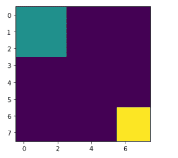

# Python maho tas 中的标记图像函数

> 原文:[https://www . geesforgeks . org/label-image-function-in-python-maho tas/](https://www.geeksforgeeks.org/labeled-image-function-in-python-mahotas/)

在本文中，我们将看到如何从 mahotas 中的二元函数中获得标记函数。标记图像是整数图像，其中的值对应于不同的区域。即，区域 1 是具有值 1 的所有像素，区域 2 是具有值 2 的像素，以此类推。按照惯例，区域 0 是背景，通常处理方式不同。为了做到这一点，我们将使用 mahotas.label 方法

> **语法:**maho tas . label(regions)
> **参数:**它以 numpy . ndaray 对象作为参数
> **返回:**它返回 numpy . ndaray 对象和整数值

**例 1:**

## 蟒蛇 3

```
# importing required libraries
import mahotas as mh
import numpy as np
from pylab import imshow, show

# creating region
# numpy.ndarray
regions = np.zeros((8, 8), bool)

# setting 1 value to the region
regions[:3, :3] = 1
regions[6:, 6:] = 1

# getting labelled function
labelled, nr_objects = mh.label(regions)

# showing the image with interpolation = 'nearest'
imshow(labelled, interpolation ='nearest')
show()
```

**输出:**



**例 2:**

## 蟒蛇 3

```
# importing required libraries
import mahotas as mh
import numpy as np
from pylab import imshow, show

# creating region
# numpy.ndarray
regions = np.zeros((10, 10), bool)

# setting 1 value in the region
regions[1, 1] = 1
regions[6, 6] = 1
regions[4, 4] = 1
regions[9, 9] = 1

# getting labelled function
labelled, nr_objects = mh.label(regions)

# showing the image with interpolation = 'nearest'
imshow(labelled, interpolation ='nearest')
show()
```

**输出:**

