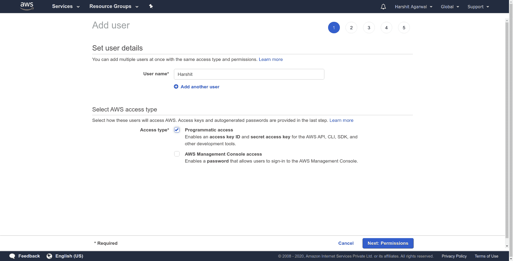
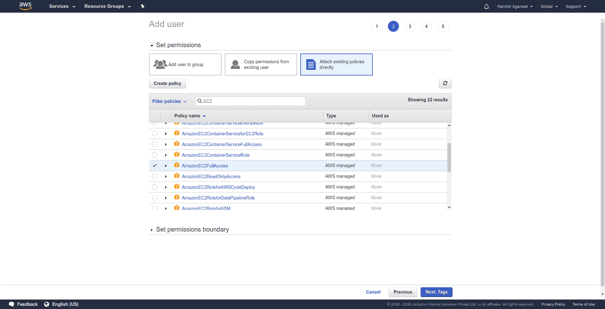
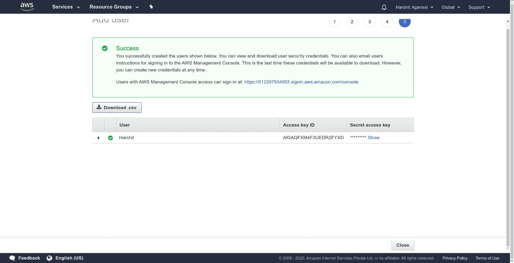
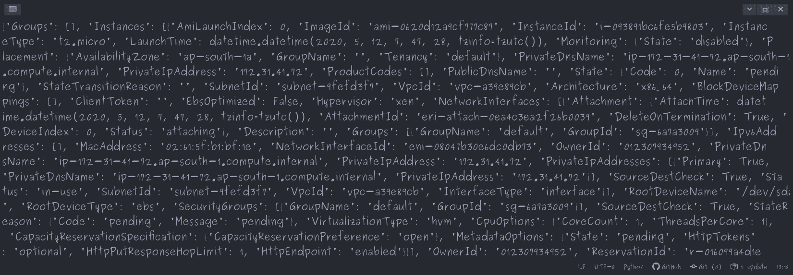

# 使用 Python 启动 AWS EC2 实例

> 原文:[https://www . geeksforgeeks . org/launching-AWS-ec2-instance-using-python/](https://www.geeksforgeeks.org/launching-aws-ec2-instance-using-python/)

在本文中，我们将了解 python 如何用于创建和管理亚马逊网络服务(AWS)，如弹性计算云(EC2)、简单存储服务(S3)、关系数据库服务(RDS)。为此，我们将使用 python 的 boto3 库，boto 是一个 Python 包，它提供了到 Amazon Web Services (AWS)的接口。

### **先决条件:**

*   具有权限的 AWS 帐户
*   [EC2](https://www.geeksforgeeks.org/what-is-elastic-compute-cloud-ec2/) 基础

对于在 python 中安装 boto3:

```py
default version : pip install boto3
specific version : python3 -m pip install boto3 (as python3 in this case)

```

### 设置 AWS EC2 控制台:

为了从 python 代码访问 AWS 服务，我们首先需要创建一个用户，并使用 Amazon console 为他提供编程访问。

*   启动 [IAM](https://console.aws.amazon.com/iam/home#/users) 控制台
*   添加用户


*   然后提供用户名，并以编程方式访问它，然后单击“下一步”。



*   现在提供与用户相关的必要权限，该用户可能属于一个组，他们的策略可以直接附加到该用户，或者我们可以复制现有用户的策略，或者我们可以直接附加现有策略，如我们将在这里提供的。



*   标签是可选的，我们可以跳过它，检查权限，最后创建用户。下载 CSV，因为这是最后一次可以下载，该文件包含访问密钥标识和密钥，下一次将在代码中使用。



现在，我们都准备使用 python 代码启动我们的 EC2 实例。为了与 EC2 实例建立连接，我们使用了 boto3 的客户端应用编程接口。客户端应用编程接口接受以下参数来与 AWS 服务建立连接。

*   **服务名称:**必须与之建立连接的服务。
*   **地区:**亚马逊 EC2 在全球多个地点托管。根据我们的需要，我们可以选择我们的地区，我们把亚太地区作为我们的地区。
*   **aws_access_key_id:** AWS 安全凭据。在空白处粘贴下载的 ID。
*   **AWS _ secret _ access _ key:**AWS 安全凭据。将下载的密钥粘贴到空白处。

#### **实施:**

## 蟒蛇 3

```py
#Python Program for creating a connection
import boto3

ec2 = boto3.client('ec2',
                   'ap-south-1',
                   aws_access_key_id='',
                   aws_secret_access_key='')

#This function will describe all the instances
#with their current state 
response = ec2.describe_instances()
print(response)
```

**输出**


### **创建实例**:

***ec2 . run _ instances***使用您拥有权限的 AMI 启动指定数量的实例。它提供了多种启动配置，但是我们可以用以下几个参数启动实例。

*   **实例类型:**您指定的实例类型决定了用于实例的主机的硬件。每种实例类型都提供不同的计算、内存和存储能力，并根据这些能力分组到实例系列中。但是，AWS 在自由层限制中免费提供“t2.micro”。
*   **最大计数:**要启动的最大实例数。如果最大计数>在目标可用性区域中有可用实例，那么它将启动大于最小计数的最大实例数。
*   **最小计数:**要启动的最小实例数。如果目标可用性区域<中有可用实例，则不启动任何实例。
*   **ImageId:** 用于启动实例的 AMI 的 Id。对于我们的案例，我们选择了 Ubuntu 服务器 18.04 LTS (HVM)，固态硬盘卷类型(ami-02d55cb47e83a99a0)。

#### **实施:**

## 蟒蛇 3

```py
#Python Program for creating a connection
import boto3

#Function for connecting to EC2 
ec2 = boto3.client('ec2',
                   'ap-south-1',
                   aws_access_key_id='',
                   aws_secret_access_key='')

#Function for running instances
conn = ec2.run_instances(InstanceType="t2.micro",
                         MaxCount=1,
                         MinCount=1,
                         ImageId="ami-02d55cb47e83a99a0")
print(conn)
```

**输出**

