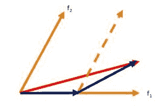

# 最小角度回归(LARS)

> 原文:[https://www.geeksforgeeks.org/least-angle-regression-lars/](https://www.geeksforgeeks.org/least-angle-regression-lars/)

回归是一种有监督的机器学习任务，它可以预测连续值(实数)，而分类可以预测分类或离散值。在我们开始之前，如果你是初学者，我强烈推荐[这篇](https://www.geeksforgeeks.org/ml-linear-regression/)文章。
最小角度回归(LARS)是一种用于高维数据(即具有大量属性的数据)回归的算法。最小角度回归有点类似于正向逐步回归。由于它与具有许多属性的数据一起使用，因此在每一步中，LARS 都会找到与目标值最相关的属性。可能有多个属性具有相同的相关性。在这种情况下，LARS 对属性进行平均，并沿着与属性相同的方向前进。这也正是这个算法被称为**最小角度**回归的原因。基本上，LARS 在不过度拟合模型的情况下，在最优化计算的方向上进行跳跃。
**算法:**

*   将所有值标准化，使平均值和单位方差为零。
*   找到一个与残差最相关的变量。沿着这个方向移动回归线，直到我们到达另一个具有相同或更高相关性的变量。

**注:** **残差**为观测值与预测值之差。**变量**，这里隐含一个属性。

*   当我们有两个具有相同相关性的变量时，以介于两者之间的角度(即两个变量之间的最小角度)移动回归线。
*   继续这样，直到我们所有的数据都用完，或者直到您认为模型足够大和“一般”。



数学上，LARS 的工作原理如下:

*   所有系数‘B’都设置为 0。
*   发现预测因子 x <sub>j</sub> 与 y 最相关。
*   在与 y 最相关的方向增加系数 B <sub>j</sub> ，当你发现其他预测因子 x <sub>k</sub> 的相关性等于或高于 x <sub>j</sub> 时，停止。
*   向与 x <sub>j</sub> 和 x <sub>k</sub> 等角的方向延伸(B <sub>j</sub> ，B <sub>k</sub> )。
*   继续并重复，直到模型中包含所有预测因子。

**在 Python3 中实现 LARS:**
对于本例，我们将使用波士顿住房数据集，该数据集具有波士顿马萨诸塞州地区的房屋中值。你可以在这里了解更多关于这个数据集[的信息。
对于评估，我们将使用 r2 评分。最好的 r2 分数是 1.0。当预测器总是预测一个恒定值时，无论属性值如何，它也可以是负的并且是 0。
**代码:**](https://www.cs.toronto.edu/~delve/data/boston/bostonDetail.html#:~:text=The%20Boston%20Housing%20Dataset, the%20area%20of%20Boston%20Mass.) 

## 蟒蛇 3

```py
# Importing modules that are required

from sklearn.datasets import load_boston
from sklearn.linear_model import LassoLars
from sklearn.metrics import r2_score
from sklearn.model_selection import train_test_split

# Loading dataset
dataset = load_boston()
X = dataset.data
y = dataset.target

# Splitting training and testing data
X_train, X_test, y_train, y_test = train_test_split(X, y,
                     test_size = 0.15, random_state = 42)

# Creating and fitting the regressor
regressor = LassoLars(alpha = 0.1)
regressor.fit(X_train, y_train)

# Evaluating model
prediction = regressor.predict(X_test)

print(f"r2 Score of test set : {r2_score(y_test, prediction)}")
```

**输出:**

```py
r2 Score of test set : 0.6815908068381828
```

我们获得了大约 0.6816 的 r2 分数，这实际上相当不错。
**使用 LARS 的优势:**

*   计算速度与正向选择一样快，但有时可能更准确。
*   当要素的数量远大于数据实例的数量时，数值效率非常高。
*   它可以很容易地被修改以产生其他估计器的解。

**使用 LARS 的缺点:**

*   LARS 对噪音高度敏感，有时会产生不可预测的结果。

**参考:**

*   [维基百科](https://en.wikipedia.org/wiki/Least-angle_regression)
*   [sci kit-学习文档](https://scikit-learn.org/stable/modules/linear_model.html#least-angle-regression)
*   [迈向数据科学](https://towardsdatascience.com/ml-algorithms-one-sd-%CF%83-regularization-algorithms-728af0e92f84)