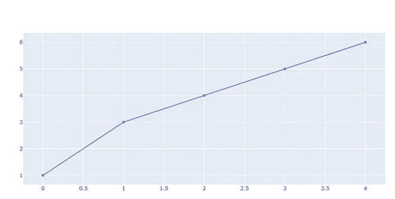
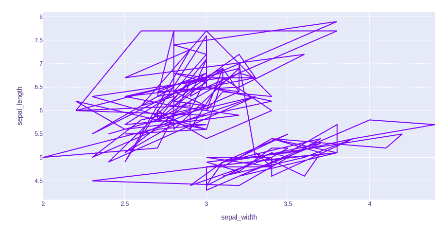
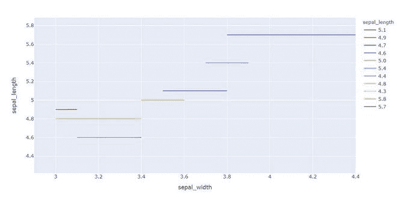
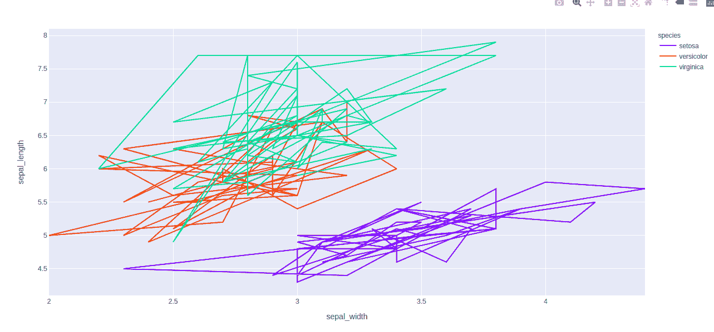

# Python 中使用 Plotly 的折线图

> 原文:[https://www . geesforgeks . org/折线图-使用 python 中的 plotly/](https://www.geeksforgeeks.org/line-chart-using-plotly-in-python/)

**Plotly** 是一个 Python 库，用来设计图形，尤其是交互图形。它可以绘制各种图形和图表，如直方图、条形图、箱线图、展开图等。它主要用于数据分析以及财务分析。plotly 是一个交互式可视化库。

## 图表中的折线图

plotly 中的**线图**对 Plotly 来说是非常容易访问和显著的补充，它管理各种类型的数据并汇编易于使用的统计数据。使用 px.line，每个数据位置被表示为 2D 空间中折线标记的顶点变换(该位置由 x 和 y 列给出)。折线图将一系列数字数据显示为由线连接的点。它可视化地显示了两个数据趋势。主要的生产功能是它可以显示成千上万的数据点，而无需滚动。可以使用 plotly.express 类的 line()方法创建。

> **语法:**plot . express . line(data _ frame =无，x =无，y =无，line _ group =无，color =无，line _ dash =无，hover _ name =无，hover _ data =无，custom _ data =无，text =无，facet _ row =无，facet _ col =无，facet_col_wrap=0，error _ x =无，error _ x _ 减=无，error _ y =无，error _ y _ 减=无，animation _ frame =无，animation _ group =无

**参数:**

<figure class="table">

| 名字 | 描述 |
| --- | --- |
| 数据帧 | 类数组和字典在内部被转换成熊猫数据帧。可选:如果缺少，则使用其他参数在头罩下构造一个数据帧。 |
| x | 数据框中的列名，熊猫系列或类似数组的对象。此列或 array_like 中的值用于在笛卡尔坐标中沿 x 轴定位标记。x 或 y 可以选择是列引用或 array _ likes 的列表，在这种情况下，数据将被视为“宽”而不是“长”。 |
| y | 数据框中的列名，熊猫系列或类似数组的对象。此列或 array_like 中的值用于在笛卡尔坐标中沿 y 轴定位标记。x 或 y 可以选择是列引用或 array _ likes 的列表，在这种情况下，数据将被视为“宽”而不是“长”。 |
| 行 _ 组 | 数据框中的列名，熊猫系列或类似数组的对象。来自该列或类似数组的值用于将 data_frame 的行分组为行。 |
| 线条 _ 虚线 | 数据框中的列名，熊猫系列或类似数组的对象。来自该列或 array_like 的值用于为线条指定虚线图案。 |

</figure>

## **创建简单的折线图**

**示例 1:** 在本例中，我们将看到一个简单的线图，其中包含两个不同的数据集。

## 蟒蛇 3

```py
import plotly.express as px

x = [1,2,3,4,5]
y = [1,3,4,5,6]
fig = px.line( x = x ,
              y = y,
              title = 'A simple line graph')
fig.show()
```

**输出:**


**示例 2:** 在本例中，我们将使用 go . scatter . plot . express 进行绘图有两个功能散射和线、 go。根据模式的值，散布可以用于绘制点(标记)或线。

## 蟒蛇 3

```py
import numpy as np
import plotly.graph_objects as go

x = [0, 1, 2, 3, 4, 5, 6, 7, 8, 9]
y = [1, 3, 4, 5, 6]
fig = go.Figure(data=go.Scatter(x = x, y = y))
fig.show()
```

**输出:**



**示例 3:** 使用 Iris 数据集，我们将绘制折线图。

## 蟒蛇 3

```py
import plotly.express as px

# Loading the iris dataset
df = px.data.iris()

fig = px.line(df, x="sepal_width", y="sepal_length")
fig.show()
```

**输出:**



## **映射编码颜色**

列编码颜色也称为颜色映射，这是一种以颜色内联形式表示文本或数字数据的方法。

**示例 1:** 在本例中，我们将使用颜色属性以不同的颜色绘制线条。

## 蟒蛇 3

```py
import plotly.express as px

df = px.data.iris().head(20)

fig = px.line(df, x = "sepal_width",
              y = "sepal_length" ,
              color = "sepal_length")
fig.show()
```

**输出:**



**例 2:** 在本例中，我们将使用不同的颜色方面。

## 蟒蛇 3

```py
import plotly.express as px

# Loading the iris dataset
df = px.data.iris()

fig = px.line(df, x = "sepal_width", y = "sepal_length",
              color = "species")
fig.show()
```

**输出:**

