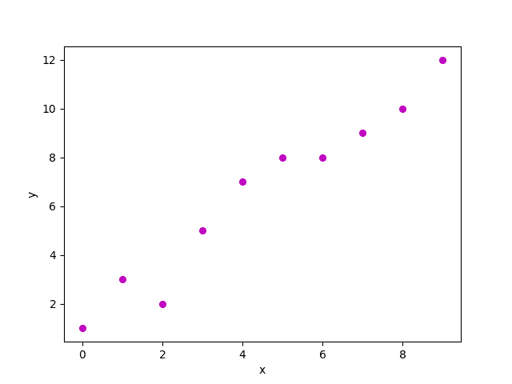
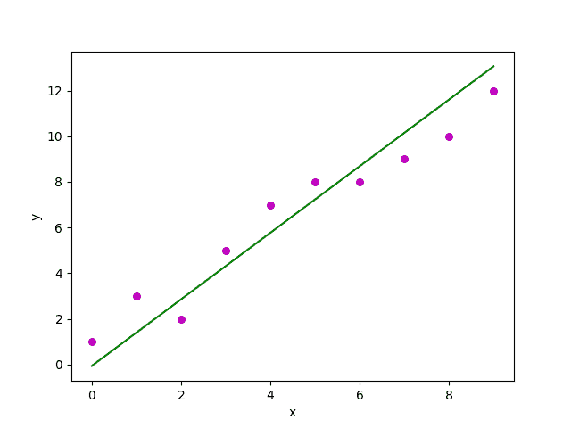
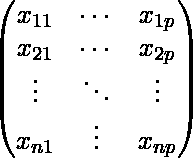
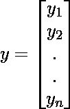
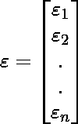
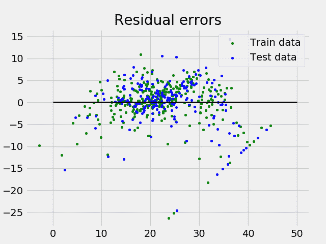
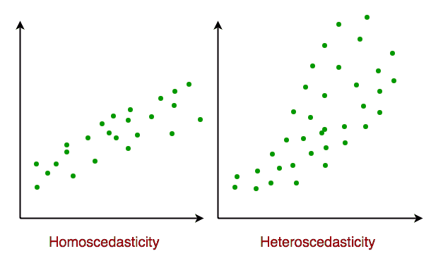

# 线性回归(Python 实现)

> 原文:[https://www . geesforgeks . org/线性回归-python-实现/](https://www.geeksforgeeks.org/linear-regression-python-implementation/)

本文讨论线性回归的基础及其在 Python 编程语言中的实现。
线性回归是一种统计方法，用于建模因变量与给定的一组自变量之间的关系。

**注:**在本文中，为了简单起见，我们将因变量称为**反应**，将自变量称为**特征**。
为了提供对线性回归的基本认识，我们先从最基础版本的线性回归开始，即**简单线性回归**。

## 简单线性回归

简单线性回归是一种使用**单一特征**预测**响应**的方法。
假设这两个变量线性相关。因此，我们试图找到一个线性函数，尽可能准确地预测响应值(y)作为特征或独立变量(x)的函数。
让我们考虑一个数据集，其中每个特征 x 的响应 y 值为:


为了通用性，我们定义:
x 为**特征向量**，即 x = [x_1，x_2，…。，x_n]，
y 为**响应向量**，即 y = [y_1，y_2，…。，y_n]
表示 **n** 个观察值(在上例中，n=10)。
上述数据集的散点图如下所示



现在，任务是在上面的散点图中找到最适合的**线，这样我们就可以预测任何新特征值的响应。(即数据集中不存在 x 值)
这条线称为**回归线**。
回归线方程表示为:
**

在这里，

*   h(x_i)代表第 I 次<sup>观察的**预测响应值**。</sup>
*   b_0 和 b_1 为回归系数，分别代表回归线的 **y 截距**和**斜率**。

为了创建我们的模型，我们必须“学习”或估计回归系数 b_0 和 b_1 的值。一旦我们估算了这些系数，我们就可以用这个模型来预测反应了！
在本文中，我们将使用**最小二乘**原理。
现在考虑:

这里，e_i 是一个**残差**在 ith 观测中。
所以，我们的目标是最小化总残差。
我们把平方误差或成本函数，J 定义为:

，我们的任务是找出 J(b_0，b_1)最小的 b_0 和 b_1 的值！
不赘述数学细节，我们在这里呈现结果:


其中 SS_xy 是 y 和 x 的交叉偏差之和:

而 SS_xx 是 x 的平方偏差之和:

注:在简单线性回归中求最小二乘估计的完整推导可以在这里找到。

**代码:上述技术在我们的小数据集**上的 Python 实现

## 计算机编程语言

```py
import numpy as np
import matplotlib.pyplot as plt

def estimate_coef(x, y):
    # number of observations/points
    n = np.size(x)

    # mean of x and y vector
    m_x = np.mean(x)
    m_y = np.mean(y)

    # calculating cross-deviation and deviation about x
    SS_xy = np.sum(y*x) - n*m_y*m_x
    SS_xx = np.sum(x*x) - n*m_x*m_x

    # calculating regression coefficients
    b_1 = SS_xy / SS_xx
    b_0 = m_y - b_1*m_x

    return (b_0, b_1)

def plot_regression_line(x, y, b):
    # plotting the actual points as scatter plot
    plt.scatter(x, y, color = "m",
               marker = "o", s = 30)

    # predicted response vector
    y_pred = b[0] + b[1]*x

    # plotting the regression line
    plt.plot(x, y_pred, color = "g")

    # putting labels
    plt.xlabel('x')
    plt.ylabel('y')

    # function to show plot
    plt.show()

def main():
    # observations / data
    x = np.array([0, 1, 2, 3, 4, 5, 6, 7, 8, 9])
    y = np.array([1, 3, 2, 5, 7, 8, 8, 9, 10, 12])

    # estimating coefficients
    b = estimate_coef(x, y)
    print("Estimated coefficients:\nb_0 = {}  \
          \nb_1 = {}".format(b[0], b[1]))

    # plotting regression line
    plot_regression_line(x, y, b)

if __name__ == "__main__":
    main()
```

**输出:**

```py
Estimated coefficients:
b_0 = -0.0586206896552
b_1 = 1.45747126437
```

得到的图是这样的:



## 多元线性回归

多元线性回归试图通过将线性方程拟合到观测数据来模拟两个或多个特征**和响应之间的关系。
显然，这不过是简单线性回归的延伸。
考虑具有 **p** 特征(或自变量)和一个响应(或因变量)的数据集。
此外，数据集包含 **n** 行/观测值。
我们定义:
X ( **特征矩阵** ) =一个大小为 **n X p** 的矩阵，其中 x_{ij}表示具有观察的 jth 特征的值。
因此，

和
y ( **响应向量** ) =大小为 **n** 的向量，其中 y_{i}表示 ith 观察的响应值。

**特征的回归线**表示为:

，其中 h(x_i)为 ith 观测的**预测响应值**，b_0，b_1，…，b_p 为**回归系数**。
同样，我们可以写:

其中 e_i 代表**在 ith 观测中的残差**。
我们可以通过将特征矩阵 **X** 表示为:

来将我们的线性模型更一般化一点，所以现在，线性模型可以用矩阵表示为:

其中，

和

现在，我们使用**最小二乘法**来确定 b 的**估计，即 b’
如前所述，最小二乘法倾向于确定总残差最小的 b’。
我们在这里直接给出结果:

其中‘’代表矩阵的转置，而-1 代表矩阵的逆矩阵。
已知最小二乘估计 b’，多元线性回归模型现在可以估计为:

，其中 y’是**估计的响应向量**。
**注:**多元线性回归中获取最小二乘估计的完整推导可以在这里找到。****

**代码:使用 Scikit-learn 在波士顿房价数据集上 Python 实现多元线性回归技术。**

## 计算机编程语言

```py
import matplotlib.pyplot as plt
import numpy as np
from sklearn import datasets, linear_model, metrics

# load the boston dataset
boston = datasets.load_boston(return_X_y=False)

# defining feature matrix(X) and response vector(y)
X = boston.data
y = boston.target

# splitting X and y into training and testing sets
from sklearn.model_selection import train_test_split
X_train, X_test, y_train, y_test = train_test_split(X, y, test_size=0.4,
                                                    random_state=1)

# create linear regression object
reg = linear_model.LinearRegression()

# train the model using the training sets
reg.fit(X_train, y_train)

# regression coefficients
print('Coefficients: ', reg.coef_)

# variance score: 1 means perfect prediction
print('Variance score: {}'.format(reg.score(X_test, y_test)))

# plot for residual error

## setting plot style
plt.style.use('fivethirtyeight')

## plotting residual errors in training data
plt.scatter(reg.predict(X_train), reg.predict(X_train) - y_train,
            color = "green", s = 10, label = 'Train data')

## plotting residual errors in test data
plt.scatter(reg.predict(X_test), reg.predict(X_test) - y_test,
            color = "blue", s = 10, label = 'Test data')

## plotting line for zero residual error
plt.hlines(y = 0, xmin = 0, xmax = 50, linewidth = 2)

## plotting legend
plt.legend(loc = 'upper right')

## plot title
plt.title("Residual errors")

## method call for showing the plot
plt.show()
```

**输出:**

```py
Coefficients:
[ -8.80740828e-02   6.72507352e-02   5.10280463e-02   2.18879172e+00
-1.72283734e+01   3.62985243e+00   2.13933641e-03  -1.36531300e+00
2.88788067e-01  -1.22618657e-02  -8.36014969e-01   9.53058061e-03
-5.05036163e-01]
Variance score: 0.720898784611
```

**残差图**如下图所示:



在上面的例子中，我们使用**解释方差分数**来确定准确度分数。
我们定义:
explained _ variation _ score = 1–Var { y–y ' }/Var { y }
其中 y '是估计的目标产量，y 是对应的(正确的)目标产量，Var 是方差，标准差的平方。
最好的可能得分是 1.0，数值越低越差。

## 假设:

下面给出了线性回归模型对应用它的数据集所做的基本假设:

*   **线性关系**:响应和特征变量之间的关系应该是线性的。线性假设可以用散点图来检验。如下所示，第一个数字代表线性相关变量，而第二个和第三个数字中的变量很可能是非线性的。因此，第一个数字将使用线性回归给出更好的预测。


*   **很少或没有多重共线性**:假设数据中很少或没有多重共线性。当特征(或自变量)彼此不独立时，就会出现多重共线性。
*   **很少或没有自相关**:另一个假设是数据中很少或没有自相关。当残差不相互独立时，就会出现自相关。您可以参考这里的了解更多关于这个话题的信息。
*   **同质性**:同质性描述了误差项(即自变量和因变量之间关系中的“噪声”或随机扰动)在自变量的所有值上相同的情况。如下所示，图 1 具有同异方差性，而图 2 具有异方差性。



随着本文的结束，我们将在下面讨论线性回归的一些应用。

## 应用:

*   **趋势线:**趋势线代表定量数据随时间的变化(如 GDP、油价等)。).这些趋势通常遵循线性关系。因此，线性回归可用于预测未来值。然而，在其他潜在变化可能影响数据的情况下，这种方法缺乏科学有效性。
*   **经济学:**线性回归是经济学中占主导地位的经验工具。例如，它用于预测消费者支出、固定投资支出、库存投资、购买一个国家的出口、进口支出、持有流动资产的需求、劳动力需求和劳动力供应。
*   **金融:**资本价格资产模型使用线性回归分析和量化一项投资的系统风险。
    **4。生物学:**线性回归用于模拟生物系统中参数之间的因果关系。

### 参考文献:

*   [https://en.wikipedia.org/wiki/Linear_regression](https://en.wikipedia.org/wiki/Linear_regression)
*   [https://en.wikipedia.org/wiki/Simple_linear_regression](https://en.wikipedia.org/wiki/Simple_linear_regression)
*   [http://sci kit-learn . org/stable/auto _ examples/linear _ model/plot _ ols . html](http://scikit-learn.org/stable/auto_examples/linear_model/plot_ols.html)
*   [http://www . statisticsolutions . com/线性回归假设/](http://www.statisticssolutions.com/assumptions-of-linear-regression/)