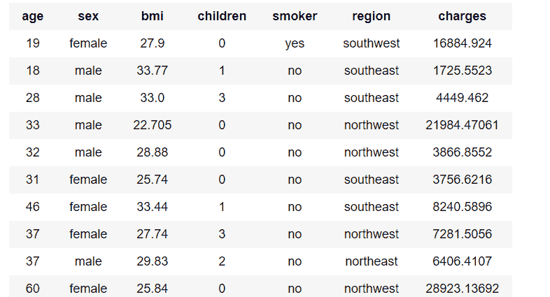
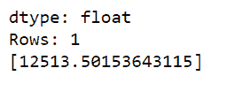

# 使用图创建的线性回归

> 原文:[https://www . geeksforgeeks . org/线性回归-使用-turicreate/](https://www.geeksforgeeks.org/linear-regression-using-turicreate/)

线性回归是一种监督学习的方法或途径。监督学习取历史或过去的数据，然后训练模型，根据过去的结果预测事物。线性回归来自“线性”和“回归”两个词。回归概念处理使用过去的数据预测未来。线性是指能够在图上用直线表示。线性回归有两个东西一个自变量和一个因变量，线性回归是两者之间的关系。

在本文中，我们将学习如何在 Turicreate 的帮助下实现线性回归。Turicreate 是 Python 中的一个库，帮助初学者轻松高效地学习和实现机器学习算法。

**步骤 1:导入图创建库**

## 蟒蛇 3

```py
import turicreate as tc
```

**第二步:读取数据集。**

## 蟒蛇 3

```py
"""
The good thing about Turicreate is that we don't have
import any other library for data loading.Turicreate
itself can load data with the help of it's SFrame
Data Structure
"""
data_sets = tc.SFrame("data.csv")
```

数据链接为=[https://www.kaggle.com/mirichoi0218/insurance](https://www.kaggle.com/mirichoi0218/insurance)
T3】第三步:探索数据

## 蟒蛇 3

```py
# It will display the first few Lines of the data
data.head()
```

**输出:**



数据集前几行

**第四步:制作线性回归模型。**

## 蟒蛇 3

```py
# We will have a target variable that stores the thing
# to the predicted and feature is the list of elements
# which we will take for making the model.
model = tc.linear_regression.create(
    data, target ="charges", features =['region'])
```

**第五步:现在评估模型**

## 蟒蛇 3

```py
# this will tell us about the max error and
# the rmse (root mean squared error)
model.evaluate(data)
```

**输出:**


最大误差和 Rmse

**第六步:现在根据人的血压预测收费**

## 蟒蛇 3

```py
# this variable will be containing the data
# of person having the bmi 27.9
bmi_person = data[data['bmi']== 27.9]
# it will predict the charges for the person with bmi 27.9
model.predict(bmi_person)
```

**输出:**



费用的预测