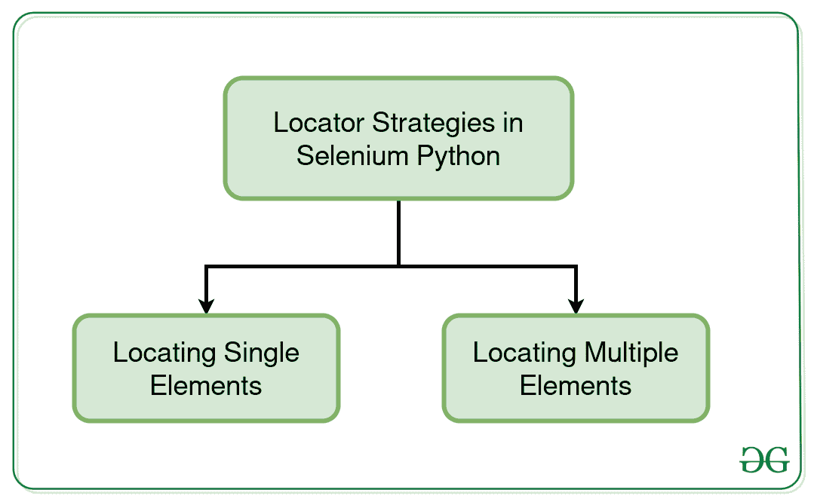

# 定位器策略–硒蟒

> 原文:[https://www . geesforgeks . org/locator-strategies-selenium-python/](https://www.geeksforgeeks.org/locator-strategies-selenium-python/)

Selenium Python 中的定位器策略是用于从页面中定位元素并对其执行操作的方法。Selenium 的 Python 模块是为使用 Python 执行自动化测试而构建的。硒 Python 绑定提供了一个简单的应用编程接口，可以使用硒网络驱动程序编写功能/验收测试。安装硒并使用获取方法查看–[导航链接后，您可能想玩更多硒蟒。使用 geeksforgeeks 等 selenium 打开页面后，您可能希望自动单击某些按钮或自动填写表单或任何此类自动任务。本文围绕两个策略展开——定位单个元素和定位多个元素。
](https://www.geeksforgeeks.org/navigating-links-using-get-method-selenium-python/)

## 定位单个第一元素的定位策略

硒蟒遵循不同的元素定位策略。一个人可以用 8 种不同的方法定位一个元素。以下是 python 中硒的定位策略列表–

| 探测器 | 描述 |
| --- | --- |
| [find_element_by_id](https://www.geeksforgeeks.org/find_element_by_id-driver-method-selenium-python/) | 将返回 id 属性值与位置匹配的第一个元素。 |
| [查找 _ 元素 _by_name](https://www.geeksforgeeks.org/find_element_by_name-driver-method-selenium-python/?ref=rp) | 将返回名称属性值与位置匹配的第一个元素。 |
| [find_element_by_xpath](https://www.geeksforgeeks.org/find_element_by_xpath-driver-method-selenium-python/?ref=rp) | 将返回 xpath 语法与位置匹配的第一个元素。 |
| [find _ element _ by _ link _ text](https://www.geeksforgeeks.org/find_element_by_link_text-driver-method-selenium-python/?ref=rp) | 将返回链接文本值与位置匹配的第一个元素。 |
| [find _ element _ by _ partial _ link _ text](https://www.geeksforgeeks.org/find_element_by_partial_link_text-driver-method-selenium-python/?ref=rp) | 将返回第一个具有与位置匹配的部分链接文本值的元素。 |
| [find_element_by_tag_name](https://www.geeksforgeeks.org/find_element_by_tag_name-driver-method-selenium-python/?ref=rp) | 将返回具有给定标记名的第一个元素。 |
| [find _ element _ by _ class _ name](https://www.geeksforgeeks.org/find_element_by_class_name-driver-method-selenium-python/?ref=rp) | 将返回具有匹配类属性名的第一个元素。 |
| [find _ element _ by _ CSS _ 选择器](https://www.geeksforgeeks.org/find_element_by_css_selector-driver-method-selenium-python/?ref=rp) | 将返回具有匹配 CSS 选择器的第一个元素。 |

## 定位多个元素的定位器策略

硒蟒遵循不同的元素定位策略。人们可以用 8 种不同的方法定位多个元素。以下是 python 中硒的定位策略列表–

| 探测器 | 描述 |
| --- | --- |
| [查找 _ 元素 _by_name](https://www.geeksforgeeks.org/find_elements_by_name-driver-method-selenium-python/?ref=rp) | 将返回名称属性值与位置匹配的所有元素。 |
| [查找 _ 元素 _by_xpath](https://www.geeksforgeeks.org/find_elements_by_xpath-driver-method-selenium-python/?ref=rp) | 将返回 xpath 语法与位置匹配的所有元素。 |
| [find _ elements _ by _ link _ text](https://www.geeksforgeeks.org/find_elements_by_link_text-driver-method-selenium-python/?ref=rp) | 将返回链接文本值与位置匹配的所有元素。 |
| [查找 _ 元素 _by_partial_link_text](https://www.geeksforgeeks.org/find_elements_by_partial_link_text-driver-method-selenium-python/?ref=rp) | 将返回部分链接文本值与位置匹配的所有元素。 |
| [find _ elements _ by _ tag _ name](https://www.geeksforgeeks.org/find_elements_by_tag_name-driver-method-selenium-python/?ref=rp) | 将返回具有给定标记名的所有元素。 |
| [find _ elements _ by _ class _ name](https://www.geeksforgeeks.org/find_elements_by_class_name-driver-method-selenium-python/?ref=rp) | 将返回具有匹配类属性名的所有元素。 |
| [find _ elements _ by _ CSS _ 选择器](https://www.geeksforgeeks.org/find_elements_by_css_selector-driver-method-selenium-python/?ref=rp) | 将返回所有具有匹配 CSS 选择器的元素。 |