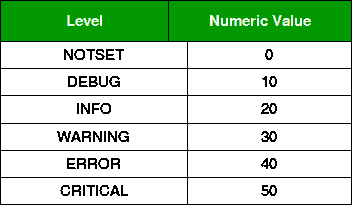
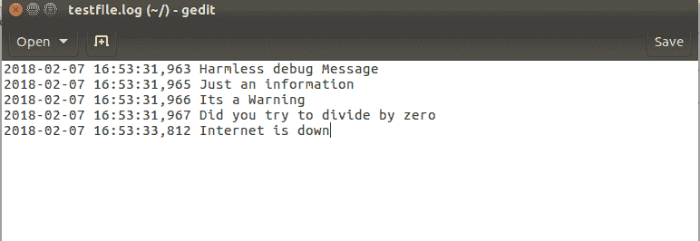

# 登录 Python

> 原文:[https://www.geeksforgeeks.org/logging-in-python/](https://www.geeksforgeeks.org/logging-in-python/)

日志是跟踪某些软件运行时发生的事件的一种方式。日志对于软件开发、调试和运行非常重要。如果您没有任何日志记录，并且您的程序崩溃，那么您检测到问题原因的机会非常小。而且如果查出原因，会消耗很多时间。通过日志记录，您可以留下痕迹，以便在出现问题时，我们可以确定问题的原因。
有很多情况，比如如果你想要一个整数，你得到了一个浮点数，你可以使用一个云应用编程接口，服务因维护而关闭等等。这样的问题是无法控制的，很难确定。

**为什么打印不是一个好的选择？**

一些开发人员使用打印语句的概念来验证语句是否正确执行或者是否发生了错误。但是印刷不是一个好主意。对于简单的脚本，它可能会解决您的问题，但是对于复杂的脚本，打印方法会失败。

Python 有一个内置的日志记录模块**，允许将状态消息写入文件或任何其他输出流。该文件可以包含执行代码的哪一部分以及出现了什么问题的信息。**

****日志消息的级别****

**日志消息有两个内置级别。**

*   ****调试:**这些用于给出详细信息，通常仅在诊断问题时感兴趣。**
*   ****信息:**这些是用来确认事情按预期进行的**
*   ****警告:**这些用于表示发生了意想不到的事情，或者表示在不久的将来会出现一些问题**
*   ****错误:**这表明由于更严重的问题，软件无法执行某些功能**
*   ****Critical :** 这表示出现严重错误，表明程序本身可能无法继续运行**

**如果需要，开发人员可以选择创建更多的级别，但是这些级别足以处理所有可能的情况。每个内置级别都被分配了其数值。**

****

**日志模块包含几个特性。它有几个常量、类和方法。所有大写的项都是常量，大写的项是类，以小写字母开头的项是方法。
模块本身提供了几个记录器对象。**

*   ****Logger.info(msg) :** 这将在此 Logger 上记录一条信息级别为 info 的消息。**
*   ****记录器.警告(消息):**这将在该记录器上记录一条警告级别的消息。**
*   ****记录器.错误(msg) :** 这将在该记录器上记录一条错误级别的消息。**
*   ****Logger.critical(msg) :** 这将在该日志记录程序上记录一条级别为 critical 的消息。**
*   ****Logger.log(lvl，msg) :** 这将在此 Logger 上记录一条具有整数级 lvl 的消息。**
*   ****记录器。异常(消息):**这将在该记录器上记录一条错误级别的消息。**
*   ****Logger.setLevel(lvl) :** 此功能将此 Logger 的阈值设置为 lvl。这意味着低于此级别的所有消息都将被忽略。**
*   ****Logger . addfilter(filter):**这将一个特定的筛选器筛选器添加到此 logger。**
*   ****Logger.removeFilter(筛选器):**这将特定的筛选器筛选器删除到该日志程序。**
*   ****记录器.过滤器(记录):**此方法将记录器的过滤器应用于所提供的记录，如果要处理记录，则返回真。否则，它将返回 False。**
*   ****Logger.addHandler(hdlr) :** 这将一个特定的处理程序 hdlr 添加到该记录器的中。**
*   ****logger . remove handler(hdlr):**这将特定的处理程序 hdlr 移至该记录器。**
*   ****Logger.hasHandlers() :** 这将检查记录器是否配置了任何处理程序。**

****基础知识****

**使用日志模块在文件中记录事件的基础非常简单。
为此，只需从库中导入模块。**

1.  **创建和配置记录器。它可以有几个参数。但重要的是，传递您想要记录事件的文件的名称。**
2.  **这里也可以设置记录器的格式。默认情况下，文件在**追加**模式下工作，但如果需要，我们可以将其更改为写入模式。**
3.  **此外，可以根据分配给每个级别的数值设置记录器的级别，作为跟踪的阈值。
    有几个属性可以作为参数传递。**
4.  **The list of all those parameters is given in [Python Library](https://docs.python.org/3/library/logging.html#logrecord-attributes). The user can choose the required attribute according to the requirement.

    之后，创建一个对象，并使用示例中所示的各种方法。

    ```py
    #importing module
    import logging

    #Create and configure logger
    logging.basicConfig(filename="newfile.log",
                        format='%(asctime)s %(message)s',
                        filemode='w')

    #Creating an object
    logger=logging.getLogger()

    #Setting the threshold of logger to DEBUG
    logger.setLevel(logging.DEBUG)

    #Test messages
    logger.debug("Harmless debug Message")
    logger.info("Just an information")
    logger.warning("Its a Warning")
    logger.error("Did you try to divide by zero")
    logger.critical("Internet is down")
    ```

    上面的代码将使用提供的名称生成一个文件，如果我们打开该文件，该文件包含以下数据。
    

    本文由 **[里沙布·班萨尔](https://www.linkedin.com/in/rishabh-bansal-9b4b71108/)** 供稿。如果你喜欢 GeeksforGeeks 并想投稿，你也可以使用[contribute.geeksforgeeks.org](http://www.contribute.geeksforgeeks.org)写一篇文章或者把你的文章邮寄到 contribute@geeksforgeeks.org。看到你的文章出现在极客博客主页上，帮助其他极客。

    如果你发现任何不正确的地方，或者你想分享更多关于上面讨论的话题的信息，请写评论。**