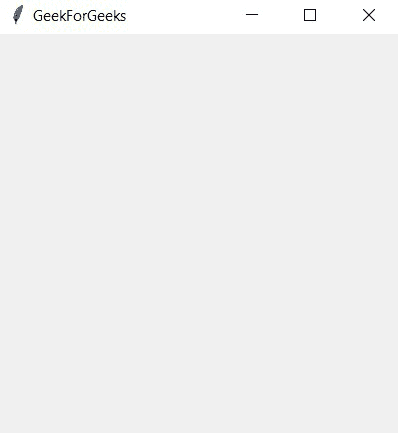
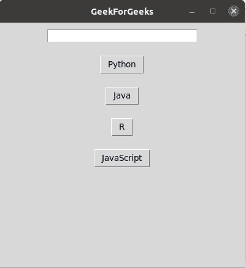

# 在 Tkit 中循环按钮

> 原文:[https://www . geesforgeks . org/循环通过按钮-in-tkinter/](https://www.geeksforgeeks.org/looping-through-buttons-in-tkinter/)

在本文中，让我们看看如何在 Tkinter 中循环按钮。

**分步实施:**

**步骤 1:** 导入 Tkinter 包及其所有模块，并创建一个根窗口(root = Tk())。

## 蟒蛇 3

```
# Import package and it's modules
from tkinter import *

# create root window
root = Tk()

# root window title and dimension
root.title("GeekForGeeks")

# Set geometry (widthxheight)
root.geometry('400x400')

# Execute Tkinter
root.mainloop()
```

**输出**



**第二步:**现在我们添加一个 [Entry()](https://www.geeksforgeeks.org/python-tkinter-entry-widget/) 类，只要点击其中一个按钮，就会显示按钮名称。

## 蟒蛇 3

```
# Import package and it's modules
from tkinter import *

# create root window
root = Tk()

# root window title and dimension
root.title("GeekForGeeks")

# Set geometry (widthxheight)
root.geometry('400x400')

# Entry Box
text = Entry(root, width = 30, bg = 'White')
text.pack(pady = 10)

# Execute Tkinter
root.mainloop()
```

**输出**


**第三步:**现在我们创建一个空字典(button_dict)来保存所有的按钮对象和一个包含所有按钮名称的列表。现在循环列表中的每一项，创建一个[按钮](https://www.geeksforgeeks.org/python-creating-a-button-in-tkinter/)对象，并将其存储在字典中。对于按钮命令，创建一个名为“action”的函数，对于每个按钮，调用 **text_update()** 函数来更新前面创建的 entry()对象中条目的更改。

## 蟒蛇 3

```
# Import package and it's modules
from tkinter import *

# text_update function
def text_updation(language):
    text.delete(0, END)
    text.insert(0, language)

# create root window
root = Tk()

# root window title and dimension
root.title("GeekForGeeks")

# Set geometry (widthxheight)
root.geometry('400x400')

# Entry Box
text = Entry(root, width=30, bg='White')
text.pack(pady=10)

# create buttons
button_dict = {}
words = ["Python", "Java", "R", "JavaScript"]
for lang in words:

    # pass each button's text to a function
    def action(x = lang): 
        return text_updation(x)

    # create the buttons 
    button_dict[lang] = Button(root, text = lang,
                               command = action)
    button_dict[lang].pack(pady=10)

# Execute Tkinter
root.mainloop()
```

**输出**

