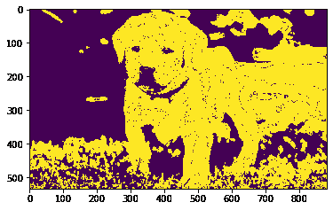

# maho tas–条件扩张图像

> 原文:[https://www . geeksforgeeks . org/maho tas-条件-扩张-image/](https://www.geeksforgeeks.org/mahotas-conditional-dilating-image/)

在本文中，我们将看到如何在 mahotas 中有条件地扩展图像。膨胀将像素添加到图像中对象的边界，而侵蚀将移除对象边界上的像素。从图像中的对象添加或移除的像素数量取决于用于处理图像的结构化元素的大小和形状。我们采用十字形扩张法进行正常扩张。

在本教程中我们将使用“lena”图像，下面是加载它的命令。

```
mahotas.demos.load('lena')
```

下面是莉娜的形象


> 为此，我们将使用 mahotas.cdilate 方法
> **语法:** mahotas.cdilate(img，c_grey，Bc={3×3 cross}，n=1)
> **参数:**它以图像对象、条件图像为强制参数，元素结构和迭代次数为可选参数
> **Return :** 它返回图像对象

**注意:**输入图像应被过滤或加载为灰色

为了过滤图像，我们将获取 numpy.ndarray 的图像对象，并在索引的帮助下过滤它，下面是这样做的命令

```
image = image[:, :, 0]
```

下面是实现

## 蟒蛇 3

```
# importing required libraries
# importing required libraries
import mahotas
import mahotas.demos
from pylab import gray, imshow, show
import numpy as np

# loading image
img = mahotas.demos.load('lena')

# grey image
g = img[:, :, 1]

# multiplying grey image values
g = g * 100

# filtering image
img = img.max(2)

# otsu method
T_otsu = mahotas.otsu(img)

# image values should be greater than otsu value
img = img > T_otsu

print("Image threshold using Otsu Method")

# showing image
imshow(img)
show()

# dilating image using conditional grey image
dilate_img = mahotas.cdilate(img, g)

# showing dilated image
print("Dilated Image")
imshow(dilate_img)
show()
```

**输出:**

```
Image threshold using Otsu Method
```


```
Dilated Image
```


另一个例子

## 蟒蛇 3

```
# importing required libraries
import mahotas
import numpy as np
from pylab import gray, imshow, show
import os

# loading image
img = mahotas.imread('dog_image.png')

# grey image
g = img[:, :, 2]

# multiplying grey image values
g = g * 100

# filtering image
img = img[:, :, 0]

# otsu method
T_otsu = mahotas.otsu(img)

# image values should be greater than otsu value
img = img > T_otsu

print("Image threshold using Otsu Method")

# showing image
imshow(img)
show()

# dilating image using conditional grey image
dilate_img = mahotas.cdilate(img, g)

# showing dilated image
print("Dilated Image")
imshow(dilate_img)
show()
```

**输出:**

```
Image threshold using Otsu Method 
```


```
Dilated Image
```

