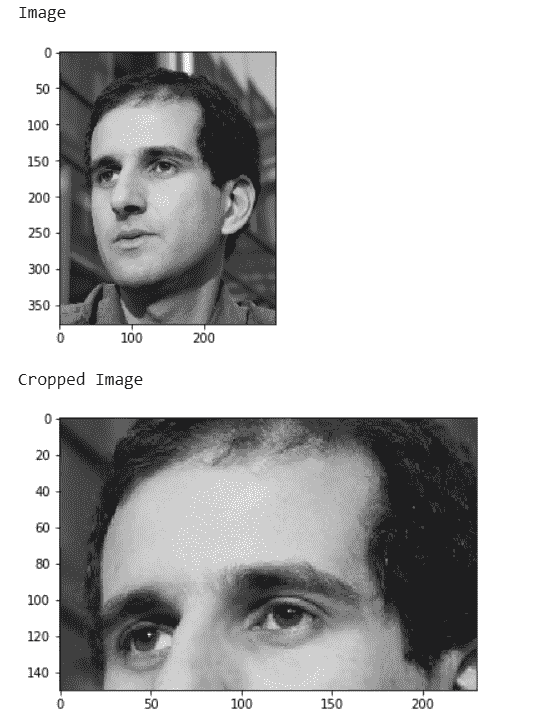
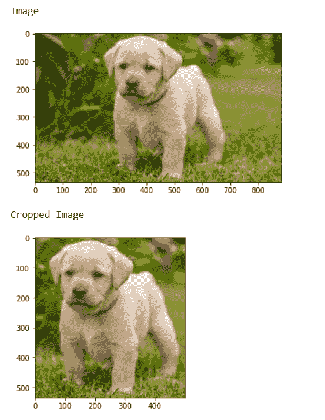

# maho tas–裁剪图像

> 原文:[https://www.geeksforgeeks.org/mahotas-cropping-image/](https://www.geeksforgeeks.org/mahotas-cropping-image/)

在本文中，我们将看到如何在 mahotas 中裁剪图像。只需从数组中切下正确的部分即可轻松完成裁剪，这里数组是 numpy.ndarray.
在本教程中，我们将使用“luispedro”图像，下面是加载它的命令。

```py
mahotas.demos.load('luispedro')
```

下面是路易斯德罗的图片


为了做到这一点，我们将采取的图像对象是 numpy.ndarray 和过滤它的帮助下，索引，下面是命令这样做

```py
image = image[i1:i2, j1:j2]
```

**例 1:**

## 蟒蛇 3

```py
# importing required libraries
import numpy as np
import mahotas
import mahotas.demos
from mahotas.thresholding import soft_threshold
from matplotlib import pyplot as plt
from os import path

# loading image as grey
f = mahotas.demos.load('luispedro', as_grey = True)

# making plt grey
plt.gray()

# showing image
print("Image")
plt.imshow(f)
plt.show()

# cropping image
f = f[50:200, 20: 250]

# Show the image
print("Cropped Image")
plt.imshow(f)
plt.show()
```

**输出:**



**例 2:**

## 蟒蛇 3

```py
# importing required libraries
import mahotas
import numpy as np
from pylab import imshow, show
import os

# loading image
img = mahotas.imread('dog_image.png')

# showing image
print("Image")
imshow(img)
show()

# cropping image
img = img[:, 200:700]

# showing the image
print("Cropped Image")
imshow(img)
show()
```

**输出:**

