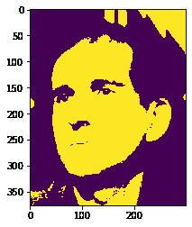
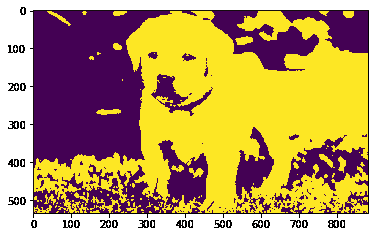

# maho tas–扩张图像

> 原文:[https://www.geeksforgeeks.org/mahotas-dilating-image/](https://www.geeksforgeeks.org/mahotas-dilating-image/)

在本文中，我们将看到如何在 mahotas 中扩展图像。膨胀将像素添加到图像中对象的边界，而侵蚀将移除对象边界上的像素。从图像中的对象添加或移除的像素数量取决于用于处理图像的结构化元素的大小和形状。

在本教程中我们将使用“luispedro”图像，下面是加载它的命令。

```py
mahotas.demos.load('luispedro')
```

下面是路易斯德罗的照片


为了做到这一点，我们将使用 maho tas . morph . extreme method

> **语法:**maho tas . morph . exploit(image)
> **自变量:**它以图像对象为自变量
> **返回:**它返回图像对象

**注意:**输入图像应被过滤或加载为灰色

为了过滤图像，我们将获取 numpy.ndarray 的图像对象，并在索引的帮助下过滤它，下面是这样做的命令

```py
image = image[:, :, 0]
```

下面是实现

## 蟒蛇 3

```py
# importing required libraries
import mahotas
import mahotas.demos
from pylab import gray, imshow, show
import numpy as np

# loading image
luispedro = mahotas.demos.load('luispedro')

# filtering image
luispedro = luispedro.max(2)

# otsu method
T_otsu = mahotas.otsu(luispedro)

# image values should be greater than otsu value
img = luispedro > T_otsu

print("Image threshold using Otsu Method")

# showing image
imshow(img)
show()

# dilating image
dilate_img = mahotas.morph.dilate(img)

# showing dilated image
print("Dilated Image")
imshow(dilate_img)
show()
```

**输出:**

```py
Image threshold using Otsu Method
```


```py
Dilated Image
```



另一个例子

## 蟒蛇 3

```py
# importing required libraries
import mahotas
import numpy as np
import matplotlib.pyplot as plt
import os

# loading image
img = mahotas.imread('dog_image.png')

# setting filter to the image
img = img[:, :, 0]

# otsu method
T_otsu = mahotas.otsu(img)

# image values should be greater than otsu value
img = img > T_otsu

print("Image threshold using Otsu Method")

# showing image
imshow(img)
show()

# dilating image
dilate_img = mahotas.morph.dilate(img)

# showing dilated image
print("Dilated Image")
imshow(dilate_img)
show()
```

**输出:**

```py
Image threshold using Otsu Method
```


```py
Dilated Image
```

