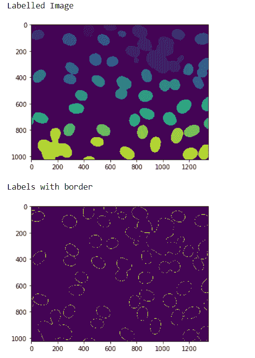

# maho tas–获取标签边框

> 原文:[https://www . geeksforgeeks . org/maho tas-获取标签边界/](https://www.geeksforgeeks.org/mahotas-getting-border-of-labels/)

在本文中，我们将看到如何在 mahotas 中获取标签图像中标签的边界。为此，我们将使用来自核分割基准的荧光显微图像。我们可以借助下面给出的命令
获得图像

```
mhotas.demos.nuclear_image()
```

下图是核 _ 图像


为了做到这一点，我们将使用方法

> **语法:**maho tas . label . borders(label _ image)
> **参数:**它以 numpy . ndaray 对象作为参数，即标签图像
> **返回:**它返回 numpy . ndaray 对象，即仅带有标签边框的标签图像

**注意:**的输入应该是标记为
的过滤后的图像对象，为了过滤图像，我们将获取 numpy.ndarray 的图像对象，并借助索引对其进行过滤，下面是执行此操作的命令

```
image = image[:, :, 0]
```

**例 1 :**

## 蟒蛇 3

```
# importing required libraries
import mahotas
import numpy as np
from pylab import imshow, show
import os

# loading nuclear image
f = mahotas.demos.load('nuclear')

# setting filter to the image
f = f[:, :, 0]

# setting gaussian filter
f = mahotas.gaussian_filter(f, 4)

# setting threshold value
f = (f> f.mean())

# creating a labelled image
labeled, n_nucleus = mahotas.label(f)

# showing the labelled image
print("Labelled Image")
imshow(labelled)
show()

# getting border of the labelled image
relabeled = mahotas.labelled.borders(labeled)

# showing the image
print("Labels with border")
imshow(relabelled)
show()
```

**输出:**



**例 2 :**

## 蟒蛇 3

```
# importing required libraries
import numpy as np
import mahotas
from pylab import imshow, show

# loading image
img = mahotas.imread('dog_image.png')

# filtering the image
img = img[:, :, 0]

# setting gaussian filter
gaussian = mahotas.gaussian_filter(img, 15)

# setting threshold value
gaussian = (gaussian > gaussian.mean())

# creating a labelled image
labelled, n_nucleus = mahotas.label(gaussian)

print("Labelled Image")
# showing the gaussian filter
imshow(labelled)
show()

# getting border of the labelled image
relabeled = mahotas.labelled.borders(labelled)

# showing the image
print("Labels with border")
imshow(relabelled)
show()
```

**输出:**

