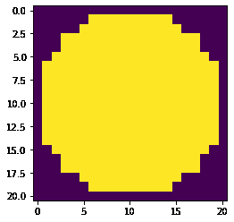

# maho tas–获取给定半径的圆盘结构元素

> 原文:[https://www . geesforgeks . org/maho tas-get-disk-structure-给定半径元素/](https://www.geeksforgeeks.org/mahotas-getting-disk-structuring-element-of-given-radius/)

在本文中，我们将看到如何在 mahotas 中获得给定图像半径的二进制圆盘结构元素。平面结构元素是二维或多维的二进制值邻域，其中真像素包括在形态计算中，而假像素不包括在内。结构元素的中心像素，称为原点，用于识别正在处理的图像中的像素。

在本教程中我们将使用“lena”图像，下面是加载它的命令。

```py
mahotas.demos.load('lena')
```

下面是莉娜的形象


> 为了做到这一点，我们将使用`mahotas.disk`方法
> 
> **语法:** mahotas.disk(半径)
> 
> **自变量:**以整数为自变量
> 
> **返回:**返回图像对象

下面是实现

```py
# importing required libraries
import mahotas
import numpy as np
from pylab import gray, imshow, show
import os

# getting disk of given radius
disk = mahotas.disk(10)

# showing disk image
imshow(disk)
show()
```

**输出:**


另一个例子

```py
# importing required libraries
import mahotas
import numpy as np
from pylab import gray, imshow, show
import os

# getting disk of given radius
disk = mahotas.disk(98)

# showing disk image
imshow(disk)
show()
```

**输出:**
