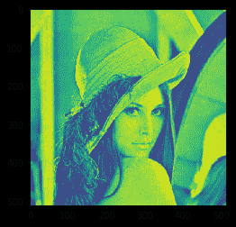

# maho tas–图像拉伸

> 原文:[https://www.geeksforgeeks.org/mahotas-image-stretching/](https://www.geeksforgeeks.org/mahotas-image-stretching/)

在本文中，我们将看到如何在 mahotas 中进行图像拉伸。对比度拉伸(通常称为归一化)是一种简单的图像增强技术，它试图通过“拉伸”图像中包含的亮度值范围来跨越所需的值范围，例如相关图像类型允许的像素值的整个范围，从而提高图像的对比度。
在本教程中我们将使用“lena”图像，下面是加载它的命令。

```py
mahotas.demos.load('lena')
```

下面是莉娜的形象


> 为此，我们将使用 mahotas.stretch 方法
> **语法:** mahotas.stretch(img)
> **参数:**它以图像对象作为参数
> **返回:**它返回图像对象

**注意:**输入图像应被过滤或应加载为灰色
为了过滤图像，我们将获取 numpy.ndarray 的图像对象，并借助索引对其进行过滤，下面是这样做的命令

```py
image = image[:, :, 0]
```

下面是实现

## 蟒蛇 3

```py
# importing required libraries
import mahotas
import mahotas.demos
from pylab import gray, imshow, show
import numpy as np
import matplotlib.pyplot as plt

# loading image
img = mahotas.demos.load('lena')

# filtering image
img = img.max(2)

print("Image")

# showing image
imshow(img)
show()

# strecting image
new_img = mahotas.stretch(img)

# Stretched image
print("Stretched Image")
imshow(new_img)
show()
```

**输出:**

```py
Image
```


```py
Stretched Image
```



另一个例子

## 蟒蛇 3

```py
# importing required libraries
import mahotas
import numpy as np
from pylab import gray, imshow, show
import os
import matplotlib.pyplot as plt

# loading image
img = mahotas.imread('dog_image.png')

# fltering image
img = img[:, :, 0]

print("Image")

# showing image
imshow(img)
show()

# strecting image
new_img = mahotas.stretch(img)

# Stretched image
print("Stretched Image")
imshow(new_img)
show()
```

**输出:**

```py
Image
```


```py
Stretched Image 
```

