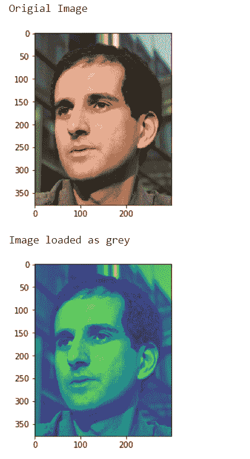

# maho tas–将图像加载为灰色

> 原文:[https://www . geesforgeks . org/maho tas-loading-image-as-grey/](https://www.geeksforgeeks.org/mahotas-loading-image-as-grey/)

在本文中，我们将看到如何在 mahotas 中将图像加载为灰色，mahotas 中有很多图像可用，我们使用 mahotas.demos.load 方法来加载它们，在本教程中我们将使用“luispedro”图像，下面是加载它的命令。

```
mahotas.demos.load('luispedro')
```

下面是路易斯德罗的照片


为此，我们将使用 mahotas.demos.load 方法

> **语法:**maho tas . demos . load(' luispedro '，as_grey=True)
> **参数:**它以图像名称作为参数
> **返回:**它返回 numpy.ndarray 即图像对象

**例 1:**

## 蟒蛇 3

```
# importing required libraries
import mahotas
import mahotas.demos
import numpy as np
from pylab import imshow, gray, show
from os import path

# loading the image
photo = mahotas.demos.load('luispedro')

# showing original image
print("Original Image")
imshow(photo)
show()

# loading image as grey
photo = mahotas.demos.load('luispedro', as_grey = True)

# showing image
print("Image loaded as grey")
imshow(photo)
show()
```

**输出:**



**例 2:**

## 蟒蛇 3

```
# importing required libraries
import mahotas
import mahotas.demos
import numpy as np
from pylab import imshow, gray, show
from os import path

# loading the image
photo = mahotas.demos.load('luispedro')

# showing original image
print("Original Image")
imshow(photo)
show()

# loading image as grey
photo = mahotas.demos.load('luispedro', as_grey = True)

# converting image type to unit8
# because as_grey returns floating values
photo = photo.astype(np.uint8)

# calling gray method
gray()

# showing image
print("Image loaded as grey")
imshow(photo)
show()
```

**输出:**

