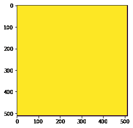

# maho tas–多数过滤器

> 原文:[https://www.geeksforgeeks.org/mahotas-majority-filter/](https://www.geeksforgeeks.org/mahotas-majority-filter/)

在本文中，我们将看到如何在 mahotas 中对图像应用多数过滤。在输入图中考虑的每组像素的多数过滤器中，多数过滤器将这些像素的主要(=最常出现的)值或类名分配给输出图中的中心像素。

在本教程中我们将使用“lena”图像，下面是加载它的命令。

```py
mahotas.demos.load('lena')
```

下面是莉娜的形象


> 为此，我们将使用 maho tas . more _ filter 方法
> **语法:**maho tas . more _ filter(img)
> **参数:**它将图像对象作为参数
> **返回:**它返回图像对象

**注意:**输入图像应被过滤或加载为灰色

为了过滤图像，我们将获取 numpy.ndarray 的图像对象，并在索引的帮助下过滤它，下面是这样做的命令

```py
image = image[:, :, 0]
```

下面是实现

## 蟒蛇 3

```py
# importing required libraries
import mahotas
import mahotas.demos
from pylab import gray, imshow, show
import numpy as np
import matplotlib.pyplot as plt

# loading image
img = mahotas.demos.load('lena')

# filtering image
img = img.max(2)

print("Image")

# showing image
imshow(img)
show()

# applying majority filter
new_img = mahotas.majority_filter(img)

# showing image
print("Majority Filter")
imshow(new_img)
show()
```

**输出:**

```py
Image
```


多数过滤器



**另一个例子**

## 蟒蛇 3

```py
# importing required libraries
import mahotas
import numpy as np
from pylab import gray, imshow, show
import os
import matplotlib.pyplot as plt

# loading image
img = mahotas.imread('dog_image.png')

# filtering image
img = img[:, :, 0]

print("Image")

# showing image
imshow(img)
show()

# applying majority filter
new_img = mahotas.majority_filter(img)

# showing image
print("Majority Filter")
imshow(new_img)
show()
```

**输出:**

```py
Image
```


多数过滤器

