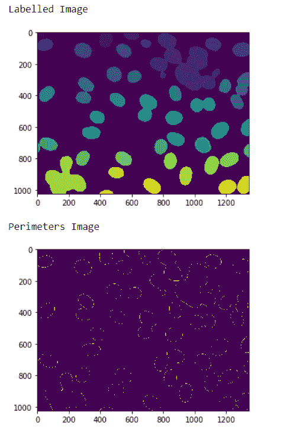
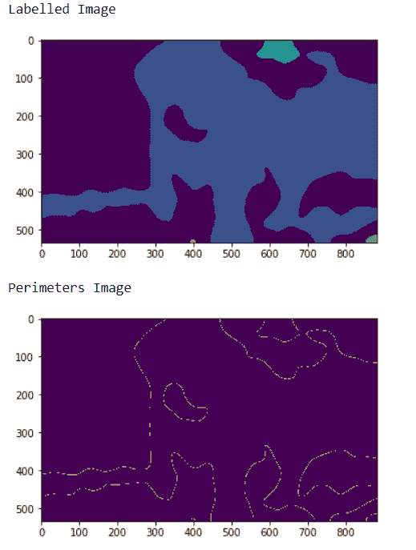

# maho tas–二值图像中物体的周长

> 原文:[https://www . geesforgeks . org/maho tas-二进制图像中物体的周长/](https://www.geeksforgeeks.org/mahotas-perimeter-of-objects-in-binary-image/)

在本文中，我们将看到如何在 mahotas 中获取二进制图像中对象的周长。为此，我们将使用来自核分割基准的荧光显微图像。我们可以借助下面给出的命令
获得图像

```py
mhotas.demos.nuclear_image()
```

下图是核 _ 图像


如果像素的值为 1，并且在其邻域中至少有一个零值像素，则像素是对象周长的一部分。默认情况下，一个像素的邻域是 4 个最近的像素，但是如果我们可以将其设置为 8，那么将考虑 8 个最近的像素。
为了做到这一点，我们将使用 maho tas . labled . bwperim 方法

> **语法:**maho tas . label . bwperim(image，n)
> **参数:**取 numpy . ndaray 对象即标签图像首选黑白和整数即可选的最近像素
> **返回:**返回 numpy . ndaray 对象即布尔图像

**注意:**的输入应该是标记为
的过滤后的图像对象，为了过滤图像，我们将获取 numpy.ndarray 的图像对象，并借助索引对其进行过滤，下面是执行此操作的命令

```py
image = image[:, :, 0]
```

**例 1 :**

## 蟒蛇 3

```py
# importing required libraries
import mahotas
import numpy as np
from pylab import imshow, show
import os

# loading nuclear image
f = mahotas.demos.load('nuclear')

# setting filter to the image
f = f[:, :, 0]

# setting gaussian filter
f = mahotas.gaussian_filter(f, 4)

# setting threshold value
f = (f> f.mean())

# creating a labelled image
labelled, n_nucleus = mahotas.label(f)

# showing the labelled image
print("Labelled Image")
imshow(labelled)
show()

# getting perimeters
relabelled = mahotas.labelled.bwperim(labelled)

# showing the image
print("Perimeters Image")
imshow(relabelled)
show()
```

**输出:**



**例 2 :**

## 蟒蛇 3

```py
# importing required libraries
import numpy as np
import mahotas
from pylab import imshow, show

# loading image
img = mahotas.imread('dog_image.png')

# filtering the image
img = img[:, :, 0]

# setting gaussian filter
gaussian = mahotas.gaussian_filter(img, 15)

# setting threshold value
gaussian = (gaussian > gaussian.mean())

# creating a labelled image
labelled, n_nucleus = mahotas.label(gaussian)

print("Labelled Image")
# showing the gaussian filter
imshow(labelled)
show()

# getting perimeters
relabeled = mahotas.labelled.bwperim(labelled, 8)

# showing the image
print("Perimeters Image")
imshow(relabelled)
show()
```

**输出:**

