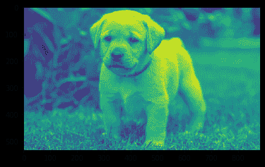

# maho tas–RGB 到灰度的转换

> 原文:[https://www . geesforgeks . org/maho tas-RGB 到灰度转换/](https://www.geeksforgeeks.org/mahotas-rgb-to-gray-conversion/)

在本文中，我们将看到如何在 mahotas 中将 rgb 图像转换为灰色。RGB 图像，有时也称为真彩色图像，在 MATLAB 中存储为一个 m 乘 n 乘 3 的数据数组，该数组定义了每个单独像素的红色、绿色和蓝色分量。
在本教程中我们将使用“lena”图像，下面是加载它的命令。

```
mahotas.demos.load('lena')
```

下面是莉娜的形象


为此，我们将使用 mahotas.colors.rgb2greymethod

> **语法:**maho tas . colors . RGB 2 gray(img)
> **参数:**它以图像对象作为参数
> **返回:**它返回图像对象

**注意:**可以像使用 rgb2gray 或 RGB 2 gray 一样将图像转换为灰度，两者都可以)。这种转换使用了视觉上逼真的方法(由于人眼对绿色通道更敏感，因此绿色通道的权重更大)
下面是实现

## 蟒蛇 3

```
# importing required libraries
import mahotas
import mahotas.demos
from pylab import gray, imshow, show
import numpy as np

# loading image
img = mahotas.demos.load('lena')

# showing image
print("Image")
imshow(img)
show()

# rgb to gray
new_img = mahotas.colors.rgb2gray(img)

# showing new image
print("New Image")
imshow(new_img)
show()
```

**输出:**

```
Image
```


```
New Image
```


另一个例子

## 蟒蛇 3

```
# importing required libraries
import mahotas
import numpy as np
import matplotlib.pyplot as plt
import os

# loading image
img = mahotas.imread('dog_image.png')

# filtering image
img = img[:, :, :3]

# showing image
print("Image")
imshow(img)
show()

# rgb to gray
new_img = mahotas.colors.rgb2gray(img)

# showing new image
print("New Image")
imshow(new_img)
show()
```

**输出:**

```
Image
```


```
New Image
```

