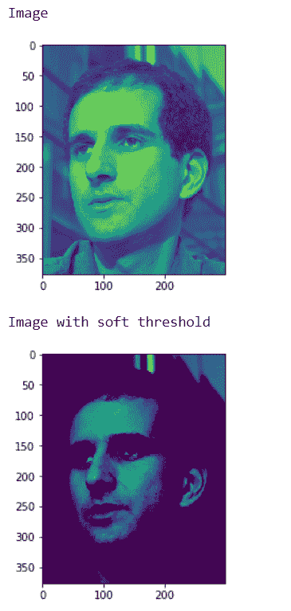
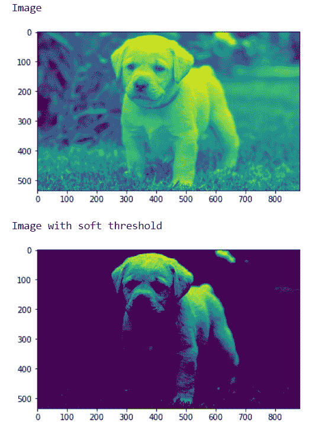

# maho tas–软阈值

> 原文:[https://www.geeksforgeeks.org/mahotas-soft-threshold/](https://www.geeksforgeeks.org/mahotas-soft-threshold/)

在本文中，我们将看到如何在 mahotas 中实现软阈值。软阈值也称为小波收缩，因为正系数和负系数的值都“收缩”到零，这与保留或去除系数值的硬阈值相反。

在本教程中我们将使用“luispedro”图像，下面是加载它的命令。

```
mahotas.demos.load('luispedro')
```

下面是路易斯德罗的照片


为了做到这一点，我们将使用 mahotas.rc 方法

> **语法:**maho tas . thresholding . soft _ threshold(image，t_value)
> **参数:**以图像对象和 unit8 值为参数
> **返回:**返回图像对象

**注意:**输入图像应被过滤或加载为灰色

为了过滤图像，我们将获取 numpy.ndarray 的图像对象，并在索引的帮助下过滤它，下面是这样做的命令

```
image = image[:, :, 0]
```

**例 1:**

## 蟒蛇 3

```
# importing required libraries
import mahotas
import mahotas.demos
import numpy as np
from pylab import imshow, gray, show
from os import path

# loading the image
photo = mahotas.demos.load('luispedro')

# loading image as grey
photo = mahotas.demos.load('luispedro', as_grey = True)

# converting image type to unit8
# because as_grey returns floating values
photo = photo.astype(np.uint8)

# showing original image
print("Image")
imshow(photo)
show()

# unit 8 value
t = np.uint8(150)

# soft threshold
photo = mahotas.thresholding.soft_threshold(photo, t)

print("Image with soft threshold")

# showing image
imshow(photo)
show()
```

**输出:**



**例 2:**

## 蟒蛇 3

```
# importing required libraries
import mahotas
import numpy as np
from pylab import imshow, show
import os

# loading image
img = mahotas.imread('dog_image.png')

# setting filter to the image
img = img[:, :, 0]

print("Image")

# showing the image
imshow(img)
show()

# unit 8 value
t = np.uint8(180)

# soft threshold
img = mahotas.thresholding.soft_threshold(img, t)

print("Image with soft threshold")

# showing image
imshow(img)
show()
```

**输出:**

