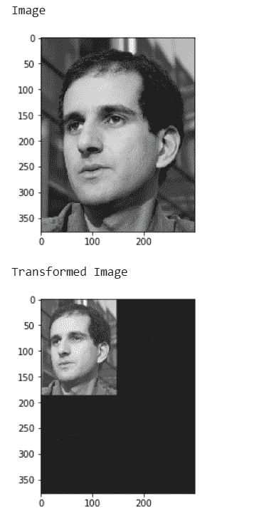
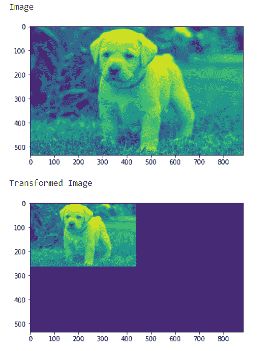

# maho tas–使用 Daubechies 小波变换图像

> 原文:[https://www . geeksforgeeks . org/maho tas-transforming-image-using-daubechies-小波/](https://www.geeksforgeeks.org/mahotas-transforming-image-using-daubechies-wavelet/)

在本文中，我们将看到如何在 mahotas 中使用 daubechies 小波变换图像。一般来说，对于给定的支撑宽度 2A，多贝希小波被选择为具有最高数量的消失矩(这并不意味着最佳平滑度)。有两种命名方案在使用，DN 使用抽头的长度或数量，dbA 指消失矩的数量。所以 D4 和 db2 是相同的小波变换。
在本教程中我们将使用“luispedro”图像，下面是加载它的命令。

```py
mahotas.demos.load('luispedro')
```

下面是路易斯德罗的图片


为此，我们将使用 mahotas.daubechies 方法

> **语法:** mahotas.daubechies(img，' D8')
> **参数:**它以图像对象和字符串即‘D2’、‘D4’、…‘D20’之一作为参数
> **返回:**它返回图像对象

**注意:**输入图像应该被过滤或者应该被加载为灰色
为了过滤图像，我们将获取 numpy.ndarray 的图像对象，并借助索引对其进行过滤，下面是这样做的命令

```py
image = image[:, :, 0]
```

**例 1:**

## 蟒蛇 3

```py
# importing various libraries
import numpy as np
import mahotas
import mahotas.demos
from mahotas.thresholding import soft_threshold
from matplotlib import pyplot as plt
from os import path

# loading image
f = mahotas.demos.load('luispedro', as_grey = True)

# making ply gray
plt.gray()

# showing image
print("Image")
plt.imshow(f)
plt.show()

# Transform using D8 Wavelet to obtain transformed image t
t = mahotas.daubechies(f, 'D8')

# showing transformed image
print("Transformed Image")
plt.imshow(t)
plt.show()
```

**输出:**



**例 2:**

## 蟒蛇 3

```py
# importing required libraries
import mahotas
import numpy as np
from pylab import imshow, show
import os

# loading image
img = mahotas.imread('dog_image.png')

# filtering image
img = img[:, :, 0]

# showing image
print("Image")
imshow(img)
show()

# Transform using D8 Wavelet to obtain transformed image t
t = mahotas.daubechies(img, 'D8')

# showing transformed image
print("Transformed Image")
imshow(t)
show()
```

**输出:**

