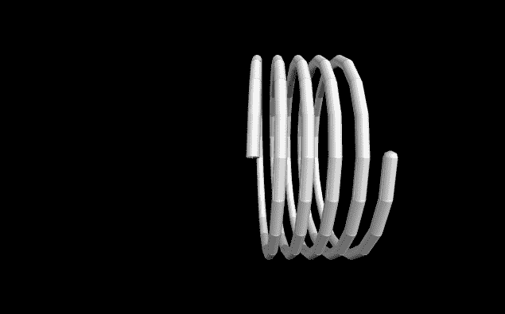
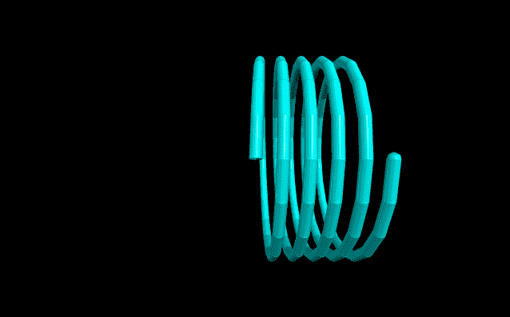
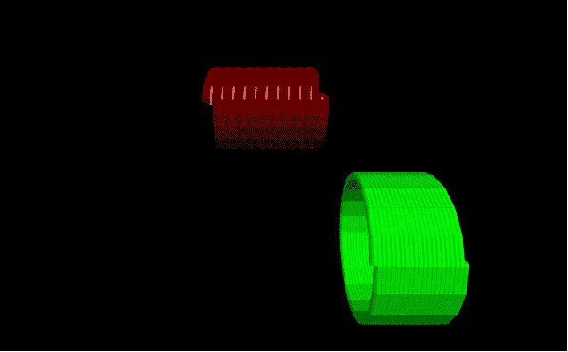

# 用 VPython 做螺旋

> 原文:[https://www.geeksforgeeks.org/making-a-helix-with-vpython/](https://www.geeksforgeeks.org/making-a-helix-with-vpython/)

**`VPython`** 可以轻松创建可导航的 3D 显示和动画，即使对于编程经验有限的人来说也是如此。因为它基于 Python，所以它也可以为有经验的程序员和研究人员提供很多东西。`VPython`允许用户在三维空间中创建球体和圆锥体等对象，并在窗口中显示这些对象。这使得创建简单的可视化变得容易，允许程序员将更多的精力放在程序的计算方面。`VPython`的简单性使它成为简单物理的图解工具，尤其是在教育环境中。

**安装:**

```py
pip install vpython
```

一个**螺旋**是三维空间中的一个几何物体，形状像一个开瓶器或螺旋楼梯。它是一种光滑的空间曲线，切线与固定轴成恒定的角度。我们可以使用`helix()`方法在`VPython`中生成一个螺旋线。

## 螺旋线()

> **语法:**螺旋线(参数)
> 
> **参数:**
> 
> *   **pos :** 是螺旋线一端中心的位置。指定包含 3 个值的向量，例如 pos = vector(0，0，0)
> *   **轴:**是螺旋线的排列轴。指定包含 3 个值的向量，例如轴=向量(1，2，1)
> *   **颜色:**是螺旋的颜色。指定一个包含 3 个值的向量，例如 color = vector(1，1，1)将给出白色
> *   **不透明度:**是螺旋线的不透明度。分配一个浮动值，其中 1 是最不透明的，0 是最不透明的，例如不透明度= 0.5
> *   **光泽:**是耳轮的光泽。指定一个浮动值，其中 1 是最闪亮的，0 是最不闪亮的，例如闪亮度= 0.6
> *   **发射率:**是螺旋线的发射率。指定一个布尔值，其中“真”是发射性的，“假”不是发射性的，例如发射率=假
> *   **长度:**是纹理的长度=纹理.灰泥。指定一个浮动值，默认长度为 1，示例长度= 10
> *   **半径:**是螺旋线的半径。指定一个浮动值，默认半径为 1，示例半径= 5
> *   **线圈:**是螺旋中的线圈数。指定一个整数值，默认线圈为 5，示例线圈= 9
> *   **厚度:**是用来画螺旋线的曲线横截面的直径。指定一个浮动值，默认厚度为半径/20，示例厚度= 1
> *   **大小:**是螺旋线的大小。指定一个包含 3 个值的向量，分别代表长度、高度和宽度，例如大小=向量(1，1，1)
> 
> 所有参数都是可选的。

**例 1 :** 没有参数的螺旋线，所有参数都会有默认值。

```py
# import the module
from vpython import * helix()
```

**输出:**


**示例 2 :** 使用颜色、不透明度、光泽和发射率参数的螺旋线。

```py
# import the module
from vpython import * cone(color = vector(0, 1, 1), 
     opacity = 0.5, 
     shininess = 1, 
     emissive = False)
```

**输出:**


**示例 3 :** 显示 2 个螺旋，以可视化属性位置、长度、半径、线圈和厚度。

```py
# import the module
from vpython import *

# the first helix
helix(pos = vector(-2, 2, 0),
      length = 3,
      radius = 1,
      coils = 10,
      thickness = 0.5,
      color = vector(0.5, 0, 0))

# the second helix
helix(pos = vector(1, -1, 5), 
      color = vector(0, 1, 0),
      coils = 20)
```

**输出:**


**示例 4 :** 使用参数轴和尺寸的螺旋线。

```py
# import the module
from vpython import * helix(axis = vector(-1, 4, 0),
      size = vector(1, 2, 2))
```

**输出:**
