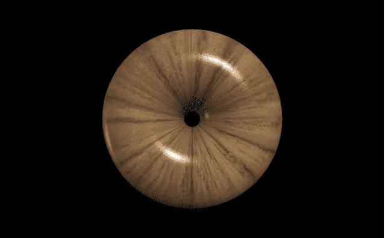

# 用 VPython 做戒指

> 原文:[https://www.geeksforgeeks.org/making-a-ring-with-vpython/](https://www.geeksforgeeks.org/making-a-ring-with-vpython/)

**`VPython`** 可以轻松创建可导航的 3D 显示和动画，即使对于编程经验有限的人来说也是如此。因为它基于 Python，所以它也可以为有经验的程序员和研究人员提供很多东西。`VPython`允许用户在三维空间中创建球体和圆锥体等对象，并在窗口中显示这些对象。这使得创建简单的可视化变得容易，允许程序员将更多的精力放在程序的计算方面。`VPython`的简单性使它成为简单物理的图解工具，尤其是在教育环境中。

**安装:**

```
pip install vpython
```

一个**环**是三维空间中的一个几何物体，它有一个内部中空的圆形形状。我们可以使用`ring()`方法在`VPython`中生成一个环。

## ring()方法

> **语法:**环(参数)
> 
> **参数:**
> 
> *   **pos :** 是环中心的位置。指定包含 3 个值的向量，例如 pos = vector(0，0，0)
> *   **轴:**是环的对齐轴。指定包含 3 个值的向量，例如轴=向量(1，2，1)
> *   **up :** 是戒指的方位。指定一个包含 3 个值的向量，例如 up = vector(0，1，0)
> *   **颜色:**是戒指的颜色。指定一个包含 3 个值的向量，例如 color = vector(1，1，1)将给出白色
> *   **不透明度:**是戒指的不透明度。分配一个浮动值，其中 1 是最不透明的，0 是最不透明的，例如不透明度= 0.5
> *   **闪耀度:**是戒指的闪耀度。指定一个浮动值，其中 1 是最闪亮的，0 是最不闪亮的，例如闪亮度= 0.6
> *   **发射率:**是戒指的发射率。指定一个布尔值，其中“真”是发射性的，“假”不是发射性的，例如发射率=假
> *   **纹理:**是戒指的纹理。从纹理类中指定所需的纹理，例如纹理=纹理.灰泥
> *   **半径:**是环的半径。指定一个浮动值，默认半径为 1，示例半径= 5
> *   **厚度:**是圆环横截面的半径。指定一个浮动值，默认厚度为半径的 1/10 值，例如厚度= 8
> *   **大小:**就是戒指的大小。指定一个包含 3 个值的向量，分别代表长度、高度和宽度，例如大小=向量(1，1，1)
> 
> 所有参数都是可选的。

**例 1 :** 一个没有参数的环，所有参数都会有默认值。

```
# import the module
from vpython import * ring()
```

**输出:**


**示例 2 :** 一个使用纹理、轴和向上参数的环。

```
# import the module
from vpython import * ring(texture = textures.wood,
     axis = vector(0, 0, 1),
     up = vector(1, 0, 0))
```

**输出:**


**示例 3 :** 显示 2 个环来可视化属性位置、半径和厚度。

```
# import the module
from vpython import *

# the first ring
ring(pos = vector(-2, 2, 0),
     axis = vector(0, 0, 1),
     radius = 2,
     thickness = 1,
     color = vector(0.2, 0.7, 0))

# the second ring
ring(pos = vector(1, -1, 5), 
     axis = vector(0, 0, 1),
     radius = 5,
     color = vector(0, 0.2, 0.8))
```

**输出:**
