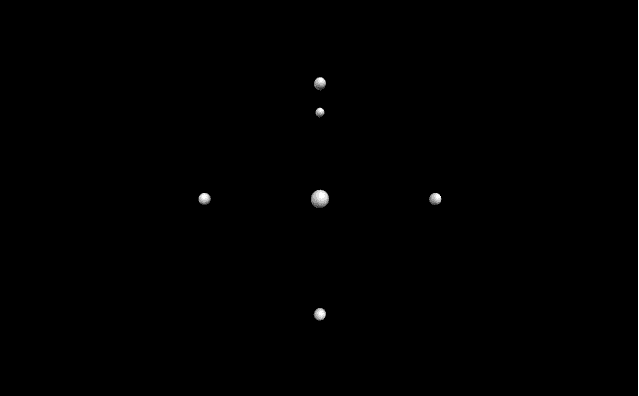

# 在 VPython

上进行积分

> 原文:[https://www.geeksforgeeks.org/making-points-in-vpython/](https://www.geeksforgeeks.org/making-points-in-vpython/)

**`VPython`** 可以轻松创建可导航的 3D 显示和动画，即使对于编程经验有限的人来说也是如此。因为它基于 Python，所以它也可以为有经验的程序员和研究人员提供很多东西。`VPython`允许用户在三维空间中创建球体和圆锥体等对象，并在窗口中显示这些对象。这使得创建简单的可视化变得容易，允许程序员将更多的精力放在程序的计算方面。`VPython`的简单性使它成为简单物理的图解工具，尤其是在教育环境中。

**安装:**

```py
pip install vpython
```

几何中的一个**点**是一个位置。我们可以使用`points()`方法在`VPython`中生成点。

## 点数()

> **语法:**点(参数)
> 
> **参数:**
> 
> *   **pos :** 是点的位置。指定包含 3 个值的向量列表，例如 pos =[向量(-1，0，0)，向量(1，0，0)]
> *   **颜色:**是点的颜色。指定一个包含 3 个值的向量，例如 color = vector(1，1，1)将给出白色
> *   **半径:**是点的半径。指定一个浮动值，默认半径为 2.5，示例半径= 5
> *   **尺寸:**是圆柱体的尺寸。指定一个包含 3 个值的向量，分别代表长度、高度和宽度，例如大小=向量(1，1，1)
> 
> 所有参数都是可选的。

没有任何参数，`points()`方法默认不显示任何内容。

**示例 1 :** 使用参数 pos 的点。

```py
# import the module
from vpython import * points(pos =[vector(-1, 0, 0), 
            vector(1, 0, 0),
            vector(0, 1, 0),
            vector(0, -1, 0),
            vector(0, 0, 1),
            vector(0, 1, -1)])
```

**输出:**


**示例 2 :** 使用参数颜色和半径的点。

```py
# import the module
from vpython import *

# first set of points
points(pos =[vector(-1, 0, 0), 
            vector(1, 0, 0),
            vector(0, 1, 0),
            vector(0, -1, 0)],
       color = vector(1, 0, 0),
       radius = 10)

# second set of points
points(pos =[vector(-0.5, 0, 0), 
            vector(0.5, 0, 0)],
       color = vector(1, 0, 1),
       radius = 20)
```

**输出:**
