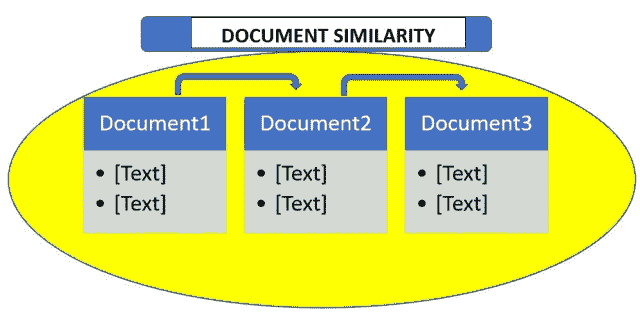

# 在 Python 中测量文档相似度

> 原文:[https://www . geeksforgeeks . org/测量 python 中的文档相似度/](https://www.geeksforgeeks.org/measuring-the-document-similarity-in-python/)

顾名思义，文档相似性决定了两个给定文档的相似程度。“文档”是指字符串的集合。例如，一篇文章或. txt 文件。许多组织使用这种文档相似性原则来检查抄袭。许多考试指导机构也用它来检查学生是否作弊。因此，了解所有这些是如何工作的非常重要也非常有趣。



文档相似度通过计算文档距离来计算。文档距离是一个概念，其中单词(文档)被视为向量，并被计算为两个给定文档向量之间的角度。文档向量是给定文档中单词出现的频率。让我们看一个例子:

假设给我们两份文件 **D1** 和 **D2** 如下:

**D1** :“这是一个极客”
**D2** :“这是一个极客的事情”

这两份文件中类似的词语变成:

```py
"This a geek"
```

如果我们用 D1、D2 和三轴几何中类似的词，把它作为向量进行三维表示，那么我们得到:


现在如果我们取 **D1** 和 **D2** 的点积，

```py
D1.D2 = "This"."This"+"is"."was"+"a"."a"+"geek"."geek"+"thing".0
```

```py
D1.D2 = 1+0+1+1+0
```

```py
D1.D2 = 3
```

**现在我们知道如何计算这些文档的点积，我们现在可以计算文档向量之间的角度:**

```py
cos d = D1.D2/|D1||D2|
```

**这里 d 是文件距离。它的值范围从 0 度到 90 度。其中 0 度表示两个文档完全相同，90 度表示两个文档非常不同。**

**现在我们已经知道了文档相似性和文档距离，让我们看一个 Python 程序来计算相同的内容:**

****文档相似性程序:****

**我们确认文档相似性的算法包括三个基本步骤:**

*   **把文件拆分成单词。**
*   **计算词频。**
*   **计算文档向量的点积。**

**第一步，我们将首先使用`.read()`方法打开并读取文件的内容。当我们阅读内容时，我们将把它们分成一个列表。接下来，我们将计算文件中读取的词频列表。因此，统计每个单词的出现次数，并按字母顺序对列表进行排序。**

```py
import math
import string
import sys

# reading the text file
# This functio will return a 
# list of the lines of text 
# in the file.
def read_file(filename): 

    try:
        with open(filename, 'r') as f:
            data = f.read()
        return data

    except IOError:
        print("Error opening or reading input file: ", filename)
        sys.exit()

# splitting the text lines into words
# translation table is a global variable
# mapping upper case to lower case and
# punctuation to spaces
translation_table = str.maketrans(string.punctuation+string.ascii_uppercase,
                                     " "*len(string.punctuation)+string.ascii_lowercase)

# returns a list of the words
# in the file
def get_words_from_line_list(text): 

    text = text.translate(translation_table)
    word_list = text.split()

    return word_list
```

****现在我们已经有了单词列表，现在我们将计算单词的出现频率。****

```py
# counts frequency of each word
# returns a dictionary which maps
# the words to  their frequency.
def count_frequency(word_list): 

    D = {}

    for new_word in word_list:

        if new_word in D:
            D[new_word] = D[new_word] + 1

        else:
            D[new_word] = 1

    return D

# returns dictionary of (word, frequency)
# pairs from the previous dictionary.
def word_frequencies_for_file(filename): 

    line_list = read_file(filename)
    word_list = get_words_from_line_list(line_list)
    freq_mapping = count_frequency(word_list)

    print("File", filename, ":", )
    print(len(line_list), "lines, ", )
    print(len(word_list), "words, ", )
    print(len(freq_mapping), "distinct words")

    return freq_mapping
```

****最后，我们将计算点积来给出文档距离。****

```py
# returns the dot product of two documents
def dotProduct(D1, D2): 
    Sum = 0.0

    for key in D1:

        if key in D2:
            Sum += (D1[key] * D2[key])

    return Sum

# returns the angle in radians 
# between document vectors
def vector_angle(D1, D2): 
    numerator = dotProduct(D1, D2)
    denominator = math.sqrt(dotProduct(D1, D1)*dotProduct(D2, D2))

    return math.acos(numerator / denominator)
```

****就这样！看到文档相似度函数的时间:****

```py
def documentSimilarity(filename_1, filename_2):

   # filename_1 = sys.argv[1]
   # filename_2 = sys.argv[2]
    sorted_word_list_1 = word_frequencies_for_file(filename_1)
    sorted_word_list_2 = word_frequencies_for_file(filename_2)
    distance = vector_angle(sorted_word_list_1, sorted_word_list_2)

    print("The distance between the documents is: % 0.6f (radians)"% distance)
```

****这里是完整的源代码。****

```py
import math
import string
import sys

# reading the text file
# This functio will return a 
# list of the lines of text 
# in the file.
def read_file(filename): 

    try:
        with open(filename, 'r') as f:
            data = f.read()
        return data

    except IOError:
        print("Error opening or reading input file: ", filename)
        sys.exit()

# splitting the text lines into words
# translation table is a global variable
# mapping upper case to lower case and
# punctuation to spaces
translation_table = str.maketrans(string.punctuation+string.ascii_uppercase,
                                     " "*len(string.punctuation)+string.ascii_lowercase)

# returns a list of the words
# in the file
def get_words_from_line_list(text): 

    text = text.translate(translation_table)
    word_list = text.split()

    return word_list

# counts frequency of each word
# returns a dictionary which maps
# the words to  their frequency.
def count_frequency(word_list): 

    D = {}

    for new_word in word_list:

        if new_word in D:
            D[new_word] = D[new_word] + 1

        else:
            D[new_word] = 1

    return D

# returns dictionary of (word, frequency)
# pairs from the previous dictionary.
def word_frequencies_for_file(filename): 

    line_list = read_file(filename)
    word_list = get_words_from_line_list(line_list)
    freq_mapping = count_frequency(word_list)

    print("File", filename, ":", )
    print(len(line_list), "lines, ", )
    print(len(word_list), "words, ", )
    print(len(freq_mapping), "distinct words")

    return freq_mapping

# returns the dot product of two documents
def dotProduct(D1, D2): 
    Sum = 0.0

    for key in D1:

        if key in D2:
            Sum += (D1[key] * D2[key])

    return Sum

# returns the angle in radians 
# between document vectors
def vector_angle(D1, D2): 
    numerator = dotProduct(D1, D2)
    denominator = math.sqrt(dotProduct(D1, D1)*dotProduct(D2, D2))

    return math.acos(numerator / denominator)

def documentSimilarity(filename_1, filename_2):

   # filename_1 = sys.argv[1]
   # filename_2 = sys.argv[2]
    sorted_word_list_1 = word_frequencies_for_file(filename_1)
    sorted_word_list_2 = word_frequencies_for_file(filename_2)
    distance = vector_angle(sorted_word_list_1, sorted_word_list_2)

    print("The distance between the documents is: % 0.6f (radians)"% distance)

# Driver code
documentSimilarity('GFG.txt', 'file.txt')
```

****输出:****

```py
File GFG.txt :
15 lines, 
4 words, 
4 distinct words
File file.txt :
22 lines, 
5 words, 
5 distinct words
The distance between the documents is:  0.835482 (radians) 
```