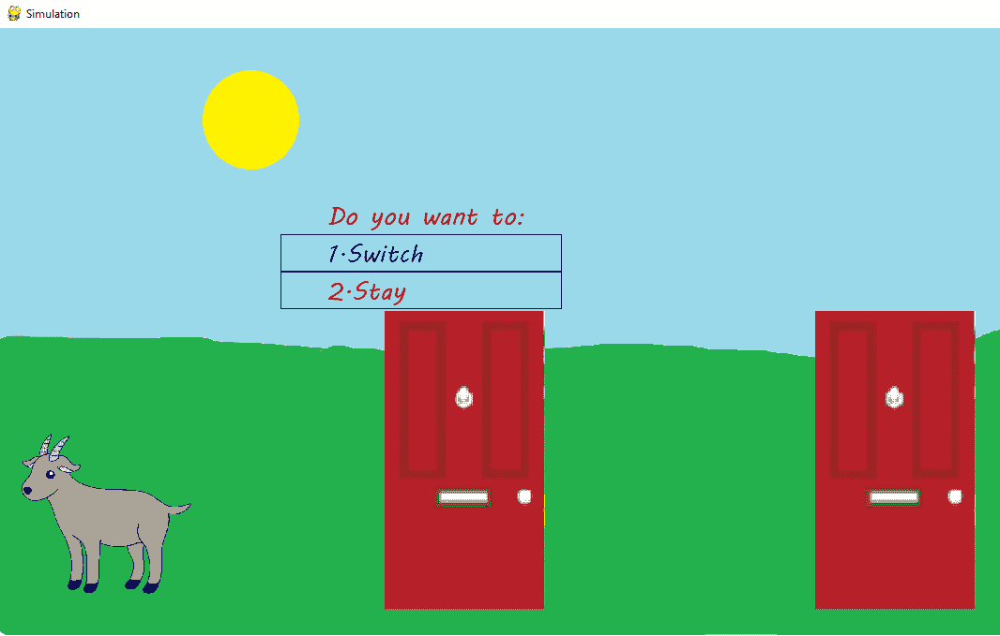
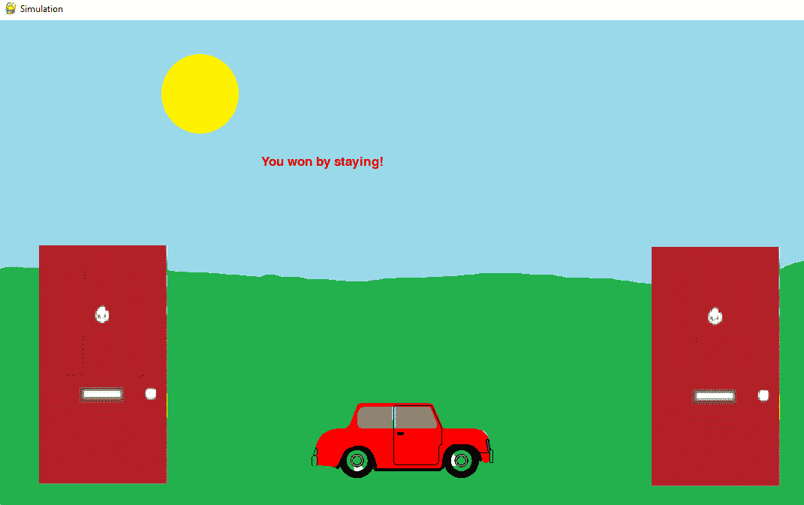
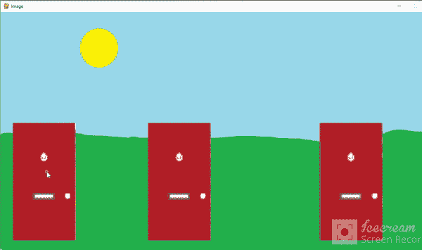

# 蒙蒂霍尔问题的 Pygame 模拟

> 原文:[https://www . geesforgeks . org/monty-hall-problems-simulation-use-pygame/](https://www.geeksforgeeks.org/monty-hall-problems-simulation-using-pygame/)

在本文中，我们将看到如何使用 Python 中的 Pygame 创建 Monty Hall 游戏。蒙蒂霍尔是美国电视游戏节目《让我们做笔交易》的游戏节目。

假设你在一个游戏节目中，你可以选择三扇门，一扇门后是一辆车；在其他人后面，是山羊。你挑一扇门，说 1 号，知道门后是什么的主人，打开另一扇门，说 3 号，里面有一只山羊。然后他对你说:“你想选 2 号门吗？”转换选择对你有利吗？

**展示最终产品的样子:**



山羊出现在 1 号门后面。最初的选择是 2 号门。



由于决定留下来，比赛就赢了。

请确保使用的图像和音频与 Python 文件存在于同一文件夹中。图像和音频可以从[这里](https://drive.google.com/drive/folders/1BQH2H161zQS2BR8Po6L3h-EJGt5LgkZR?usp=sharing)下载。

## 工作流程和逻辑

整个模拟可以归纳为以下几点:

*   因为有三扇门，所以会产生数字 1、2、3 的随机排列，每个数字代表门的号码。这个随机生成的排列的前两个数字对应山羊所在的门，第三个数字是汽车所在的门。
*   一旦生成了配置，就可以通过图像以图形方式表示。每个配置都有一个映像。
*   有一点需要注意——根据谜题，在用户选择了门牌号之后，只有后面有山羊的门才会被显示出来。因此，如果用户选择了后面有汽车的门，那么剩下的两个门中的任何一个都可以被显示出来。然而，如果用户选择了后面有山羊的门，则剩下的两扇门中只有一扇门可以被打开(因为不允许打开用户选择的门)。

## 进行导入和生成配置

## 蟒蛇 3

```
import pygame
import random
pygame.init()
white = (255, 255, 255)
X = 1200
Y = 650
doors = random.sample(range(1, 4), 3)
goat1 = doors[0]
goat2 = doors[1]
goats = [goat1, goat2]
car = doors[2]
```

这个模拟 pygame 和 random 只需要两个外部模块。在每个 Pygame 程序的开始，都需要通过编写 **pygame.init()来初始化 Pygame。**X 和 Y 值是指运行模拟的窗口的尺寸。这些值可以根据所需的分辨率和使用的图像进行更改。列表“门”的值介于 1 和 3 之间(含 1 和 3)。每次运行程序时，这些值的顺序都会混乱。这样做是为了指定门，后面会有山羊。根据问题，这两扇门后面总共有三扇门，会有山羊，第三扇门后面会有汽车。变量**山羊 1 和山羊 2** 保存着门号，门号后面会有山羊。这些数字然后被添加到一个名为山羊的列表中。第三个数字分配给变量 car。

## **添加背景和音乐**

## 蟒蛇 3

```
display_surface = pygame.display.set_mode((X, Y))
pygame.display.set_caption('Simulation')
image = pygame.image.load('all_doors.jpg')
change = False

def music():
    file = 'click.mp3'
    pygame.mixer.init()
    pygame.mixer.music.load(file)
    pygame.mixer.music.play()
```

**display_surface** 变量就像一张画布，我们将在上面添加实体(图像、文本等)。)按照要求。通过 **display.set_caption** 函数传递的参数将是模拟窗口的标题。首先要显示的图像——所有三扇门都已关闭。一个布尔变量，**变化**，用于记录变化。功能**音乐**是可选的。它的功能是当用户按下一扇门时产生*点击*的声音。一定要有任何想要播放的音乐的 mp3 文件。该函数执行初始化、加载和播放三个步骤。

## 基于用户输入更新图像

## 蟒蛇 3

```
def show_car(car, state):
    my_font = pygame.font.SysFont("latoblack", 26)
    display_surface = pygame.display.set_mode((X, Y))
    car1 = pygame.image.load('car_1.jpg')
    car2 = pygame.image.load('car_2.jpg')
    car3 = pygame.image.load('car_3.jpg')

    if car == 1:
        display_surface.blit(car1, (0, 0))
        pygame.display.update()
    elif car == 2:
        display_surface.blit(car2, (0, 0))
        pygame.display.update()
    elif car == 3:
        display_surface.blit(car3, (0, 0))
        pygame.display.update()
    if state == 1:
        the_text = my_font.render("You won by switching!", True, (231, 0, 10))
        display_surface.blit(the_text, (350, 180))
        pygame.display.update()
    elif state == 2:
        the_text = my_font.render(
            "You could've won by staying!", True, (231, 0, 0))
        display_surface.blit(the_text, (350, 180))
        pygame.display.update()
    elif state == 3:
        the_text = my_font.render("You won by staying!", True, (231, 0, 0))
        display_surface.blit(the_text, (350, 180))
        pygame.display.update()
    elif state == 4:
        the_text = my_font.render(
            "You could've won by switcing!", True, (231, 0, 0))
        display_surface.blit(the_text, (350, 180))
        pygame.display.update()

def draw_rect():
    pygame.draw.rect(display_surface, (20, 24, 11), 
                     (300, 220, 300, 40), 1)
    pygame.display.update()
    pygame.draw.rect(display_surface, (14, 2, 200),
                     (300, 260, 300, 40), 1)
    pygame.display.update()
```

**show_car** 功能可能看起来有点麻烦，但是它的功能相当琐碎。它旨在显示适当方向的图像，即，如果汽车在门 3 后面，则显示对应于该方向(汽车在位置 3)的图像。所有的图片(以及代码中使用的名称)都在本文的末尾。**状态**参数告诉模拟的结果。

**有四种可能的结果:**

<figure class="table">

| **结果** | **决定** |
| 获胜 | 逗留 |
| 获胜 | 转换 |
| 遗失 | 逗留 |
| 遗失 | 转换 |

</figure>

必须使用 **pygame.display.update()** 才能进行任何显示更改。可以通过更改 **my_font** 变量中的参数来更改字体和字号。 **display_surface.blit** 的第一个参数是要渲染的图像，第二个参数是表示 X 和 Y 坐标的元组。 **my_font** 有一个属性 **render** 用于显示文本。第一个参数是要显示的文本，第三个参数是包含用于指定文本颜色的 RGB 值的元组。 **display_surface.blit** 用于将**指定的文本渲染到画布上。第一个参数是文本的规格，第二个参数有 X 和 Y 坐标。要找到坐标，请使用:**

## 蟒蛇 3

```
x, y = pygame.mouse.get_pos()
```

这将创建一个十字准线，点击点的坐标将是已知的。

## 主循环和处理点击

## 蟒蛇 3

```
while True:
    music()
    if change == False:
        display_surface.fill(white)
        display_surface.blit(image, (0, 0))
    for event in pygame.event.get():
        if event.type == pygame.QUIT:
            pygame.quit()
        pygame.display.update()
        clicked = False

        if event.type == pygame.MOUSEBUTTONDOWN:

            # Check if door 1 is pressed.
            if(event.pos[0] >= 71 and event.pos[0] <= 203 
               and event.pos[1] >= 387 and event.pos[1] <= 632):
                user = 1
                clicked = True
                music()
            # Check if door 2 is pressed.
            elif(event.pos[0] >= 353 and event.pos[0] <= 485 
                 and event.pos[1] >= 386 and event.pos[1] <= 635):
                user = 2
                clicked = True
                music()
            # Check if door 3 is pressed.
            elif(event.pos[0] >= 938 and event.pos[0] <= 1100 
                 and event.pos[1] >= 387 and event.pos[1] <= 633):
                user = 3
                # print("Clicked on door 3.")
                clicked = True
                music()
```

每个游戏都包含一个无限循环(当为真时为**)。**检查注册的事件类型是否为**退出，**即用户关闭了 Pygame 窗口。在这种情况下，程序终止。**侏儒怪。**鼠标左键点击鼠标的事件。if 条件用于确定用户已按下的门(基于坐标)，门号被分配给变量**用户**。例如，如果发生点击的点的 X 坐标( **event.pos[0]** )在 71 和 203 之间，Y 坐标( **event.pos[1]** )在 387 和 633 之间，则登记点击在门 1 上有点击。单击**布尔型设置为真，只要单击三扇门中的一扇门。**

## **加载所有有效配置(图像)并生成山羊位置**

## **蟒蛇 3**

```
if clicked:
            image1 = pygame.image.load('goat_1.jpg')
            image2 = pygame.image.load('goat_2.jpg')
            image3 = pygame.image.load('goat_3.jpg')
            image4 = pygame.image.load('car_1.jpg')
            image5 = pygame.image.load('car_2.jpg')
            image6 = pygame.image.load('car_3.jpg')
            wr = random.randint(0, 1)
            if(goats[0] == user):
                g = goats[1]
            elif(goats[1] == user):
                g = goats[0]
            else:
                g = goats[wr]
            if g == 1:
                change = True
                display_surface.blit(image1, (0, 0))
                pygame.display.update()
            elif g == 2:
                change = True
                display_surface.blit(image2, (0, 0))
                pygame.display.update()
            elif g == 3:
                change = True
                display_surface.blit(image3, (0, 0))
                pygame.display.update()
            print(u"There is a goat behind door {}".format(g))
            my_font = pygame.font.SysFont("mvboli", 26)
            the_text = my_font.render("Do you want to:", True, (231, 0, 0))
            display_surface.blit(the_text, (350, 180))
            the_text2 = my_font.render("1.Switch", True, (0, 0, 190))
            display_surface.blit(the_text2, (350, 220))
            the_text3 = my_font.render("2.Stay", True, (190, 0, 0))
            display_surface.blit(the_text3, (350, 260))
            draw_rect()
            clicked2 = False
            print(u"The car is behind door {}".format(car))

        clicked2 = False
        if event.type == pygame.MOUSEBUTTONDOWN:
          # Compare click coordinates with
          # coordinates where it says 'Switch' and 'Stay'.
            if(event.pos[0] >= 299 and event.pos[0] <= 597 
               and event.pos[1] >= 220 
               and event.pos[1] <= 260):

                  # user2 = 1 means user has chosen to switch.
                user2 = 1  
                clicked2 = True
            elif(event.pos[0] >= 301 and event.pos[0] <= 598 
                 and event.pos[1] >= 259 and event.pos[1] <= 297):
                user2 = 2   # user2 = 2 means user has chosen to stay. 
                clicked2 = True
```

**注册有效点击后，将加载六个图像。检查用户是否点击了后面有山羊的门。由于用户选择的门无法打开，并且可以打开的门后面必须包含山羊，因此只有一个可能的门可以打开。比方说，山羊在门 1 和门 2 的后面，用户点击门 1，因为门 1 不能打开，所以门 2 是唯一可以打开的门。变量 **g** 存储可以打开的有效门。如果用户没有选择后面有山羊的门，则使用**随机点**功能随机分配山羊，并在变量 **wr** 中存储 1 或 0。**

**变量 **user2** 存储用户是选择停留还是切换。布尔型，**点击 2** ，存储用于确定选择(停留或切换)的点击是否已注册。**

## **基于用户输入显示结果(文本)**

## **蟒蛇 3**

```
if clicked2:

    if user2 == 1:
        print("You chose to switch!")
        if user in goats:
            my_font = pygame.font.SysFont("mvboli", 26)
            the_text = my_font.render(
                "You won by switching!", True, (231, 0, 0))
            state = 1
            display_surface.blit(the_text, (350, 180))
            pygame.display.update()
            print("You won by switching!")
        else:   # User has chosen the door behind which there is a car.
            my_font = pygame.font.SysFont("mvboli", 26)
            the_text2 = my_font.render(
                "You could've won by staying!", True, (231, 0, 0))
            state = 2
            display_surface.blit(the_text2, (350, 180))
            pygame.display.update()
            print("You could have won by switching!")
    elif user2 == 2:
        print("You chose to stay!")
        if user == car:
            my_font = pygame.font.SysFont("mvboli", 26)
            the_text3 = my_font.render(
                "You won by staying!", True, (231, 0, 0))
            display_surface.blit(the_text3, (350, 180))
            state = 3
            pygame.display.update()
            print("You won by staying!")
        else:
            my_font = pygame.font.SysFont("mvboli", 26)
            the_text4 = my_font.render(
                "You could've won by switching!", True, (231, 0, 0))
            display_surface.blit(the_text4, (350, 180))
            state = 4
            pygame.display.update()
            print("You could have won by switching!")
    show_car(car, state)
```

**一旦用户选择了，就确定他们是否赢了(他们最终选择的门后是否有车)。确定获胜者可以通过下表来理解:**

<figure class="table">

| **动作** | **初始选择(山羊或汽车)** | **结果** |
| 转换 | 山羊 | 获胜 |
| 转换 | 汽车 | 遗失 |
| 逗留 | 汽车 | 获胜 |
| 逗留 | 山羊 | 遗失 |

</figure>

## **下面是完整的实现:**

## **蟒蛇 3**

```
import pygame
import random
pygame.init()
white = (255, 255, 255)
X = 1200
Y = 650
doors = random.sample(range(1, 4), 3)
goat1 = doors[0]
goat2 = doors[1]
goats = [goat1, goat2]
car = doors[2]
display_surface = pygame.display.set_mode((X, Y))
pygame.display.set_caption('Simulation')
image = pygame.image.load('all_doors.jpg')
change = False
msg_disp = False

def music():
    file = 'click.mp3'
    pygame.mixer.init()
    pygame.mixer.music.load(file)
    pygame.mixer.music.play()

def show_car(car, state):
    my_font = pygame.font.SysFont("latoblack", 26)
    display_surface = pygame.display.set_mode((X, Y))
    car1 = pygame.image.load('car_1.jpg')
    car2 = pygame.image.load('car_2.jpg')
    car3 = pygame.image.load('car_3.jpg')

    if car == 1:
        display_surface.blit(car1, (0, 0))
        pygame.display.update()
    elif car == 2:
        display_surface.blit(car2, (0, 0))
        pygame.display.update()
    elif car == 3:
        display_surface.blit(car3, (0, 0))
        pygame.display.update()
    if state == 1:
        the_text = my_font.render("You won by switching!",
                                  True, (231, 0, 10))
        display_surface.blit(the_text, (350, 180))
        pygame.display.update()
    elif state == 2:
        the_text = my_font.render(
            "You could've won by staying!", True,
          (231, 0, 0))
        display_surface.blit(the_text, (350, 180))
        pygame.display.update()
    elif state == 3:
        the_text = my_font.render("You won by staying!", 
                                  True, (231, 0, 0))
        display_surface.blit(the_text, (350, 180))
        pygame.display.update()
    elif state == 4:
        the_text = my_font.render(
            "You could've won by switcing!", True,
          (231, 0, 0))
        display_surface.blit(the_text, (350, 180))
        pygame.display.update()

def draw_rect():
    pygame.draw.rect(display_surface, (20, 24, 11), 
                     (300, 220, 300, 40), 1)
    pygame.display.update()
    pygame.draw.rect(display_surface, (14, 2, 200), 
                     (300, 260, 300, 40), 1)
    pygame.display.update()

while True:
    music()
    if change == False:
        display_surface.fill(white)
        display_surface.blit(image, (0, 0))
    for event in pygame.event.get():
        if event.type == pygame.QUIT:
            pygame.quit()

        pygame.display.update()

        clicked = False

        if event.type == pygame.MOUSEBUTTONDOWN:
            # Check if door 1 is pressed.
            if(event.pos[0] >= 71 and event.pos[0] <= 203
               and event.pos[1] >= 387 and event.pos[1] <= 632):
                user = 1
                clicked = True
                music()
            # Check if door 2 is pressed.
            elif(event.pos[0] >= 353 and event.pos[0] <= 485 
                 and event.pos[1] >= 386 and event.pos[1] <= 635):
                user = 2
                clicked = True
                music()
            # Check if door 3 is pressed.
            elif(event.pos[0] >= 938 and event.pos[0] <= 1100 
                 and event.pos[1] >= 387 and event.pos[1] <= 633):
                user = 3

                clicked = True
                music()
        if clicked:

            image1 = pygame.image.load('goat_1.jpg')
            image2 = pygame.image.load('goat_2.jpg')
            image3 = pygame.image.load('goat_3.jpg')
            image4 = pygame.image.load('car_1.jpg')
            image5 = pygame.image.load('car_2.jpg')
            image6 = pygame.image.load('car_3.jpg')
            wr = random.randint(0, 1)
            if(goats[0] == user):
                g = goats[1]
            elif(goats[1] == user):
                g = goats[0]
            else:
                g = goats[wr]
            if g == 1:
                change = True
                display_surface.blit(image1, (0, 0))
                pygame.display.update()
            elif g == 2:
                change = True
                display_surface.blit(image2, (0, 0))
                pygame.display.update()
            elif g == 3:
                change = True
                display_surface.blit(image3, (0, 0))
                pygame.display.update()
            print(u"There is a goat behind door {}".format(g))

            my_font = pygame.font.SysFont("mvboli", 26)
            the_text = my_font.render("Do you want to:", True, (231, 0, 0))
            display_surface.blit(the_text, (350, 180))
            the_text2 = my_font.render("1.Switch", True, (0, 0, 190))
            display_surface.blit(the_text2, (350, 220))
            the_text3 = my_font.render("2.Stay", True, (190, 0, 0))
            display_surface.blit(the_text3, (350, 260))
            draw_rect()
            clicked2 = False
            print(u"The car is behind door {}".format(car))

    # for event in pygame.event.get():
        clicked2 = False
        if event.type == pygame.MOUSEBUTTONDOWN:

            # Compare click coordinates with coordinates
            # where it says 'Switch' and 'Stay'.
            if(event.pos[0] >= 299 and event.pos[0] <= 597
               and event.pos[1] >= 220 and event.pos[1] <= 260):

                # user2 = 1 means user has chosen to switch.
                user2 = 1  
                clicked2 = True
            elif(event.pos[0] >= 301 and event.pos[0] <= 598 
                 and event.pos[1] >= 259 and event.pos[1] <= 297):

                  # user2 = 2 means user has chosen to stay.
                user2 = 2   
                clicked2 = True

        if clicked2:

            if user2 == 1:
                print("You chose to switch!")
                if user in goats:
                    my_font = pygame.font.SysFont("mvboli", 26)
                    the_text = my_font.render(
                        "You won by switching!", True, (231, 0, 0))
                    state = 1
                    display_surface.blit(the_text, (350, 180))
                    pygame.display.update()
                    print("You won by switching!")

                # User has chosen the door behind which there is a car.
                else:   
                    my_font = pygame.font.SysFont("mvboli", 26)
                    the_text2 = my_font.render(
                        "You could've won by staying!", True, (231, 0, 0))
                    state = 2
                    display_surface.blit(the_text2, (350, 180))
                    pygame.display.update()
                    print("You could have won by switching!")
            elif user2 == 2:
                print("You chose to stay!")
                if user == car:
                    my_font = pygame.font.SysFont("mvboli", 26)
                    the_text3 = my_font.render(
                        "You won by staying!", True, (231, 0, 0))
                    display_surface.blit(the_text3, (350, 180))
                    state = 3
                    pygame.display.update()
                    print("You won by staying!")
                else:
                    my_font = pygame.font.SysFont("mvboli", 26)
                    the_text4 = my_font.render(
                        "You could've won by switching!", True, (231, 0, 0))
                    display_surface.blit(the_text4, (350, 180))
                    state = 4
                    pygame.display.update()
                    print("You could have won by switching!")
            show_car(car, state)
```

****输出:****

****