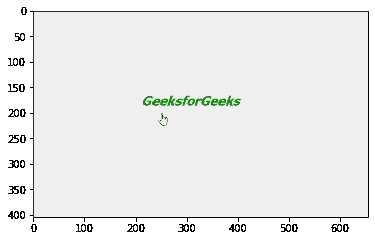
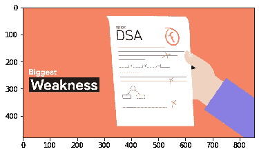

# 影片–从视频文件剪辑中获取帧

> 原文:[https://www . geesforgeks . org/moviepy-从视频文件获取帧-剪辑/](https://www.geeksforgeeks.org/moviepy-getting-frame-from-video-file-clip/)

在本文中，我们将了解如何在给定时间从 MoviePy 中的视频文件剪辑中获取帧。MoviePy 是一个用于视频编辑的 Python 模块，可用于视频和 GIF 的基本操作。帧的组合构成了视频，每一次都存在一个类似于正常图像的特定帧。获取帧意味着获取一个 numpy 数组，该数组表示剪辑在时间 t 的 RGB 图像或声音剪辑的(单声道或立体声)值。

> 为此，我们将对视频文件剪辑对象使用`get_frame`方法
> 
> **语法:** clip.get_frame(n)
> 
> **自变量:**以浮点值为自变量
> 
> **返回:**返回数字数组

下面是实现

```py
# importing matplotlib
from matplotlib import pyplot as plt

# importing numpy
import numpy as np

# Import everything needed to edit video clips
from moviepy.editor import *

# loading video gfg
clip = VideoFileClip("geeks.mp4")

# getting only first 5 seconds
clip = clip.subclip(0, 5)

# getting only first 5 seconds 
clip = clip.subclip(0, 5) 

# getting frame at time 3
frame = clip.get_frame(3)

# showing the frame with the help of matplotlib
plt.imshow(frame, interpolation ='nearest')

# show
plt.show()
```

**输出:**


另一个例子

```py
# importing matplotlib
from matplotlib import pyplot as plt

# importing numpy
import numpy as np

# Import everything needed to edit video clips 
from moviepy.editor import *

# loading video dsa gfg intro video 
clip = VideoFileClip("dsa_geek.mp4") 

# getting only first 5 seconds
clip = clip.subclip(0, 5)

# getting frame at time 2
frame = clip.get_frame(2)

# showing the frame with the help of matplotlib
plt.imshow(frame, interpolation ='nearest')

# show
plt.show()
```

**输出:**
