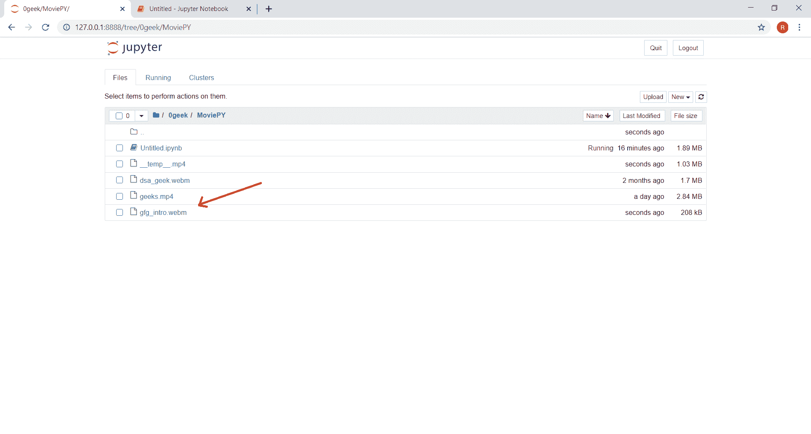
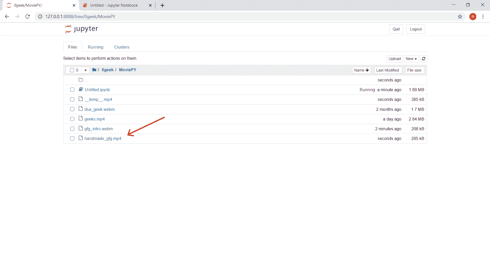

# 电影-保存视频文件剪辑

> 原文:[https://www . geesforgeks . org/moviepy-saving-video-file-clip/](https://www.geeksforgeeks.org/moviepy-saving-video-file-clip/)

在本文中，我们将了解如何在 MoviePy 中保存视频文件剪辑。MoviePy 是一个用于视频编辑的 Python 模块，可用于视频和 GIF 的基本操作。将一系列图像组合成一幅运动图像的视觉多媒体源。视频将信号传输到屏幕，并处理屏幕截图的显示顺序。视频通常具有与屏幕上显示的图片相对应的音频成分。

> 为此，我们将对视频文件剪辑对象使用`write_videofile`方法
> 
> **语法:**clip . write _ video file(new _ name)
> 
> **参数:**它以字符串作为参数，这是文件的新名称或位置
> 
> **返回:**返回无

**注意:**如果参数中只给出了新名称，那么文件将保存在代码的同一个文件夹中。

下面是实现

```
# Import everything needed to edit video clips
from moviepy.editor import *

# loading video dsa gfg intro video
clip = VideoFileClip("dsa_geek.webm")

# getting subclip as video is large
clip = clip.subclip(55, 65)

# saving the clip
clip.write_videofile("gfg_intro.webm")

# showing clip
clip.ipython_display(width = 480)
```

**输出:**

```
Moviepy - Building video gfg_intro.webm.
Moviepy - Writing video gfg_intro.webm

Moviepy - Done !
Moviepy - video ready gfg_intro.webm
Moviepy - Building video __temp__.mp4.
Moviepy - Writing video __temp__.mp4

Moviepy - Done !
Moviepy - video ready __temp__.mp4

```

<video class="wp-video-shortcode" id="video-456658-1" width="665" height="374" preload="metadata" controls=""><source type="video/mp4" src="https://media.geeksforgeeks.org/wp-content/uploads/20200721164610/113.mp4?_=1">[https://media.geeksforgeeks.org/wp-content/uploads/20200721164610/113.mp4](https://media.geeksforgeeks.org/wp-content/uploads/20200721164610/113.mp4)</video>

当我们进入代码文件夹时，我们可以看到新文件被创建，下面是创建的文件将如何


另一个例子

```
# Import everything needed to edit video clips
from moviepy.editor import *

# loading video gfg
clip = VideoFileClip("geeks.mp4")

# getting subclip 
clip = clip.subclip(0, 7)

# saving the clip
clip.write_videofile("handmade_gfg.mp4")

# showing clip
clip.ipython_display()
```

**输出:**

```
Moviepy - Building video handmade_gfg.mp4.
MoviePy - Writing audio in handmade_gfgTEMP_MPY_wvf_snd.mp3

MoviePy - Done.
Moviepy - Writing video handmade_gfg.mp4

Moviepy - Done !
Moviepy - video ready handmade_gfg.mp4
Moviepy - Building video __temp__.mp4.
MoviePy - Writing audio in __temp__TEMP_MPY_wvf_snd.mp3

MoviePy - Done.
Moviepy - Writing video __temp__.mp4

Moviepy - Done !
Moviepy - video ready __temp__.mp4

```

<video class="wp-video-shortcode" id="video-456658-2" width="656" height="404" preload="metadata" controls=""><source type="video/mp4" src="https://media.geeksforgeeks.org/wp-content/uploads/20200721164810/26.mp4?_=2">[https://media.geeksforgeeks.org/wp-content/uploads/20200721164810/26.mp4](https://media.geeksforgeeks.org/wp-content/uploads/20200721164810/26.mp4)</video>
When we go into the code folder we can see the new file is created, below is how the created file will be
