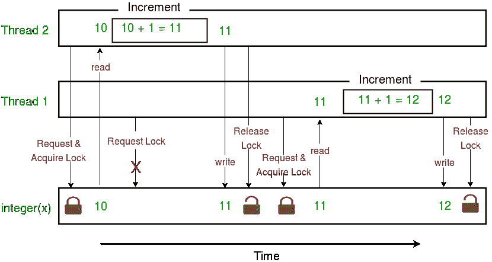

# Python 中的多线程|集 2(同步)

> 原文:[https://www . geesforgeks . org/python 中的多线程-set-2-同步/](https://www.geeksforgeeks.org/multithreading-in-python-set-2-synchronization/)

本文讨论 Python 编程语言中**多线程**情况下的线程同步概念。

**线程间同步**

线程同步被定义为一种确保两个或多个并发线程不会同时执行某个特定程序段的机制，该程序段被称为**临界段**。

> 关键部分是指程序中访问共享资源的部分。

例如，在下图中，3 个线程试图同时访问共享资源或关键部分。


对共享资源的并发访问会导致**竞争状态**。

> 当两个或两个以上的线程可以访问共享数据并且试图同时更改数据时，就会出现争用情况。因此，变量值可能是不可预测的，并且根据进程上下文切换的时间而变化。

考虑下面的程序来理解比赛状态的概念:

```
import threading

# global variable x
x = 0

def increment():
    """
    function to increment global variable x
    """
    global x
    x += 1

def thread_task():
    """
    task for thread
    calls increment function 100000 times.
    """
    for _ in range(100000):
        increment()

def main_task():
    global x
    # setting global variable x as 0
    x = 0

    # creating threads
    t1 = threading.Thread(target=thread_task)
    t2 = threading.Thread(target=thread_task)

    # start threads
    t1.start()
    t2.start()

    # wait until threads finish their job
    t1.join()
    t2.join()

if __name__ == "__main__":
    for i in range(10):
        main_task()
        print("Iteration {0}: x = {1}".format(i,x))
```

输出:

```
Iteration 0: x = 175005
Iteration 1: x = 200000
Iteration 2: x = 200000
Iteration 3: x = 169432
Iteration 4: x = 153316
Iteration 5: x = 200000
Iteration 6: x = 167322
Iteration 7: x = 200000
Iteration 8: x = 169917
Iteration 9: x = 153589
```

在上述程序中:

*   两个线程 **t1** 和 **t2** 在 **main_task** 函数中创建，全局变量 **x** 设置为 0。
*   每个线程都有一个目标函数 **thread_task** ，其中**增量**函数被调用 100000 次。
*   **递增**函数将在每次调用中将全局变量 **x** 递增 1。

**x** 的预计最终值是 200000，但是我们在 **main_task** 函数的 10 次迭代中得到的是一些不同的值。

这是由于线程对共享变量 **x** 的并发访问造成的。 **x** 的不可预测性只不过是**的比赛条件**。

下面给出的图表显示了在上述程序中如何出现**比赛状态**:


注意上图中 **x** 的期望值是 12，但由于比赛情况，结果是 11！

因此，我们需要一个工具来实现多线程之间的适当同步。

**使用锁**

**穿线**模块提供了一个**锁**类来处理比赛情况。使用操作系统提供的**信号量**对象来实现锁定。

> 信号量是一个同步对象，它控制并行编程环境中多个进程/线程对公共资源的访问。它只是操作系统(或内核)存储中指定位置的一个值，每个进程/线程可以检查然后更改。根据找到的值，进程/线程可以使用该资源，或者会发现它已经在使用中，并且必须等待一段时间才能重试。信号量可以是二进制的(0 或 1)，也可以有其他值。通常，使用信号量的进程/线程会检查该值，然后，如果它正在使用资源，会更改该值以反映这一点，以便后续的信号量用户知道要等待。

**锁定**类提供以下方法:

*   **获取(【阻塞】):**获取锁。锁可以是阻塞的，也可以是非阻塞的。
    *   当阻塞参数设置为**真**(默认值)时调用，线程执行被阻塞，直到锁被解锁，然后锁被设置为锁定并返回**真**。
    *   当阻塞参数设置为**假**时调用，线程执行不会被阻塞。如果锁未锁定，则设置为锁定并立即返回**真**否则返回**假**。
*   **释放():**释放锁定。
    *   当锁被锁定时，将其重置为解锁状态，然后返回。如果任何其他线程在等待锁解锁时被阻止，请允许其中一个线程继续。
    *   如果锁已经解锁，则会出现**螺纹错误**。

考虑下面给出的例子:

```
import threading

# global variable x
x = 0

def increment():
    """
    function to increment global variable x
    """
    global x
    x += 1

def thread_task(lock):
    """
    task for thread
    calls increment function 100000 times.
    """
    for _ in range(100000):
        lock.acquire()
        increment()
        lock.release()

def main_task():
    global x
    # setting global variable x as 0
    x = 0

    # creating a lock
    lock = threading.Lock()

    # creating threads
    t1 = threading.Thread(target=thread_task, args=(lock,))
    t2 = threading.Thread(target=thread_task, args=(lock,))

    # start threads
    t1.start()
    t2.start()

    # wait until threads finish their job
    t1.join()
    t2.join()

if __name__ == "__main__":
    for i in range(10):
        main_task()
        print("Iteration {0}: x = {1}".format(i,x))
```

输出:

```
Iteration 0: x = 200000
Iteration 1: x = 200000
Iteration 2: x = 200000
Iteration 3: x = 200000
Iteration 4: x = 200000
Iteration 5: x = 200000
Iteration 6: x = 200000
Iteration 7: x = 200000
Iteration 8: x = 200000
Iteration 9: x = 200000

```

让我们试着一步步理解上面的代码:

*   首先，使用

    ```
      lock = threading.Lock()

    ```

    创建一个**锁定**对象
*   然后，**锁定**作为目标函数参数传递:

    ```
      t1 = threading.Thread(target=thread_task, args=(lock,))
      t2 = threading.Thread(target=thread_task, args=(lock,))

    ```

*   In the critical section of target function, we apply lock using **lock.acquire()** method. As soon as a lock is acquired, no other thread can access the critical section (here, **increment** function) until the lock is released using **lock.release()** method.

    ```
      lock.acquire()
      increment()
      lock.release()

    ```

    从结果中可以看到， **x** 的最终值每次出来都是 20 万(这是预期的最终结果)。

下面给出的图表描述了上述程序中锁的实现:


这就把我们带到了这个关于 Python 中**多线程的教程系列的结尾。
最后，下面是多线程的几个优缺点:**

**优势:**

*   它不会阻止用户。这是因为线程是相互独立的。
*   更好地利用系统资源是可能的，因为线程并行执行任务。
*   在多处理器机器上增强性能。
*   多线程服务器和交互式图形用户界面只使用多线程。

**缺点:**

*   随着线程数量的增加，复杂性也会增加。
*   共享资源(对象、数据)的同步是必要的。
*   很难调试，结果有时难以预料。
*   导致饥饿的潜在死锁，即一些线程可能没有好的设计
*   构建和同步线程是 CPU/内存密集型的。

本文由 [**尼基尔·库马尔**](https://www.facebook.com/nikhilksingh97) 供稿。如果你喜欢 GeeksforGeeks 并想投稿，你也可以使用[contribute.geeksforgeeks.org](http://www.contribute.geeksforgeeks.org)写一篇文章或者把你的文章邮寄到 contribute@geeksforgeeks.org。看到你的文章出现在极客博客主页上，帮助其他极客。

如果你发现任何不正确的地方，或者你想分享更多关于上面讨论的话题的信息，请写评论。