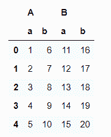
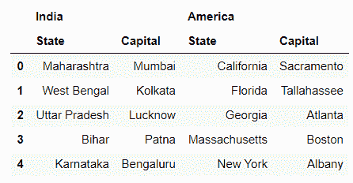

# 嵌套字典到多索引数据框

> 原文:[https://www . geesforgeks . org/nested-dictionary-to-multi index-data frame/](https://www.geeksforgeeks.org/nested-dictionary-to-multiindex-dataframe/)

**Pandas DataFrame** 是一个二维大小可变、潜在异构的表格数据结构，带有标记轴(行和列)。数据框是一种二维数据结构，即数据以表格形式排列成行和列。熊猫数据框架由三个主要部分组成，即数据、行和列。一个**多索引数据帧**是一个熊猫数据帧，具有多级索引或分级索引。

熊猫需要多索引值作为元组，而不是嵌套字典。因此，首先，我们需要将嵌套索引值转换为元组。

**示例#1:**

## 蟒蛇 3

```
# Import module
import pandas as pd

# Nested dictionary to convert it
# into multiindex dataframe
nested_dict = {'A': {'a': [1, 2, 3,
                           4, 5],
                     'b': [6, 7, 8,
                           9, 10]},

               'B': {'a': [11, 12, 13,
                           14, 15],
                     'b': [16, 17, 18,
                           19, 20]}}

reformed_dict = {}
for outerKey, innerDict in nested_dict.items():
    for innerKey, values in innerDict.items():
        reformed_dict[(outerKey,
                       innerKey)] = values

# Multiindex dataframe
reformed_dict
```

**输出:**


请注意，在*重整 _dict* 中，索引值在元组中。现在要将*重组字典*转换成多索引数据框，我们可以使用 **pd。DataFrame()** 方法。

## 蟒蛇 3

```
multiIndex_df = pd.DataFrame(reformed_dict)
multiIndex_df
```

**输出:**



在输出中，我们可以看到列的分层索引/多索引。

**例 2:**

## 蟒蛇 3

```
# Import module
import pandas as pd

# Nested dictionary to convert it into multiindex dataframe
nested_dict = {'India': {'State': ['Maharashtra', 'West Bengal',
                                   'Uttar Pradesh', 'Bihar', 'Karnataka'],
                         'Capital': ['Mumbai', 'Kolkata', 'Lucknow',
                                     'Patna', 'Bengaluru']},

               'America': {'State': ['California', 'Florida', 'Georgia',
                                     'Massachusetts', 'New York'],
                           'Capital': ['Sacramento', 'Tallahassee', 'Atlanta',
                                       'Boston', 'Albany']}}

reformed_dict = {}
for outerKey, innerDict in nested_dict.items():
    for innerKey, values in innerDict.items():
        reformed_dict[(outerKey, innerKey)] = values

# Display multiindex dataframe
multiIndex_df = pd.DataFrame(reformed_dict)
multiIndex_df
```

**输出:**

