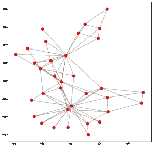
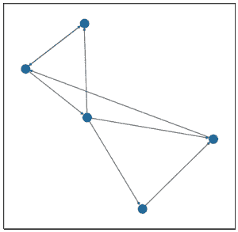

# 使用 Networkx | Python 在图中测量网络中心度

> 原文:[https://www . geesforgeks . org/network-centrality-measures-in-a-graph-use-networkx-python/](https://www.geeksforgeeks.org/network-centrality-measures-in-a-graph-using-networkx-python/)

中心性度量允许我们精确定位图中最重要的节点。这基本上有助于我们识别:

*   社交网络中有影响力的节点。
*   向许多节点传播信息的节点
*   交通网络中的枢纽
*   网络中的重要页面
*   防止网络崩溃的节点

首先，我们需要考虑 1977 年出版的著名社交图，叫做扎卡里空手道俱乐部图。这是一个内置的网络图。所有的中心性度量都将使用该图进行演示。

```
import matplotlib.pyplot as plt
import networkx as nx

G = nx.karate_club_graph()

plt.figure(figsize =(15, 15))
nx.draw_networkx(g, with_labels = True)
```

**输出:**


**常用的中心性度量技术如下:**

## 程度中心性:

这是基于重要节点有许多连接的假设。

，其中是节点 v 的度数，N 是图的所有节点的集合。

网络中

```
deg_centrality = nx.degree_centrality(G)

# G is the Karate Club Graph
print(deg_centrality)
```

**输出:**

```
{0: 0.48484848484848486,
 1: 0.2727272727272727,
 2: 0.30303030303030304,
 3: 0.18181818181818182,
 4: 0.09090909090909091,
 5: 0.12121212121212122,
 6: 0.12121212121212122,
 7: 0.12121212121212122,
 8: 0.15151515151515152,
 9: 0.06060606060606061,
 10: 0.09090909090909091,
 11: 0.030303030303030304,
 12: 0.06060606060606061,
 13: 0.15151515151515152,
 14: 0.06060606060606061,
 15: 0.06060606060606061,
 16: 0.06060606060606061,
 17: 0.06060606060606061,
 18: 0.06060606060606061,
 19: 0.09090909090909091,
 20: 0.06060606060606061,
 21: 0.06060606060606061,
 22: 0.06060606060606061,
 23: 0.15151515151515152,
 24: 0.09090909090909091,
 25: 0.09090909090909091,
 26: 0.06060606060606061,
 27: 0.12121212121212122,
 28: 0.09090909090909091,
 29: 0.12121212121212122,
 30: 0.12121212121212122,
 31: 0.18181818181818182,
 32: 0.36363636363636365,
 33: 0.5151515151515151}

```

返回一个字典，其大小等于图 G 中的节点数，其中 ith 元素是 ith 节点的度中心性度量。对于有向图，度和度的度量是不同的。计算方法如下:

```
in_deg_centrality = nx.in_degree_centrality(G)
out_deg_centrality = nx.out_degree_centrality(G)
```

其中 *g* 是有向图。

## 接近中心性:

这是基于重要节点靠近其他节点的假设。它被计算为从给定节点到所有其他节点的路径长度的总和。但是对于一个不能到达所有其他节点的节点，用下面的公式来衡量贴近度中心度:
其中，R(v)是 v 能到达的所有节点的集合。

```
close_centrality = nx.closeness_centrality(G)

# G is the Karate Social Graph
print(close_centrality)
```

**输出:**

```
{0: 0.5689655172413793,
 1: 0.4852941176470588,
 2: 0.559322033898305,
 3: 0.4647887323943662,
 4: 0.3793103448275862,
 5: 0.38372093023255816,
 6: 0.38372093023255816,
 7: 0.44,
 8: 0.515625,
 9: 0.4342105263157895,
 10: 0.3793103448275862,
 11: 0.36666666666666664,
 12: 0.3707865168539326,
 13: 0.515625,
 14: 0.3707865168539326,
 15: 0.3707865168539326,
 16: 0.28448275862068967,
 17: 0.375,
 18: 0.3707865168539326,
 19: 0.5,
 20: 0.3707865168539326,
 21: 0.375,
 22: 0.3707865168539326,
 23: 0.39285714285714285,
 24: 0.375,
 25: 0.375,
 26: 0.3626373626373626,
 27: 0.4583333333333333,
 28: 0.4520547945205479,
 29: 0.38372093023255816,
 30: 0.4583333333333333,
 31: 0.5409836065573771,
 32: 0.515625,
 33: 0.55}

```

## 介数中心性:

它假设重要节点连接其他节点。计算介数中心性的公式如下:
其中是节点 s 和 t 之间的最短路径数，是节点 s 和 t 之间通过 v 的最短路径数，
我们可以包含也可以不包含节点 v 本身进行计算。

对于具有大量节点的图，介数中心度的值非常高。因此，我们可以通过除以节点对的数量(不包括当前节点)来归一化该值。对于有向图，节点对的数量为`(|N|-1)*(|N|-2)`，而对于无向图，节点对的数量为`(1/2)*(|N|-1)*(|N|-2)`。

```
bet_centrality = nx.betweenness_centrality(G, normalized = True, 
                                              endpoints = False)

# G is the Karate Social Graph, parameters normalized
# and endpoints ensure whether we normalize the value
# and consider the endpoints respectively.
print(bet_centrality)
```

**输出:**

```
{0: 0.43763528138528146,
 1: 0.053936688311688304,
 2: 0.14365680615680618,
 3: 0.011909271284271283,
 4: 0.0006313131313131313,
 5: 0.02998737373737374,
 6: 0.029987373737373736,
 7: 0.0,
 8: 0.05592682780182781,
 9: 0.0008477633477633478,
 10: 0.0006313131313131313,
 11: 0.0,
 12: 0.0,
 13: 0.04586339586339586,
 14: 0.0,
 15: 0.0,
 16: 0.0,
 17: 0.0,
 18: 0.0,
 19: 0.03247504810004811,
 20: 0.0,
 21: 0.0,
 22: 0.0,
 23: 0.017613636363636363,
 24: 0.0022095959595959595,
 25: 0.0038404882154882154,
 26: 0.0,
 27: 0.02233345358345358,
 28: 0.0017947330447330447,
 29: 0.0029220779220779218,
 30: 0.014411976911976909,
 31: 0.13827561327561325,
 32: 0.145247113997114,
 33: 0.30407497594997596}

```

## 页面排名:

页面排名算法是由谷歌创始人开发的，用于从超链接网络结构中衡量网页的重要性。页面排名为每个节点分配一个重要性分数。重要节点是那些具有来自重要页面的许多内联的节点。它主要用于定向网络。

```
n -> Number of nodes
k -> Number of steps

All nodes have a Page Rank of 1/n
Repeat k times : 
    For node u pointing to node v, add Page Rank of u 
    divided by out degree of u to the Page Rank of v

```

为了理解页面排名，我们将考虑以下图表:


```
Let k = 2

Initially,
A -> 1/5
B -> 1/5
C -> 1/5
D -> 1/5
E -> 1/5

After first iteration,
A -> 1/15+1/5 = 4/15
B -> 1/5+1/5 = 2/5
C -> 1/10+1/15 = 1/6
D -> 1/10
E -> 1/15

After second iteration,
A -> 1/30+1/15 = 1/10
B -> 4/15+1/6 = 13/30
C -> 1/5+1/30 = 7/30
D -> 1/5
E -> 1/30

So, after 2 iterations, Page Rank is as follows:
B > C > D > A > E

```

一个节点在第 *k* 步的页面等级是一个随机步行者在走完 *k* 步后降落在该节点上的概率。
现在我们来考虑下面这个网络，

对于 *k* 趋于无穷大的随机游走，最终会去 F 或者 G，会卡在那里。因此，对于 F = 1/2，G = 1/2 的页面等级，其余节点的页面等级将为 0。这通过引入“阻尼参数”来解决。

```
Each node has a Page Rank of 1/n
Start on a Random Node
Repeat k times:
     With probability , choose an outgoing edge at random and follow it to the next node. 
     With probability , choose a random node and go to it.

```

alpha 的值通常设置在 0.8 到 0.9 之间。

```
pr = nx.pagerank(G, alpha = 0.8)

# G is the Karate Social Graph
print(pr)
```

**输出:**

```
{0: 0.09456117898156402,
 1: 0.05152334607950815,
 2: 0.05510962827358582,
 3: 0.03520686871052657,
 4: 0.022556530085318473,
 5: 0.02965434765152121,
 6: 0.02965434765152121,
 7: 0.02429306613631948,
 8: 0.029203590410895465,
 9: 0.014918270732782356,
 10: 0.022556530085318473,
 11: 0.010610337618460166,
 12: 0.015304584795945321,
 13: 0.028920243421725694,
 14: 0.015180200879547068,
 15: 0.015180200879547068,
 16: 0.01774436545128434,
 17: 0.01519007845263465,
 18: 0.015180200879547068,
 19: 0.019817255738040863,
 20: 0.015180200879547068,
 21: 0.01519007845263465,
 22: 0.015180200879547068,
 23: 0.03138523208020211,
 24: 0.021678994504154954,
 25: 0.021582293035938838,
 26: 0.015815184517974507,
 27: 0.02572094617382946,
 28: 0.019815535386497624,
 29: 0.026528036905982717,
 30: 0.024432622368453834,
 31: 0.03672846196415318,
 32: 0.07006405452640968,
 33: 0.09833298540908077}

```

这些是网络中心性的不同度量。还有其他方法，如负荷中心性、卡兹中心性、渗透中心性等。