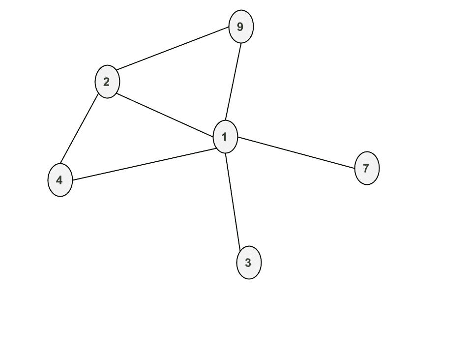
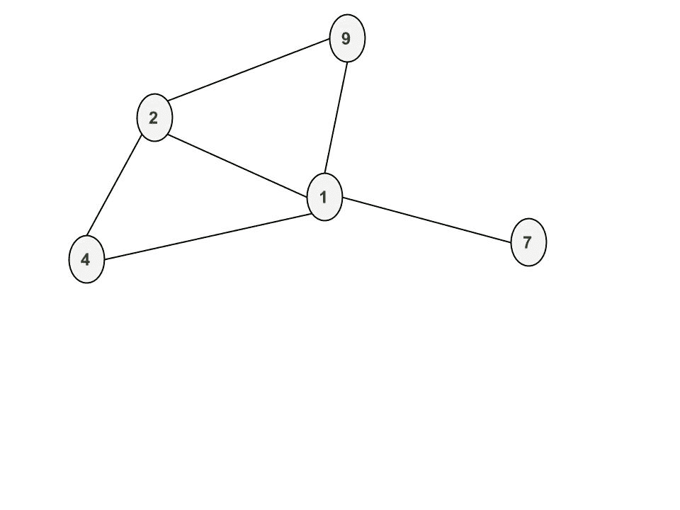

# NetworkX:研究复杂网络的 Python 软件包

> 原文:[https://www . geesforgeks . org/networkx-python-软件包-研究-复杂网络/](https://www.geeksforgeeks.org/networkx-python-software-package-study-complex-networks/)

网络是一个 Python 语言软件包，用于创建、操作和研究复杂网络的结构、动力学和功能。它被用来研究以具有节点和边的图的形式表示的大型复杂网络。使用 networkx，我们可以加载和存储复杂的网络。我们可以生成许多类型的随机和经典网络，分析网络结构，建立网络模型，设计新的网络算法和绘制网络。

**包装安装:**

```py
pip install networkx
```

**创建节点**

一次添加一个节点:

```py
 G.add_node(1)
```

添加节点列表:

```py
 G.add_nodes_from([2,3])
```

让我们在图 g 中创建节点。在添加节点 1、2、3、4、7、9 之后


**创建边:**

一次添加一条边:

```py
G.add_edge(1,2)
G.add_edge(3,1)
G.add_edge(2,4)
G.add_edge(4,1)
G.add_edge(9,1)
```

添加边列表:

```py
G.add_edges_from([(1,2),(1,3)])
```

添加边(1，2)、(3，1)、(2，4)、(4，1)、(9，1)、(1，7)、(2，9)后



**移除节点和边:**

可以使用以下任何一种函数来分解图形:

```py
Graph.remove_node(), Graph.remove_nodes_from(),
Graph.remove_edge() and Graph.remove_edges_from()
```

移除节点 3 后



移除边缘(1，2)后


## 计算机编程语言

```py
# Python program to create an undirected 
# graph and add nodes and edges to a graph

# To import package
import networkx

# To create an empty undirected graph
G = networkx.Graph()

# To add a node
G.add_node(1)
G.add_node(2)
G.add_node(3)
G.add_node(4)
G.add_node(7)
G.add_node(9)

# To add an edge
# Note graph is undirected
# Hence order of nodes in edge doesn't matter
G.add_edge(1,2)
G.add_edge(3,1)
G.add_edge(2,4)
G.add_edge(4,1)
G.add_edge(9,1)
G.add_edge(1,7)
G.add_edge(2,9)

# To get all the nodes of a graph
node_list = G.nodes()
print("#1")
print(node_list)

# To get all the edges of a graph
edge_list = G.edges()
print("#2")
print(edge_list)

# To remove a node of a graph
G.remove_node(3)
node_list = G.nodes()
print("#3")
print(node_list)

# To remove an edge of a graph
G.remove_edge(1,2)
edge_list = G.edges()
print("#4")
print(edge_list)

# To find number of nodes
n = G.number_of_nodes()
print("#5")
print(n)

# To find number of edges
m = G.number_of_edges()
print("#6")
print(m)

# To find degree of a node
# d will store degree of node 2
d = G.degree(2)
print("#7")
print(d)

# To find all the neighbor of a node
neighbor_list = G.neighbors(2)
print("#8")
print(neighbor_list)

#To delete all the nodes and edges
G.clear()
```

输出:

```py
#1
[1, 2, 3, 4, 7, 9]
#2
[(1, 9), (1, 2), (1, 3), (1, 4), (1, 7), (2, 4), (2, 9)]
#3
[1, 2, 4, 7, 9]
#4
[(1, 9), (1, 4), (1, 7), (2, 4), (2, 9)]
#5
5
#6
5
#7
2
#8
[4, 9]
```

在下一篇文章中，我们将讨论如何创建加权图、有向图和多图。如何画图表？在后面的帖子中，我们将看到如何使用内置的功能，如深度优先搜索又名 dfs，广度优先搜索又名 BFS，迪克斯特拉的最短路径算法。

**参考:**T2】吉图布的 Networxx

本文由 [**普拉蒂克·查哈尔**](https://github.com/pratik-chhajer) 供稿。如果你喜欢 GeeksforGeeks 并想投稿，你也可以使用[write.geeksforgeeks.org](http://www.write.geeksforgeeks.org)写一篇文章或者把你的文章邮寄到 review-team@geeksforgeeks.org。看到你的文章出现在极客博客主页上，帮助其他极客。
如果发现有不正确的地方，或者想分享更多关于上述话题的信息，请写评论。