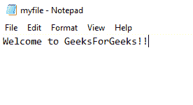
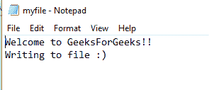

# 用 Python 打开文件

> 原文:[https://www.geeksforgeeks.org/open-a-file-in-python/](https://www.geeksforgeeks.org/open-a-file-in-python/)

Python 提供了创建、写入和读取文件的内置功能。Python 中可以处理的文件有两种，普通文本文件和二进制文件(用二进制语言编写，`0s`和`1s`)。

*   **文本文件:**在这种类型的文件中，每一行文本都以一个名为 **EOL(行尾)**的特殊字符结束，默认情况下，这是 Python 中的新行字符(`‘\n’`)。
*   **二进制文件:**在这种类型的文件中，一行没有终止符，数据在转换成机器可理解的二进制语言后存储。

> 参考下面的文章，了解文件处理的基础知识。
> 
> *   [文件处理基础](https://www.geeksforgeeks.org/file-handling-python/)
> *   [读写文件](https://www.geeksforgeeks.org/reading-writing-text-files-python/)

## 打开文件

打开文件指的是准备好文件以供读取或写入。这可以使用`open()`功能来完成。这个函数返回一个文件对象，并接受两个参数，一个接受文件名，另一个接受模式(访问模式)。现在，问题来了，什么是访问模式？

访问模式控制打开的文件中可能的操作类型。它指的是文件打开后将如何使用。这些模式还定义了文件中**文件句柄**的位置。**文件句柄**就像一个光标，它定义了从哪里读取或写入文件中的数据。python 中有 6 种访问模式。

*   **只读(' r'):** 打开文本文件阅读。句柄位于文件的开头。如果文件不存在，将引发输入/输出错误。这也是打开文件的默认模式。
*   **读写(' r+'):** 打开文件进行读写。句柄位于文件的开头。如果文件不存在，将引发输入/输出错误。
*   **只写(' w'):** 打开文件写。对于现有文件，数据被截断和覆盖。句柄位于文件的开头。如果文件不存在，则创建该文件。
*   **读写(' w+'):** 打开文件进行读写。对于现有文件，数据被截断和覆盖。句柄位于文件的开头。
*   **仅追加(' a'):** 打开文件进行写入。如果文件不存在，则创建该文件。句柄位于文件的末尾。正在写入的数据将被插入到现有数据的末尾。
*   **追加并读取(' a+'):** 打开文件进行读写。如果文件不存在，则创建该文件。句柄位于文件的末尾。正在写入的数据将被插入到现有数据的末尾。

**语法:**

```
File_object = open(r"File_Name", "Access_Mode")

```

**注意:**文件应该和 Python 脚本存在同一个目录下，否则应该写入文件的完整地址。

**示例#1:** 假设文本文件如下所示



我们想使用 Python 读取文件的内容。

```
# Python program to demonstrate
# opening a file

# Open function to open the file "myfile.txt"  
# (same directory) in read mode and store
# it's reference in the variable file1

file1 = open("myfile.txt")

# Reading from file
print(file1.read())

file1.close()
```

**输出:**

```
Welcome to GeeksForGeeks!!

```

**示例#2:** 假设我们想使用 Python 向上述文件中写入更多数据。

```
# Python program to demonstrate
# opening a file

# Open function to open the file "myfile.txt"
# (same directory) in append mode and store
# it's reference in the variable file1
file1 = open("myfile.txt", "a")

# Writing to file
file1.write("\nWriting to file :)")

# Closing file
file1.close()
```

**输出:**

