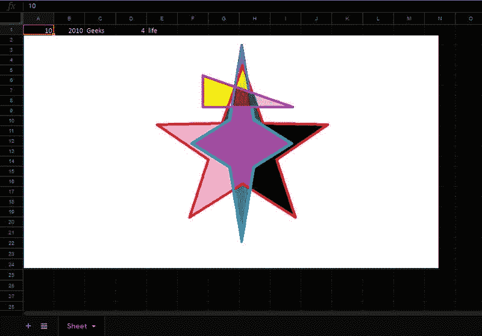

# open pyxl–添加图像

> 原文:[https://www.geeksforgeeks.org/openpyxl-adding-image/](https://www.geeksforgeeks.org/openpyxl-adding-image/)

Openpyxl 是一个 Python 库，用于操作在微软 excel 的不同变体中创建的格式(xlsx/xlsm/xltx/xltm)的 Excel 文档。该库的起源是由于缺乏一个本地库来从 Python(办公开放 XML 格式)本地读取/写入。

Openpyxl 为 python 提供了数据集处理能力，并允许创建不同类型的数据库文件。库提供的 stark 特性之一是允许用户在工作表的单元格内定义图像。这为在我们的工作表中合并可视数据打开了空间，允许更全面和明确的结果。

要安装 openpyxl 库，请在命令行中执行以下命令:

```
pip install openpyxl
```

为了在工作表中导入图像，我们将使用 openpyxl 库中的一个名为 openpyxl.drawing.image.Image 的方法。 [PIL](https://www.geeksforgeeks.org/python-pillow-a-fork-of-pil/) (枕头)库中找到的图像方法。因此需要安装 [PIL](https://www.geeksforgeeks.org/python-pillow-a-fork-of-pil/) (枕头)库才能使用该方法。
**测试图像:**


下面是实现–

## 蟒蛇 3

```
import openpyxl

# It is not required for one to create a workbook on
# filesystem, therefore creating a virtual workbook
wrkb = openpyxl.Workbook()

# Number of sheets in the workbook (1 sheet in our case)
ws = wrkb.worksheets[0]

# Adding a row of data to the worksheet (used to
# distinguish previous excel data from the image)
ws.append([10, 2010, "Geeks", 4, "life"])

# A wrapper over PIL.Image, used to provide image
# inclusion properties to openpyxl library
img = openpyxl.drawing.image.Image('test.png')

# The Coordinates where the image would be pasted
# (an image could span several rows and columns
# depending on it's size)
img.anchor = 'A2'

# Adding the image to the worksheet
# (with attributes like position)
ws.add_image(img)

# Saving the workbook created under the name of out.xlsx
wb.save('out.xlsx')
```

**输出(out.xlsx):-**



**解释**
上面的代码首先创建一个工作簿，并保存在变量 wrkb(工作簿的缩写)中。wrkb.worksheet[0]指定书中的工作表列表。因为我们只需要一张纸，所以我们指定 0 作为参数。ws.append()用于向我们的工作表添加数据。在我们的案例中，我们在工作表中添加了一行数据 10，2010，“极客”，4，“生活”。openpyxl . drawing . image . image(' test . png ')指定将添加到工作表中的图像的路径(在我们的例子中是 test.png)。img.anchor = 'A2 '用于指定要粘贴/添加图像的坐标。
默认情况下，图像将从单元格 A1(锚点 A1)或工作簿的第一个单元格添加。可以通过在 img.anchor 属性中指定单元格坐标来更改此位置。ws.add_image()将图像添加到工作表内部。这是一种用于最终确定我们想要的图像更改的方法。所有其他属性，如锚点，将在此函数之前提供。wrkb.save()用于保存我们的工作表。需要一个路径(相对/绝对)作为参数，以及路径中包含的任何扩展(如果没有明确提供)。