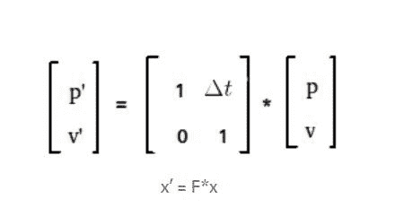

# 自动驾驶汽车卡尔曼滤波器概述

> 原文:[https://www . geesforgeks . org/自动驾驶汽车卡尔曼滤波器概述/](https://www.geeksforgeeks.org/overview-of-kalman-filter-for-self-driving-car/)

卡尔曼滤波器是一种最优估计算法。当我们由于精度或物理限制等不同限制而处于怀疑状态时，它可以帮助我们预测/估计物体的位置，我们稍后将讨论这些限制。

**卡尔曼滤波器的应用:**
卡尔曼滤波器用于–

*   只能间接测量的感兴趣变量。
*   测量值可从各种传感器获得，但可能会受到噪声的影响，即传感器融合。

让我们一个接一个地深入挖掘每一个用途。

1.  **间接测量:**
    测量只能间接测量的感兴趣变量(考虑中的变量)。这种类型的变量称为状态估计变量。我们用一个例子来理解。
    **例:**
    假设你想知道你的狗 Jacky 有多开心。因此你的兴趣变量，y 就是 Jacky 的快乐。现在衡量杰基幸福的唯一方法是间接衡量，因为幸福不是一种可以直接衡量的身体状态。你可以选择看 Jacky 摇尾巴，预测他是否快乐。你也可能有一个完全不同的方法来给你一个想法或估计杰克有多开心。这个独特的想法是卡尔曼滤波器。这就是我说卡尔曼滤波是一种最优估计算法的意思。
2.  **传感器融合:**
    现在你有了这个滤镜到底是什么的直觉。卡尔曼滤波器将测量和预测结合起来，以找到汽车位置的最佳估计。
    **例:**
    假设你有一辆遥控车，它以 1 米/秒的速度行驶，假设 1 秒后你需要预测汽车的确切位置，你的预测会是什么？？
    好吧，如果你知道一些基本的时间、距离和速度公式，你就能正确地说比当前位置提前 1 米。但是这个模型有多准确呢？？
    与理想场景总是有一些偏差，这种偏差是错误的原因。现在，为了最小化状态预测中的误差，从传感器进行测量。传感器测量也有一些误差。因此，现在我们有两个概率分布(传感器和预测，因为它们不总是一个数字，而是概率分布函数(pdf))来告诉汽车的位置。一旦我们把这两条高斯曲线结合起来，我们就可以得到一个方差小得多的全新高斯。
    **举例:**
    假设你有一个朋友(传感器 2)数学好，物理没那么好，你(传感器 1)物理好，数学没那么好。现在考试当天，当你的目标是取得一个好成绩时，你和你的朋友走到一起，以便在这两个科目上都出类拔萃。你们两个合作来最小化错误和最大化结果(输出)。
    **例子:**
    就像当你需要了解一个事件时，你问不同的人关于它的问题，听完他们所有的故事后，你自己制作哪个，你似乎比任何一个人的故事都要准确得多。看到它总是与我们的日常生活有关，我们总是可以与我们已经经历的事情联系起来。

 **代码:Python 实现的一维卡尔曼滤波器**

```py
def update(mean1, var1, mean2, var2):
    new_mean = float(var2 * mean1 + var1 * mean2) / (var1 + var2)
    new_var = 1./(1./var1 + 1./var2)
    return [new_mean, new_var]

def predict(mean1, var1, mean2, var2):
    new_mean = mean1 + mean2
    new_var = var1 + var2
    return [new_mean, new_var]

measurements = [5., 6., 7., 9., 10.]
motion = [1., 1., 2., 1., 1.]
measurement_sig = 4.
motion_sig = 2.
mu = 0.
sig = 10000.

# print out ONLY the final values of the mean
although for a better understanding you may choose to 
# and the variance in a list [mu, sig]. 

for measurement, motion in zip(measurements, motion):
    mu, sig = update(measurement, measurement_sig, mu, sig)
    mu, sig = predict(motion, motion_sig, mu, sig)
print([mu, sig])
```

**解释:**
正如我们已经讨论过的，在完整的过程中有两个主要步骤首先是更新步骤，然后是预测步骤。这两个步骤反复循环，以估计机器人的准确位置。

**预测步骤:**
可以使用公式
计算新位置 p’

<center>**p’ = p + v * dt**</center>

where p is the previous position, v is the velocity and dt is the time-step.
new velocity v’ will be the same as the previous velocity as its constant(assumption). This in equation can be given as

<center>**v’ = v**</center>

现在把这个完整的东西写在一个矩阵里。

<center>

预测步骤

</center>

**更新步骤:**
你刚才实现的过滤器是 python 的，也是一维的，大部分情况下我们要处理不止一个维度，语言也会发生变化。所以让我们用 C++实现一个卡尔曼滤波器。

**要求:**
[本征库](https://eigen.tuxfamily.org/dox/group__QuickRefPage.html)
你将需要本征库，尤其是密集类，以便处理过程中所需的线性代数。下载库并粘贴到包含代码文件的文件夹中，以防您不知道库在 C++中是如何工作的。也请查看[官方文档](https://eigen.tuxfamily.org/dox/group__QuickRefPage.html)以更好地了解如何使用其功能。我不得不承认，他们在文档中解释的方式是惊人的，比你可以要求的任何教程都好。

现在使用我们发现的新武器(库)在 c++中实现相同的预测和更新功能，以处理过程中的代数部分。
**预测步骤:**

<center>**x’=F*x + B*u + v
P’ = F * P * F.transpose() + Q** </center>

Here **B.u becomes zero** as this is used to incorporate changes related to friction or any other force that is hard to calculate. **v is the process noise** which determines random noise that can be present in the system as a whole.

```py
void KalmanFilter::Predict()
{
    x = F * x;
    MatrixXd Ft = F.transpose();
    P = F * P * Ft + Q;
}
```

这样，我们就能计算出 X 的预测值和协方差矩阵 p

**更新步骤:**

<center>**z = H * x + w** </center>

where **w** represents sensor **measurement noise.**

所以对于激光雷达，测量函数看起来是这样的:

<center>**z = p’**</center>

也可以用矩阵形式表示:

<center>

矩阵形式的表示

</center>

In this step, we use the latest measurements to update our estimate and our uncertainty.

**H** 是将状态映射到测量值的测量函数，通过将**测量值(z)** 与我们的**预测值(H*x)进行比较，有助于计算**误差(y)** 。**

<center>**y= z – H*x**</center>

The error is mapped into a matrix S, which is obtained by projecting the **System Uncertainty(P)** into the measurement space using the measurement function(H) + Matrix **R** that characters **measurement Noise.**

<center>**S = H * P * H.transpose() + R**</center>

This is then mapped into the variable called K. **K is the Kalman gain** and decides whether the measurement taken needs to be given more weight or the prediction according to the previous data and its uncertainty.

<center>**K = P*H.transpose() * S.inverse()**</center>

And then finally we **update our estimate(x) and our uncertainty(P)** using this equation using Kalman gain.

<center> **x = x + (K * y)
P = (I – K * H) * P** </center>

Here **I** is an identity matrix.

```py
void KalmanFilter::Update(const VectorXd& z)
{
    VectorXd z_pred = H * x;
    VectorXd y = z - z_pred;
    MatrixXd Ht = H.transpose();
    MatrixXd S = H * P * Ht + R;
    MatrixXd Si = S.inverse();
    MatrixXd PHt = P * Ht;
    MatrixXd K = PHt * Si;

    // new estimate
    x = x + (K * y);
    long x_size = x_.size();
    MatrixXd I = MatrixXd::Identity(x_size, x_size);
    P = (I - K * H) * P;
}
```

**代码:**

```py
// create a 4D state vector, we don't know yet the values of the x state
x = VectorXd(4);

// state covariance matrix P
P = MatrixXd(4, 4);
P << 1, 0, 0, 0,
    0, 1, 0, 0,
    0, 0, 1000, 0,
    0, 0, 0, 1000;

// measurement covariance
R = MatrixXd(2, 2);
R << 0.0225, 0,
    0, 0.0225;

// measurement matrix
H = MatrixXd(2, 4);
H << 1, 0, 0, 0,
    0, 1, 0, 0;

// the initial transition matrix F
F = MatrixXd(4, 4);
F << 1, 0, 1, 0,
    0, 1, 0, 1,
    0, 0, 1, 0,
    0, 0, 0, 1;

// set the acceleration noise components
noise_ax = 5;
noise_ay = 5;
```

我最初没有初始化矩阵的原因是，在我们编写卡尔曼滤波器时，这不是主要部分。首先，我们应该知道这两个主要功能是如何工作的。然后是初始化和其他事情。

**一些缺点:**

*   我们制作这个卡尔曼滤波器模型是为了处理激光雷达数据，这些数据可以用线性函数进行预测。嗯，我们在自动驾驶汽车上不使用唯一的激光雷达。我们也使用雷达，为了使用它，我们需要在相同的代码中进行一些调整，但是对于初学者来说，这是完美的。*   我们假设被跟踪的车辆以恒定的速度移动，这是一个很大的假设，因此我们将使用代表恒定转弯速率和速度大小模型的 CTRV 模型，在处理该模型时，我们将看到一种全新的方法来完成称为无迹卡尔曼滤波器的任务。